# SnapLine current architecture

Status: review baseline  
Reviewed: 2026-07-25  
Repository baseline: `29373b4`, including the current uncommitted SnapLine work

This document describes the SnapLine code as it exists in the current working
tree. It is descriptive, not an endorsement of every current boundary. The
companion [ownership specification](./ownership-specification.md) turns the
desired framework-owned model into a proposed normative contract.

## Executive summary

SnapLine currently has four layers:

| Layer                       | Current responsibility                                                                                 |
| --------------------------- | ------------------------------------------------------------------------------------------------------ |
| Application/framework state | Renders node and connector collections; may own an `EdgeLike[]` document                               |
| React/Svelte adapters       | Create and destroy core objects, render DOM, and translate callbacks into framework updates            |
| SnapLine core               | Handles gestures, selection, geometry, grouping, connector policy, line objects, and mirror registries |
| SnapEngine core             | Provides object lifecycle, input routing, collision, transforms, scheduling, and camera coordinates    |

Node and connector **existence** is already framework-led: mounting a
`<Node>` or `<Connector>` creates a core object and unmounting it destroys the
owned object. `NodeManager` mirrors the live core instances for queries and
edge reconciliation.

Line ownership is transitional:

- Without `EdgeSyncController`, connector topology is authoritative.
  `ConnectorComponent.connectToConnector()`, connection gestures, and
  `deleteLine()` directly create and destroy `LineComponent` objects.
- With `EdgeSyncController`, an application `EdgeLike[]` is treated as
  canonical. SnapLine still creates and owns the `LineComponent` instances,
  but `sync()` reconciles them to the application edge list and gesture
  mutations are reported as application intents.

That means the current package supports both an imperative topology model and
a controlled-edge model at the same time. Most of the design ambiguity comes
from the overlap between those modes.

## Layer and data flow

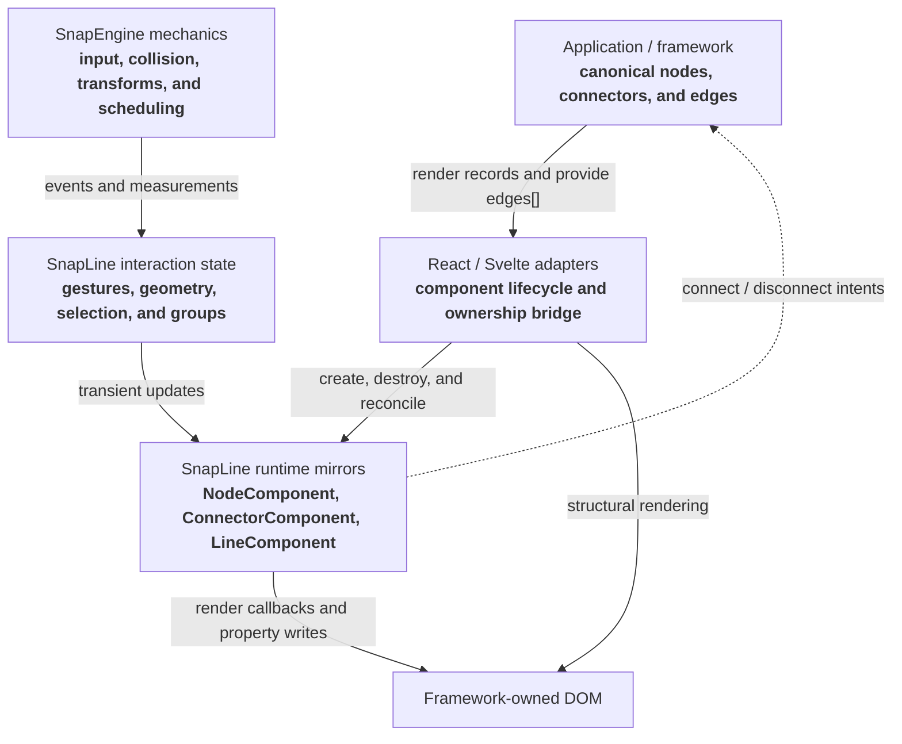

The word “mirror” is important. Core objects contain interaction and geometry
state that domain records do not need to contain, but their existence should
follow the application records when the controlled model is in use.

## Entity lifecycle

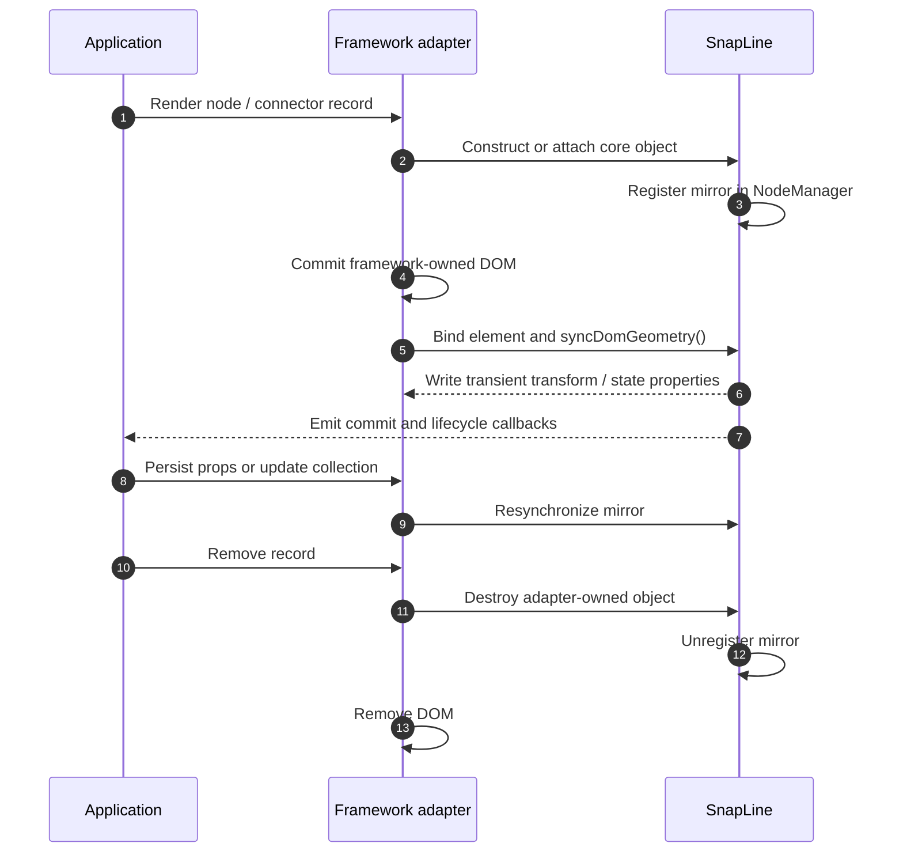

### Nodes

1. A React or Svelte `Node` adapter is rendered from application state.
2. The adapter either accepts a supplied `NodeComponent` or constructs one.
3. The constructor registers the node with SnapEngine and the per-engine
   `NodeManager`.
4. The adapter assigns the committed DOM element, sets the world transform,
   and calls `syncDomGeometry()`.
5. During a drag, core mutates `worldTransform` immediately and writes the DOM
   transform. `onDragCommit` reports final positions for persistence.
6. During resize, core updates collision state, writes width/height, remeasures
   connectors, and re-glues lines in staged frame writes. `onSizeChange` is
   observational; `onResizeCommit` reports the settled box for persistence.
7. On unmount, an adapter-owned node is destroyed and unregistered.

The framework controls whether a node is mounted, but live position is locally
owned by core during a gesture. The `x`, `y`, `width`, and `height` props can
resynchronize core, although unchanged props do not by themselves reject and
revert a completed local drag.

### Connectors

1. A connector is rendered inside a node.
2. The adapter constructs or accepts a `ConnectorComponent`.
3. `NodeComponent.addConnectorObject()` calls `assignToNode()`, which stores
   the connector in the node’s name-keyed `_connectors` map and shares the
   node property bag.
4. The constructor also registers the connector in `NodeManager`.
5. Connector policy and presentation-related configuration are updated in
   place through `updateConfig()`.
6. A visible connector binds a DOM element; a virtual connector remains a
   logical object and uses surface strategies for hit testing and anchors.
7. Destroying a connector removes all of its incoming and outgoing line
   mirrors, unregisters it, and removes it from the parent map.

Connector existence therefore follows framework rendering. Connector
configuration is copied into the core mirror. The connector’s `name` is a
construction-time key; metadata is currently the common place to carry domain
node/port identity.

### Connector connection rules

The current capability model is asymmetric:

```ts
interface ConnectorCapabilities {
  source: boolean;
  target: boolean;
  maxIncoming: number;
  reconnect: boolean;
  allowParallel: boolean;
}
```

- `source` and `target` independently enable the two connector roles.
- `maxIncoming === 0` prevents incoming connections.
- A positive `maxIncoming` is a finite capacity.
- A negative `maxIncoming` means unlimited.
- There is no corresponding `maxOutgoing`; a source connector’s outgoing
  collection is currently unbounded.
- The deprecated `maxConnectors` option feeds the `maxIncoming` default.

When a new connection would exceed finite incoming capacity,
`connectToConnector()` deletes the oldest required incoming lines before
attaching the new line. That replacement behavior is implicit rather than a
separate policy.

Both source and target connectors may provide `canConnect`. SnapLine accepts a
candidate only if both callbacks accept:

```ts
canConnect?: (event: {
  source: ConnectorComponent;
  target: ConnectorComponent;
}) => boolean;
```

This already supports endpoint-pair compatibility rules based on connector
configuration or metadata. It does not receive the proposed `LineComponent`,
line payload, gesture phase, or connection origin, so it cannot directly
express line-specific admission rules. It is also currently reused by
programmatic and hydration connections rather than being cleanly separated
from canonical-document validation.

### Lines

Lines are not registered in `NodeManager`. They are organized as topology on
connectors:

- the source connector holds the line in `outgoingLines`;
- the target connector holds the same object in `incomingLines`;
- `LineComponent.start` points to the source;
- `LineComponent.target` points to the target, or is `null` for a preview;
- the source node exposes the flattened outgoing list to its adapter.

The source node adapter renders one framework `Line` component per outgoing
`LineComponent`. `onLinesChanged` copies the latest source list into React or
Svelte state, so framework reconciliation owns the SVG DOM while SnapLine owns
the list being mirrored.

Preview creation does not synchronously flush that framework update. React or
Svelte may mount the SVG according to its normal scheduler while core
continues updating the targetless `LineComponent`. This does not lose
geometry:

- anchors and preview position remain current on the line model;
- `writeTransform()` is harmless while no geometry writer is bound;
- the line view reads `geometrySnapshot()` when it renders;
- `bindGeometryWriter()` immediately replays the latest geometry when the view
  mounts.

The preview SVG is therefore not a prerequisite for hit testing or gesture
progress. A very short rejected drag may be created and removed from framework
state before an SVG ever commits, which is valid.

This is separate from `syncDomGeometry()`. Node and connector DOM sometimes
must be measured after a framework commit; a line preview does not depend on
measuring its own SVG. It is also separate from EdgeSync’s queued
acceptance/rejection reconciliation, whose pre-paint timing prevents a
controlled-edge flicker rather than forcing line DOM to mount synchronously.

A line also carries transient rendering state: anchors, phase, candidate,
preview position, optional payload, and render subscriptions.

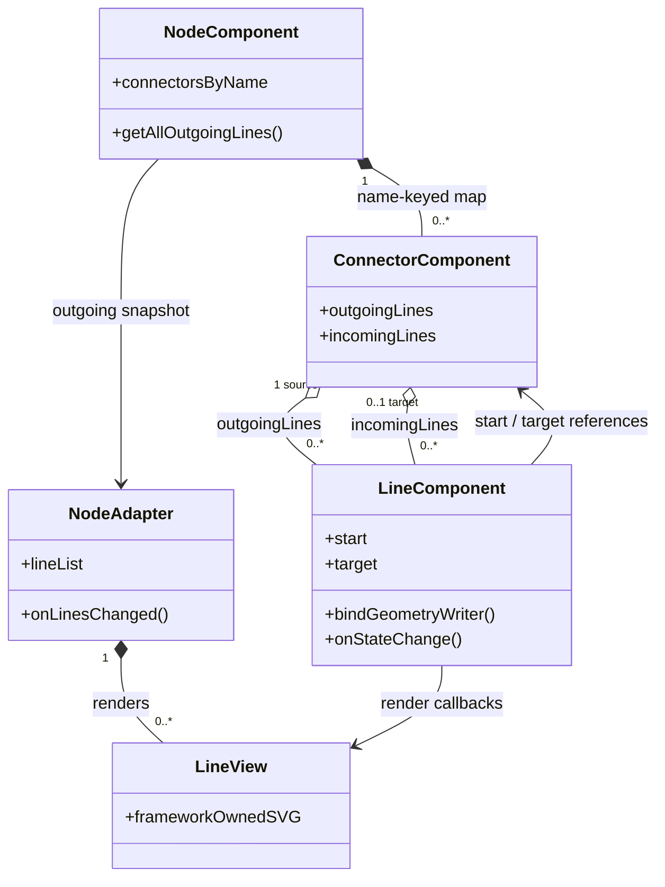

### Groups

`GroupNodeComponent` extends `NodeComponent`. Groups are also kept in the
shared `global.data.groups` list.

Membership is derived from measured geometry:

- ordinary nodes use center containment;
- nested groups require full-bounds containment;
- the smallest eligible group wins by default;
- a per-engine resolver may choose another eligible parent or no parent;
- membership cycles are rejected;
- group drag temporarily reparents transforms, not DOM.

Group membership is therefore SnapLine-derived interaction state, not a
framework graph-document relation in the current design.

### Selection

Selection is stored in `global.data.select`. `NodeComponent.setSelected()`
updates that list, writes `data-selected`/`data-snapline-state`, and emits a
selection callback. `RectSelectComponent` owns the selection gesture and
collision box. The adapter mounts the rubber-band element once and binds an
imperative geometry writer; `onRectChange` remains an observer callback.

SnapLine is the logical owner of selection because core behaviors such as
multi-node dragging need the selected set synchronously. The framework remains
the visual owner: it may use the emitted callback and state attributes to
highlight a node, render another selection treatment, or render none.
Selection is not a controlled framework prop.

## Controlled edge reconciliation

`EdgeSyncController` is the current implementation of application-owned edge
existence.

### Inputs

```ts
interface EdgeSyncConfig {
  engine: EngineLike;
  identity(connector: ConnectorComponent): EdgeEndpoint | null;
  getEdges(): readonly EdgeLike[];
  callbacks?: {
    onEdgeConnect?(event: EdgeConnectIntentEvent): void;
    onEdgeDisconnect?(event: EdgeDisconnectIntentEvent): void;
  };
}
```

### How `identity()`, `getEdges()`, and callbacks divide responsibility

These three seams connect runtime connector objects to the application’s
canonical edge document:

| Seam                                 | Direction                               | Current responsibility                                                                        |
| ------------------------------------ | --------------------------------------- | --------------------------------------------------------------------------------------------- |
| `identity(connector)`                | SnapLine runtime → application identity | Maps a live `ConnectorComponent` to `{ node, port }`, or returns `null` to leave it unmanaged |
| `getEdges()`                         | Application state → SnapLine sync       | Returns the latest canonical edge snapshot whenever `sync()` runs                             |
| `onEdgeConnect` / `onEdgeDisconnect` | SnapLine gesture → application          | Reports semantic gesture intents so the application can replace its edge state                |

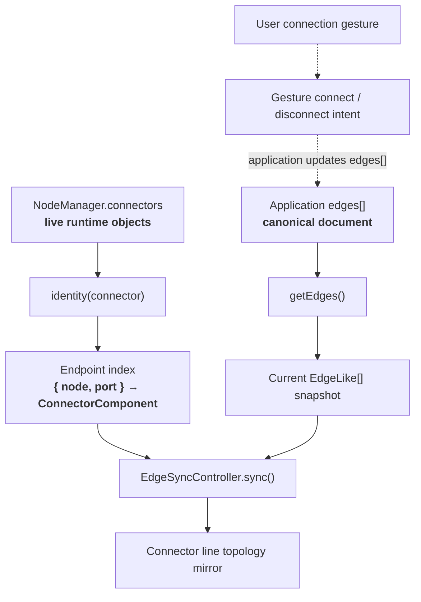

#### `identity(connector)`

`identity()` is not a node or connector registry. It is a translation function
called by `EdgeSyncController`:

- at least once for each registered connector while building a sync-time
  endpoint index;
- again when a line endpoint needs a fallback lookup;
- again for the source and target when translating a gesture connect or
  disconnect into an application intent.

The returned `{ node, port }` pair is the connector’s semantic identity in the
application document. Both values are strings. Returning `null` means:

- the connector is excluded from the endpoint index;
- its lines are not added or removed by `sync()`;
- gesture events involving it do not produce controlled-edge intents.

The function should therefore be deterministic for the duration of a sync.
The controller does not retain the result between sync passes.

The current implementation silently lets the last connector win if two live
connectors resolve to the same endpoint key. It also identifies an edge only
by its endpoint pair, not by a stable edge ID.

#### `getEdges()`

`getEdges()` is a pull API, not a subscription. It is called once near the
start of every `sync()` and must return the application’s latest edge
collection.

`EdgeSyncController` does not:

- store its own canonical edge list;
- mutate the returned list;
- subscribe to an application store;
- automatically know that an edge document changed.

React and Svelte keep the function live through a ref or prop getter, then
explicitly call `sync()` when their `edges` prop changes. A vanilla integration
must arrange the equivalent notification itself.

#### Why the apparent loop does not recurse

The data-flow diagram describes an event loop:

1. A gesture emits an intent.
2. The application updates `edges[]`.
3. A later `sync()` reads the new snapshot.
4. `sync()` converges the line mirror.

It is not a direct call cycle from `sync()` back into `getEdges()` and then
into `sync()` again.

The current implementation has four protections:

1. `getEdges()` is only a synchronous data read. Calling it does not schedule
   another sync.
2. `EdgeSyncController.#syncing` is a re-entrancy guard. A nested call to
   `sync()` returns immediately while a pass is active.
3. Lines created by reconciliation use `origin: "hydration"`.
   `notifyConnect()` forwards only `origin: "gesture"`.
4. Lines removed by reconciliation use `reason: "programmatic"`, and
   `notifyDisconnect()` suppresses all notifications while `#syncing` is true.

Because the controlled `onEdgeConnect`/`onEdgeDisconnect` callbacks do not fire
for sync’s own mutations, the adapter callbacks that queue post-intent
microtasks are not re-entered.

Several independent triggers can still request redundant passes—for example,
an application edge update and the post-intent microtask. Those passes run
sequentially and `sync()` is intended to be idempotent, so the later pass
finds the mirror already converged and performs no mutation.

An integration should keep `getEdges()` and `identity()` free of side effects.
The re-entrancy guard prevents a direct nested `sync()`, but it cannot make an
application callback that continually mutates its own edge document converge.

#### Controlled-edge callbacks

`onEdgeConnect` and `onEdgeDisconnect` are intent callbacks, not general
topology lifecycle callbacks.

They are forwarded only for:

- gesture connections;
- gesture disconnections;
- disconnections labeled `"replacement"`.

Replacement events do not carry their own connection origin. A programmatic
`connectToConnector()` call made outside `sync()` can therefore also cause a
controlled `onEdgeDisconnect` intent if it evicts an existing line. During
`sync()`, replacement forwarding is suppressed and a warning is logged.

They are not forwarded for:

- hydration;
- programmatic reconciliation;
- connector or node teardown;
- controller-driven removal of a rejected optimistic line.

Low-level connector `onConnect`/`onDisconnect` callbacks are broader and still
observe those local topology changes with an explicit `origin` or `reason`.

| Local topology cause             | Node/connector callbacks                                                                                | Controlled-edge intent                     |
| -------------------------------- | ------------------------------------------------------------------------------------------------------- | ------------------------------------------ |
| New drag preview                 | Node `onLinesChanged`, then source `onDragStart`                                                        | None                                       |
| Successful gesture connection    | Node `onLinesChanged`, then source and target `onConnect`, `origin: "gesture"`                          | `onEdgeConnect`                            |
| Document hydration               | Node `onLinesChanged`, then source and target `onConnect`, `origin: "hydration"`                        | None                                       |
| Gesture disconnect               | Source and target `onDisconnect`, `reason: "gesture"`, then source-node `onLinesChanged`                | `onEdgeDisconnect`                         |
| Capacity replacement             | Source and target `onDisconnect`, `reason: "replacement"`, then old source-node `onLinesChanged`        | `onEdgeDisconnect` unless a sync is active |
| Rejected optimistic line cleanup | Source and target `onDisconnect`, `reason: "programmatic"`, then source-node `onLinesChanged`           | None                                       |
| Connector/node teardown          | Source and target `onDisconnect`, `reason: "teardown"`, then the surviving source-node `onLinesChanged` | None                                       |

### Controller lifetime and sync triggers

Only one `EdgeSyncController` is attached to a `NodeManager` at a time.
Constructing another controller replaces the manager reference with a warning.

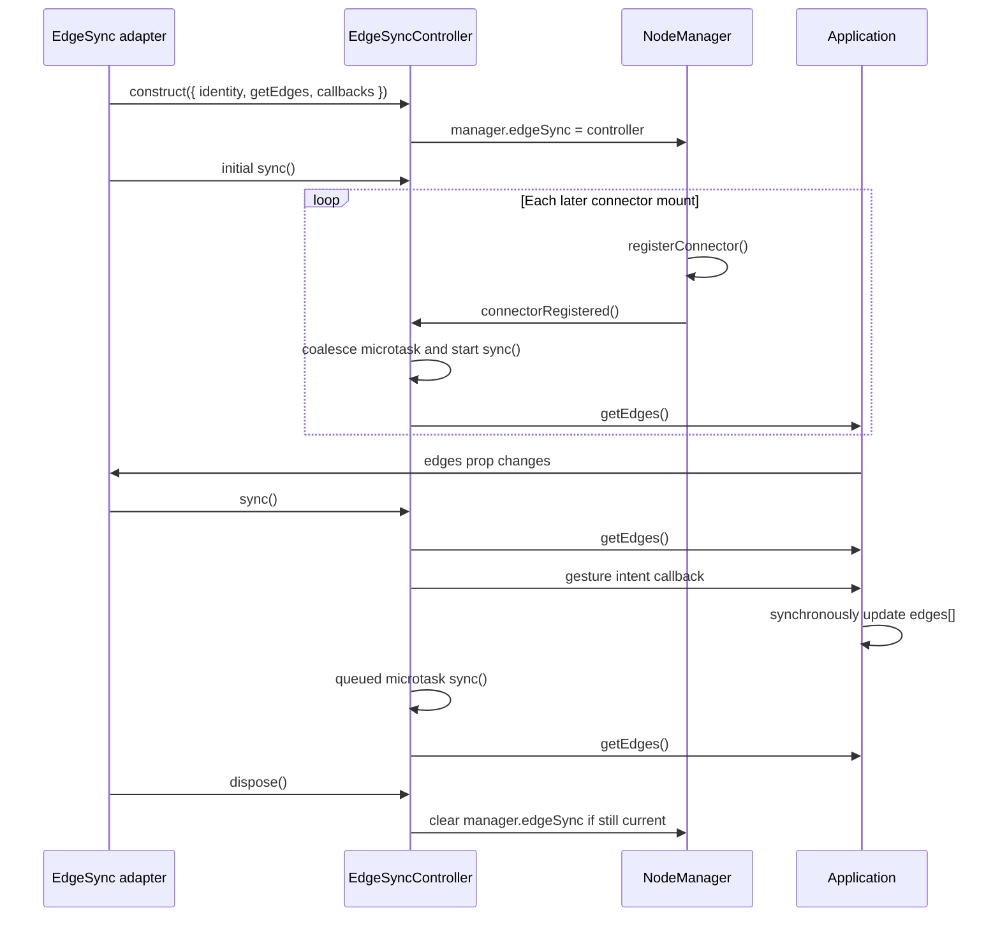

Current sync triggers are:

1. Controller/adapter mount.
2. An `edges` prop change.
3. Registration of a connector after the controller exists.
4. The microtask queued after a controlled connect/disconnect intent.
5. An explicit vanilla call to `controller.sync()`.

Connector registration is coalesced so a batch of newly mounted endpoints
causes one sync. Connector unregistration does not request a sync: connector
teardown directly removes its incident line mirrors while the application edge
remains canonical and latent.

#### Bulk registration behavior

Node registration does not trigger edge reconciliation. Connector registration
does, because a newly available endpoint may make a canonical edge
representable. Each call to `registerConnector()` reaches
`connectorRegistered()`, but the controller uses a `#syncQueued` flag and one
microtask:

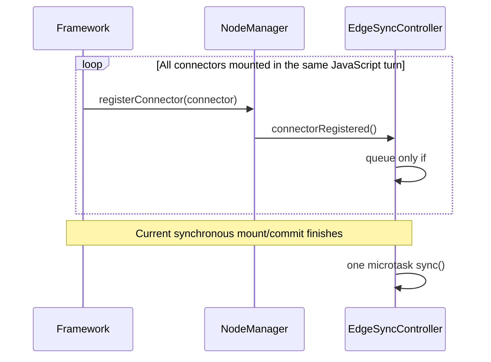

Consequently, loading 100 nodes in one synchronous framework batch does not
normally run one reconciliation per node or connector. It runs at most one
connector-registration reconciliation for that microtask window. If the
controller is created only after the connectors mount, its initial `sync()`
provides the single pass instead.

The batching boundary is scheduling-based, not an explicit graph transaction:

- registrations spread across separate tasks or framework commits can produce
  one sync per commit;
- an adapter edge-prop effect and the connector-registration microtask can both
  request a pass;
- React and Svelte have different effect timing, so the exact redundant-pass
  pattern is adapter-dependent;
- no API currently says “the full saved graph has finished mounting.”

The redundant passes are intended to be idempotent, but each pass snapshots and
indexes all connectors, scans settled lines, and walks all canonical edges.
Repeated partial-load passes can therefore become materially more expensive
than one final pass on a large graph, even though they remain correct.

### Reconciliation algorithm

On `sync()`:

1. Snapshot all registered connectors.
2. Resolve each managed connector to an endpoint key.
3. Snapshot the application edge list.
4. Delete settled managed lines whose endpoint pair is absent from the
   application list.
5. Leave preview lines and unmanaged lines untouched.
6. For every application edge whose endpoints are mounted, hydrate a missing
   line with `connectToConnector({ origin: "hydration" })`.
7. Leave edges with unmounted endpoints latent until a later sync.

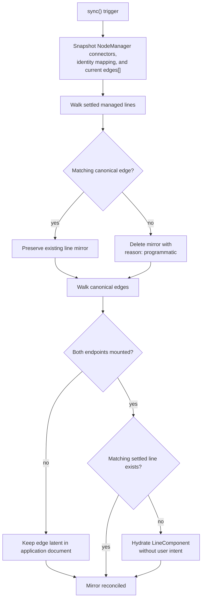

Connector registration asks the active controller to reconcile in a
microtask, allowing latent document edges to rehydrate when endpoints mount.
Connector teardown deletes line mirrors with reason `"teardown"` but does not
ask the application to delete its edge record.

### Gesture connect

The line exists as a preview before the application is asked to create a
canonical edge. A successful drop does **not** delete that preview and create a
replacement. `endDragOutLine()` passes the active `#dragLine` into
`connectToConnector()`, and `connectTarget()` settles that same object by
assigning its target, connected phase, and final anchors. The preview is
destroyed only when the drag is cancelled, rejected, or dropped without a
valid target.

The current callback lifetime is:

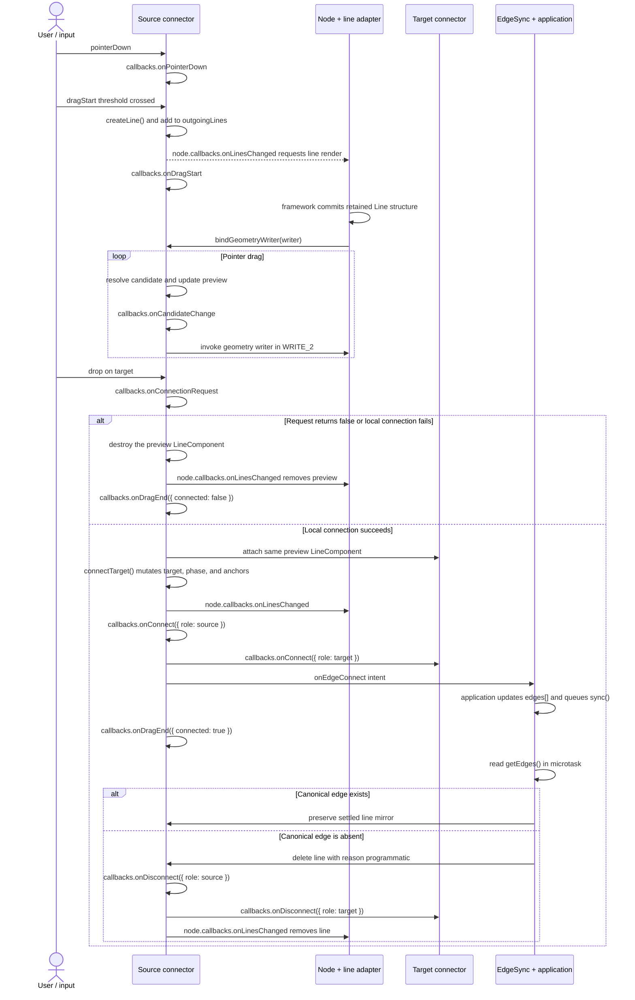

#### Line phase lifetime

The line’s `phase` is semantic state, separate from connector lifecycle
callbacks:

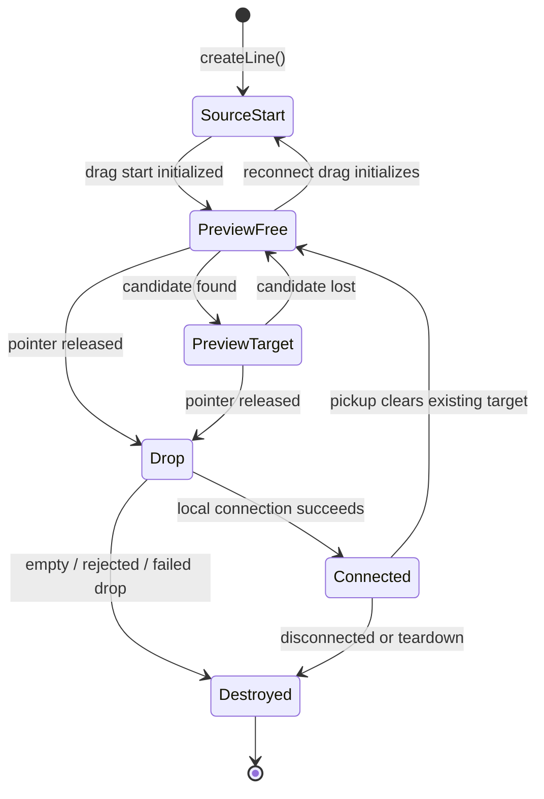

`setPhase()`, `setCandidate()`, and payload changes notify
`line.onStateChange()` subscribers. Anchor updates remain local model changes;
the scheduled transform write invokes the single registered geometry writer.
Neither path calls connector `onConnect`/`onDisconnect`.

#### Preview creation

Pointer-down only arms the source and calls
`source.callbacks.onPointerDown`. A new `LineComponent` is not created until
the engine’s drag threshold is crossed.

At drag start, the source:

1. Creates the targetless line.
2. Adds it to `source.outgoingLines`.
3. Calls `node.callbacks.onLinesChanged`.
4. Calls `source.callbacks.onDragStart`.
5. Changes the line phase from `"source-start"` to `"preview-free"`.

The node adapter responds to `onLinesChanged` by rendering a line component.
That component mounts its static SVG structure and calls
`line.bindGeometryWriter()`. Binding immediately supplies the current geometry,
so a line created before the framework commit still mounts correctly. During
the drag, scheduled core writes mutate the retained SVG through that writer;
they do not enqueue framework state updates. Custom renderers use the same
contract for their own retained SVG, canvas, or other imperative surface.

#### Candidate callbacks

While the pointer moves, the source resolves eligible targets. A changed
candidate updates the line first and then calls
`source.callbacks.onCandidateChange`.

`canConnect` is a policy predicate rather than a lifecycle callback. It may be
consulted repeatedly during candidate discovery and again before the final
local connection.

#### Drop policy

Dropping on a candidate first calls the source-only
`onConnectionRequest`. This is the legacy application-model seam:

- returning `false` rejects the local connection;
- returning nothing accepts it;
- returning `{ payload }` accepts it and attaches opaque payload to the line.

If it rejects, or if the drop has no candidate, the preview is removed,
`node.onLinesChanged` fires, and `source.onDragEnd` reports
`connected: false`. No connector `onConnect` callback and no controlled
`onEdgeConnect` intent fires.

#### Successful local connection

When the local connection succeeds, the current order is:

1. Enforce target capacity, potentially disconnecting replacement lines.
2. Attach the line to the target’s `incomingLines`.
3. Update anchors and render state.
4. Fire `node.callbacks.onLinesChanged`.
5. Fire source `onConnect` with `role: "source"`.
6. Fire target `onConnect` with `role: "target"`.
7. Notify `EdgeSyncController`, which synchronously calls `onEdgeConnect`.
8. The adapter invokes the application handler and queues `sync()` in a
   microtask.
9. Fire source `onDragEnd({ connected: true })`.
10. Clear the active candidate, which may emit a final
    `onCandidateChange` with `candidate: null`.

`connected: true` means the gesture produced a successful **local** connector
attachment. It does not prove that the application accepted a canonical edge.

#### Acceptance versus rejection by the application

The application is expected to update `edges[]` synchronously inside
`onEdgeConnect`. The queued microtask then calls `getEdges()`:

- If the endpoint pair exists, `sync()` preserves the line object.
- If it does not exist, `sync()` deletes the optimistic line with reason
  `"programmatic"`.

That rejection cleanup fires the low-level source and target `onDisconnect`
callbacks and `node.onLinesChanged`. It does **not** fire controlled
`onEdgeDisconnect`, because programmatic reconciliation is not a user
disconnect intent.

This distinction explains why an application can observe
`onDragEnd({ connected: true })` and then see the line disappear during the
same task: the first event describes local gesture completion, while the
canonical edge document decides whether the settled mirror survives.

### Gesture disconnect and replacement

Picking up an existing connection detaches it locally and emits a gesture
disconnect intent. Connecting to a full finite-capacity target deletes the
oldest required incoming lines with reason `"replacement"` before committing
the new line. The current controlled demo updates the document from the
disconnect and connect callbacks in that order.

Replacement is therefore exposed as multiple ordered intents rather than one
atomic application transaction.

## Current ownership matrix

| Data or resource              | Current owner                            | Notes                                                                     |
| ----------------------------- | ---------------------------------------- | ------------------------------------------------------------------------- |
| Domain node records           | Application/framework                    | SnapLine does not define node factories or node types                     |
| Mounted node instances        | Framework lifecycle + core mirror        | Adapter creates/destroys `NodeComponent`                                  |
| Domain connector/port records | Application/framework                    | Usually expressed by connector children                                   |
| Mounted connector instances   | Framework lifecycle + core mirror        | Stored in `NodeManager` and the parent node map                           |
| Domain edges                  | Application only when `EdgeSync` is used | Otherwise no separate domain edge source is required                      |
| Settled line topology         | Connector arrays                         | Derived from `edges` in controlled mode; authoritative in imperative mode |
| Preview line                  | SnapLine                                 | Ephemeral gesture state, not a domain edge                                |
| Node/connector/line DOM       | React/Svelte adapter                     | Core never structurally inserts, removes, or reparents framework DOM      |
| Node live transform           | SnapLine during interaction              | Framework geometry props can resynchronize it                             |
| Node persisted transform      | Application by convention                | Reported through drag commit callbacks                                    |
| Node size DOM                 | SnapLine during interaction              | Framework persists the committed size and may issue later prop updates    |
| Connector geometry            | SnapLine                                 | Measured/cached from node and optional connector DOM                      |
| Line geometry and anchors     | SnapLine                                 | Adapter binds an imperative geometry writer                               |
| Selection                     | SnapLine shared state                    | Framework receives callbacks; not controlled                              |
| Group membership              | SnapLine derived state                   | Framework receives deltas                                                 |
| Connector policy              | Application config copied into core      | `canConnect`, capabilities, strategies, metadata                          |
| Property propagation          | SnapLine                                 | Legacy name-keyed node property graph                                     |

## Registries and organization

### SnapEngine object table

All `BaseObject`/`ElementObject` instances also participate in SnapEngine’s
general object table. Some SnapLine code still scans that table:

- connector candidate discovery;
- group membership node enumeration.

### `NodeManager`

`NodeManager` is lazy and per engine. It contains:

- a `Set<NodeComponent>`;
- a `Set<ConnectorComponent>`;
- the optional active `edgeSync` controller.

The public `getNodes()`, `getConnectors()`, and `getGroupNodes()` helpers now
delegate to this registry. Registration-order snapshots are returned as
copies.

`NodeManager` does not currently track:

- lines;
- semantic IDs;
- domain records;
- selection;
- group membership;
- ownership of supplied versus adapter-created objects.

### Shared `global.data`

`snapline-globals.ts` types the SnapLine fields on SnapEngine’s shared data bag:

- `select`;
- `groups`;
- `resizeHandles`;
- `sourceSurfaces`;
- `resizingNode`;
- deprecated `allowCameraControl`;
- the per-engine `nodeManagers` map.

The manager is engine-keyed, but several other lists are shared arrays and
must be filtered by engine at their use sites. Selection currently has no
engine-keyed container.

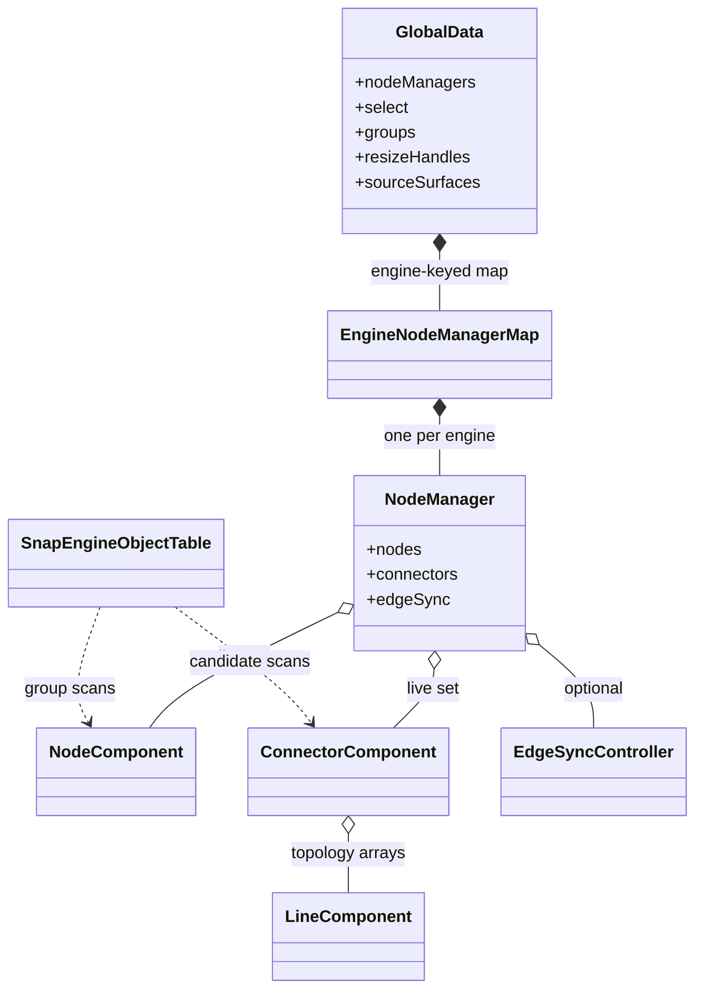

## Public API surface

The package exports raw TypeScript source and is still pre-1.0. The root entry
point currently exports the following API families.

### Core objects

| Export                   | Main public role                                                         |
| ------------------------ | ------------------------------------------------------------------------ |
| `NodeComponent`          | Node geometry, selection, resize, connector lookup, property propagation |
| `ConnectorComponent`     | Port policy, hit testing, gestures, topology mutation, geometry          |
| `LineComponent`          | Line endpoints, phase, anchors, payload, render subscription             |
| `GroupNodeComponent`     | Derived membership and recursive group carry                             |
| `RectSelectComponent`    | Rectangle selection state machine                                        |
| `PlacementController<T>` | Headless placement preview/commit state machine                          |
| `NodeManager`            | Live node/connector registry and edge-sync attachment                    |
| `EdgeSyncController`     | Reconciles connector line mirrors to application edges                   |

### Queries and policy helpers

- `getNodes(engine)`
- `getConnectors(engine)`
- `getGroupNodes(engine)`
- `getSelectedNodes(engine)`
- `getParentGroup(node)`
- `setGroupMembershipResolver(engine, resolver)`
- `resolveConnectorSourceAtPoint(engine, position, node?)`
- `getNodeManager(engine)`

### Important node configuration and callbacks

`NodeConfig` covers position locking, resizing, minimum size, resize handles,
metadata, callbacks, and edge-pan behavior.

`NodeCallbacks` exposes:

- drag authorization and position resolution;
- selection-mode resolution;
- drag start/live/commit;
- selection changes;
- size, resize-handle, and resize-commit events;
- outgoing line-list changes.

Notable callable methods include `setSelected()`, `registerDragHandle()`,
`syncDomGeometry()`, `setSizeState()`, `setSize()`, connector lookup,
incoming/outgoing line queries, property propagation, and `destroy()`.

### Important connector configuration and callbacks

`ConnectorConfig` includes:

- construction-time `name`;
- legacy `maxConnectors` and `allowDragOut`;
- independent source/target/reconnect/parallel capabilities;
- surface hit-test and anchor strategies;
- line class, collider radius, metadata, callbacks, and edge pan.

`ConnectorCallbacks` exposes connection policy, the legacy
`onConnectionRequest` domain seam, pointer/drag lifecycle, candidate changes,
and connect/disconnect events.

The imperative topology API includes:

- `connectToConnector()`;
- `disconnectFromConnector()`;
- `deleteLine()` and `deleteAllLines()`;
- `createLine()`;
- direct `outgoingLines` and `incomingLines` getters;
- `updateConfig()` and `bindElement()`;
- geometry, hit-test, and anchor-resolution helpers.

### Framework packages

The Svelte package exports:

- `Node`
- `Group`
- `Connector`
- `Line`
- `Select`
- `Placement`
- `EdgeSync`

The React package exports the same component families plus:

- the asset-base `Engine` and engine context helpers;
- `NodeObjectContext`;
- `useNodeHandle()`;
- prop/ref types.

Adapters accept caller-supplied core objects. Supplied objects are not
destroyed on unmount; adapter-created objects are.

## Important design tensions in the current code

These are the main topics to resolve before treating the ownership model as
settled.

### 1. Controlled edges are optional

The same connector mutation methods serve both as the imperative source of
truth and as the implementation detail beneath a controlled mirror. There is
no explicit controlled/uncontrolled mode on an engine or connector, so API
callers must understand which authority model is active.

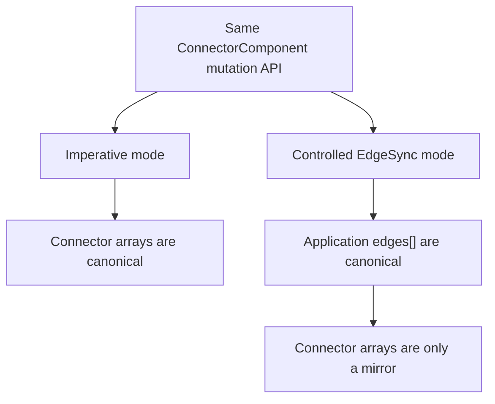

### 2. Two application edge-creation seams overlap

`ConnectorCallbacks.onConnectionRequest` can create a domain edge and attach a
payload before local connection. `EdgeSync.onEdgeConnect` separately asks the
application to create the canonical edge after local connection. Using both
can duplicate policy or mutation work.

### 3. `EdgeLike` has no edge identity

An edge is identified only by its source and target endpoint pair. As a
result:

- duplicate/parallel domain edges collapse during sync;
- `capabilities.allowParallel` cannot be represented by controlled
  `EdgeLike[]`;
- a hydrated line has no standard stable edge ID or payload;
- disconnect intents identify an endpoint pair, not a specific edge record.

### 4. Hydration still applies connector mutation policy

Document hydration calls `connectToConnector()`, which runs `canConnect`,
parallel checks, and incoming-capacity replacement. A canonical document can
therefore remain unrendered or be reduced/reordered by view-layer policy.
This is a direct question for the ownership specification: are those rules
gesture policy, document validity, or both?

### 5. Topology internals are publicly mutable

The connector returns its actual mutable incoming/outgoing arrays.
`LineComponent.start`, `target`, `payload`, anchors, phase, and candidate are
also public writable fields. `NodeComponent` retains several underscore-named
members that are TypeScript-public. Consumers can bypass lifecycle callbacks
and reconciliation invariants.

### 6. There is no line registry or line query

Nodes and connectors have a central mirror registry; lines are only discoverable
by walking connector arrays or node outgoing lists. This makes engine-wide
topology inspection and invariant checking asymmetric.

### 7. Enumeration has two mechanisms

Public queries use `NodeManager`, while connector target discovery and group
membership still scan SnapEngine’s general object table. The manager is not
yet the single internal organization boundary.

### 8. Engine scoping is inconsistent

`NodeManager` is engine-keyed, but selection and several interaction registries
live directly on application-wide `global.data`. Some readers filter by
engine; selected-node queries currently return the shared selection list.

### 9. Geometry props are cooperative, not strictly controlled

Core mutates transforms during interaction and adapters only rerun geometry
effects when prop values change. If an application rejects a move by leaving
its canonical coordinates unchanged, the mirror is not automatically reverted.

### 10. Package exports lag root exports

`EdgeSync` is exported from the React/Svelte root indexes, but the current
package subpath maps do not expose `./EdgeSync`. The core root exports
`EdgeSyncController`, `NodeManager`, and `getNodeManager`, while its documented
subpath map does not include `./edge-sync` or `./node-manager`.

### 11. Geometry writers are single-owner bindings

Line, selection, and placement geometry use `bindGeometryWriter`. The newest
binding replaces the previous writer, and its cleanup is identity-guarded so a
stale framework cleanup cannot detach a newer renderer. Observer callbacks such
as `onRectChange`, `onSizeChange`, and `onStateChange` remain separate and are
not used by the adapters to drive per-frame framework renders.

## Source map

| Concern                        | Primary implementation                         |
| ------------------------------ | ---------------------------------------------- |
| Public exports                 | `assets/snapline/core/src/index.ts`            |
| Node lifecycle and interaction | `assets/snapline/core/src/node.ts`             |
| Connector policy and topology  | `assets/snapline/core/src/connector.ts`        |
| Line state and geometry        | `assets/snapline/core/src/line.ts`             |
| Live node/connector registry   | `assets/snapline/core/src/node-manager.ts`     |
| Controlled edge reconciliation | `assets/snapline/core/src/edge-sync.ts`        |
| Shared registries              | `assets/snapline/core/src/snapline-globals.ts` |
| Engine queries                 | `assets/snapline/core/src/query.ts`            |
| Svelte ownership bridge        | `assets/snapline/svelte/src/*.svelte`          |
| React ownership bridge         | `assets/snapline/react/src/*.tsx`              |
| Controlled-edge example        | `demo/svelte/src/demo/node_ui_edges/`          |
| Controlled-edge browser tests  | `tests/e2e/snapline-edges.spec.ts`             |
