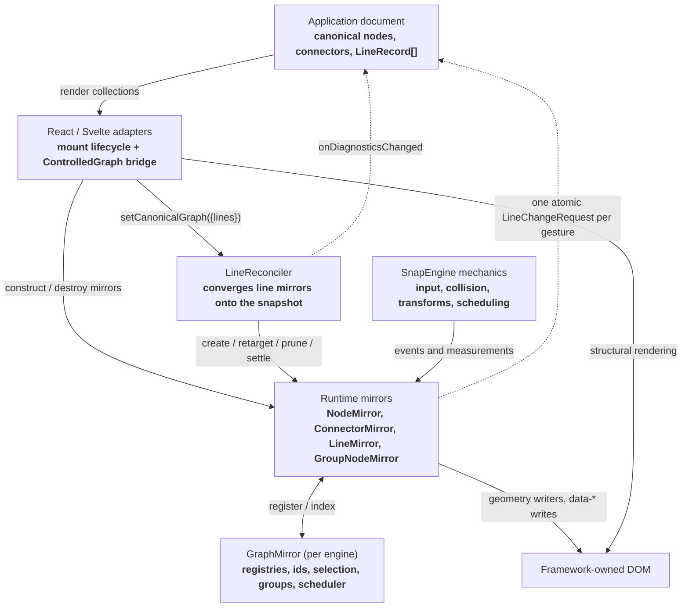
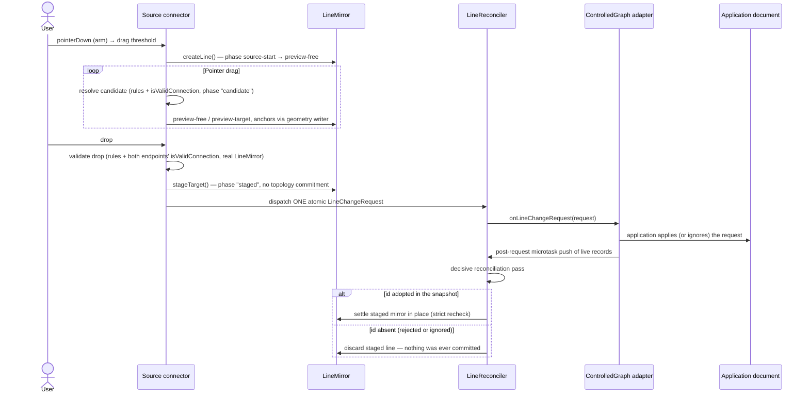
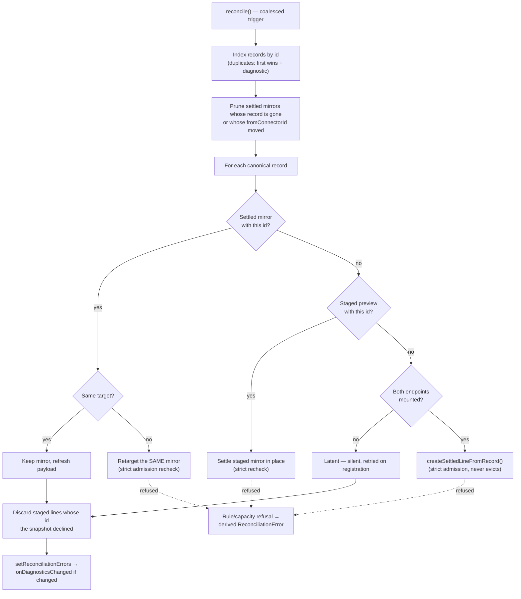

# SnapLine current architecture

Status: describes the post-re-architecture implementation  
Reviewed: 2026-07-25  
Companions:
[ownership specification](./ownership-specification.md) ·
[migration notes](./migration-notes.md) ·
[planned re-architecture](./planned-rearchitecture.md)

This document describes the SnapLine code as it exists after the
controlled-graph re-architecture. The
[ownership specification](./ownership-specification.md) is the normative
contract this implementation conforms to; the
[migration notes](./migration-notes.md) cover the API delta for upgraders.

## Executive summary

Topology — which nodes, connectors, and lines exist — is **always
controlled**: the application document is the single source of truth, and
there is no uncontrolled topology mode (vanilla consumers own the graph with
a plain graph-owner module driving the same contract). SnapLine maintains an
engine-scoped runtime mirror of that document plus everything the document
does not need to contain: gestures, geometry, selection, and groups. User
gestures never mutate settled topology locally; each gesture proposes one
atomic `LineChangeRequest` that the application accepts, normalizes, or
rejects by updating its records. Position and size stay SnapLine-owned —
geometry is a visual cue, observed (not negotiated) through one batched
`onGeometryChanged` callback.

| Layer                       | Responsibility                                                                                                 |
| --------------------------- | -------------------------------------------------------------------------------------------------------------- |
| Application/framework state | Canonical document: node/connector collections and the `LineRecord[]` line list; applies change requests        |
| React/Svelte adapters       | Mount/destroy mirrors from collections, push canonical snapshots, render DOM, forward requests and observations |
| SnapLine core               | Runtime mirrors, gesture mechanics, the line reconciler, selection, geometry, grouping, connector rules         |
| SnapEngine core             | Object lifecycle, input routing, collision, transforms, frame scheduling, camera coordinates                    |

Node and connector **existence** is framework-mount-led: mounting a
`<Node>`/`<Connector>` constructs the mirror, unmounting destroys it. Line
**existence** is record-led: `attachControlledGraph()` installs a
`LineReconciler` that converges settled `LineMirror`s onto the cached
canonical `{ lines: LineRecord[] }` snapshot. Every mirror carries a stable
domain id (`nodeId` / `connectorId` / `lineId`), supplied via `id`
props/config or minted (`node-42`-style) for the mirror's lifetime.

## Layer and data flow



"Mirror" is the load-bearing word: runtime objects carry interaction and
geometry state the document does not need, but their existence follows the
application's records and mounted components.

## Entity lifecycles

### Nodes and connectors (framework-mount-led)

1. The adapter renders a `Node`/`Connector` from application state and
   constructs the mirror; the constructor registers it with the engine's
   `GraphMirror` under its domain id (`config.id` or minted).
2. The adapter assigns the committed DOM element and calls
   `remeasureDomGeometry()` (nodes) / relies on the connector's scheduled
   local-center measurement. A connector may stay headless (virtual) and use
   surface strategies for hit testing and anchors.
3. Connector registration schedules a reconciliation pass — a newly mounted
   endpoint may make a latent canonical line representable.
4. On unmount, `destroy()` unregisters the mirror; connector/node teardown
   removes incident line mirrors with reason `"teardown"` and never emits a
   document-deletion request (the canonical record stays latent).

Connector policy updates in place through `updateConfig()`; `name` is a
construction-time key in the parent node's map. `bindElement()` attaches or
detaches the optional visible port without destroying the logical connector.

### Lines: the controlled protocol

The application owns `LineRecord`s:

```ts
interface LineRecord {
  id: LineId;
  fromConnectorId: ConnectorId;
  toConnectorId: ConnectorId;
  payload?: unknown;
}
```

`attachControlledGraph(engine, { onLineChangeRequest, onDiagnosticsChanged? })`
installs the engine's `LineReconciler` and returns
`{ setCanonicalGraph, flush, dispose }`. Canonical state is **pushed and
cached**: `setCanonicalGraph({ lines })` stores the snapshot and schedules one
coalesced pass. Internal triggers (connector register/unregister, batch
close, request dispatch) replay the cached snapshot — reconciliation never
pulls from the application.

The gesture flow, end to end:



Key properties:

- **One atomic request per gesture.**
  `{ intent: "connect" | "disconnect" | "replace" | "reconnect", add:
  ProposedLine[], remove: LineId[], update: LineEndpointUpdate[] }`. A
  gesture-created line carries a SnapLine-minted `lineId` in `add`; a
  reconnect arrives as an `update` of the existing id; capacity evictions on
  a `replace-oldest` target ride the same request as `remove` entries
  (intent `"replace"`) — never local deletes.
- **Staging, not optimism.** The drop stages the outcome on the same mirror
  (phase `"staged"`); the line is not in the target's incoming list and not
  in the settled index. A gesture disconnect stages the detached line and
  proposes `remove`; a rejected removal re-glues it from the unchanged
  document.
- **Adapters guarantee a post-request push.** Both `ControlledGraph`
  components queue `setCanonicalGraph` with the live records in a microtask
  ahead of the decisive pass, so acceptance, normalization, rejection, and
  rejection-by-inaction all resolve from the next snapshot — rejection needs
  no code path.
- **Gestures are serial.** One in-flight request per engine
  (`GraphMirror.pendingGestureRequest`); a second dispatch before the pass
  warns about a stalled adapter push.
- **No graph owner, no gesture.** A drop on an engine without an attached
  reconciler warns and discards the preview — there is no document to
  propose to.

### The reconcile pass

`LineReconciler.reconcile()` is one idempotent pass over the cached snapshot.
It is read-only with respect to canonical state: it never emits a request and
never rewrites, reorders, or deletes records.



Identity is stable across the pass: a `toConnectorId` change **retargets the
same mirror**; a `fromConnectorId` change recreates under the same id (a
line's start connector is fixed at construction). A mid-drag preview leaves
its record latent. Records the mirror cannot represent are never evicted or
rewritten — unmounted endpoints are silently latent and retried; rule or
capacity violations become structured diagnostics.

## ConnectorRules and admission

```ts
interface ConnectorRules {
  maxOutgoing: number | "unlimited"; // default "unlimited"; 0 = target-only
  maxIncoming: number | "unlimited"; // default 1; 0 = source-only
  reconnect: boolean;                // default true
  allowParallel: boolean;            // default false; BOTH endpoints must allow
  onFull: "reject" | "replace-oldest"; // default "reject"
  isValidConnection?: (proposal: ConnectionProposal) => boolean;
}
```

Limits normalize to numbers internally (`"unlimited"` → `Infinity`), and the
roles are derived: `isSource` = `maxOutgoing !== 0`, `isTarget` =
`maxIncoming !== 0`. `isValidConnection` is line-aware —
`{ line, source, target, phase: "candidate" | "drop" }` — synchronous and
side-effect free (candidate discovery calls it per pointer move), and either
endpoint may veto.

Two admission paths share the structural rules but differ in policy:

- **Gesture admission** (candidate discovery and drop): a full
  `replace-oldest` target still admits — the evictions ride the request.
- **Record admission** (create/retarget/settle from canonical records):
  strict — capacity never evicts regardless of `onFull`, and refusal returns
  a diagnostic code (`"capacity-exceeded"` / `"connection-rejected"`)
  instead of throwing.

`canConnect(target, line?)` remains public as a read-only admission query.

## Geometry ownership

Position and size are SnapLine-owned visual cues; live and settled geometry
never round-trip the framework:

- During a drag, core mutates `worldTransform` and writes DOM transforms in
  scheduled frame stages; group/multi-select drags move every drag root.
- During a resize, core clamps, updates collision state, writes
  width/height, remeasures connector centers, and re-glues lines
  (`WRITE_1 → READ_2 → WRITE_2`). `onSizeChange` is the live observation.
- One batched **`onGeometryChanged({ nodes: [{ node, x, y, width, height }] })`**
  fires per settled gesture: a group or multi-select drag reports every
  moved node in one event; a resize reports a single entry. The application
  may persist the observation; ignoring it never reverts the mirror.
- Line, selection, and placement geometry use single-owner
  `bindGeometryWriter()` bindings that mutate retained SVG/DOM without
  framework state; `onStateChange` carries semantic line state separately.

## Selection and groups

Selection is logically SnapLine-owned — core behaviors such as multi-node
dragging need the selected set synchronously — and **engine-scoped** on
`GraphMirror.selection`. `setSelected()` maintains the list, writes
`data-selected`/`data-snapline-state`, and emits `onSelectionChange`. The
framework is the visual owner; the consumer supplies pointer policy through
`resolveSelectionMode` (SnapLine owns no modifier keys). `RectSelectController`
owns the rubber-band gesture.

Group membership is SnapLine-derived interaction state, computed from
measured geometry: ordinary nodes use center containment, nested groups
require full-bounds containment, the smallest eligible group wins by default,
a per-engine `membershipResolver` may override, and cycles are rejected.
Group drags carry members by transform parenting only — never DOM
reparenting, never selection mutation. Membership refreshes when a drag or
resize settles.

## Registries

### GraphMirror (per engine)

`getGraphMirror(engine)` lazy-creates the engine-scoped registry the first
time any mirror registers (constructors register, `destroy()` unregisters —
no adapter wiring). It holds:

- live sets: nodes, connectors; settled lines and preview lines separately
  (every line starts as a preview; `settleLine`/`unsettleLine` move it);
- domain-id indexes `nodesById` / `connectorsById` / `linesById` with a
  **first-registration-wins** duplicate policy — a duplicate id never steals
  the index entry; it stays unindexed with a `"duplicate-id"` diagnostic
  until the conflict resolves, then promotes;
- engine-scoped interaction state: `selection`, `groups`, `resizingNode`,
  `parentGroups`, `membershipResolver`;
- the `reconciler` slot (installed by `attachControlledGraph`) and the
  coalescing reconciliation scheduler.

Connector candidate discovery and public queries both read this registry —
there is one enumeration mechanism.

### query(engine)

`query(engine)` returns the read-only `GraphQuery` facade:
`nodes() / connectors() / groups() / lines()` snapshots, `node(id) /
connector(id) / line(id)` domain-id lookups, and `diagnostics()`. It returns
live mirrors (whose own mutation surface is constrained separately) and never
exposes registry sets, topology arrays, or mutation methods. The standalone
`getNodes` / `getConnectors` / `getGroupNodes` / `getSelectedNodes` helpers
delegate to the same registry.

### What stays on global.data, and why

`SnapLineSharedData` (typed by `snapline-globals.ts`) now holds only:

- `resizeHandles` and `sourceSurfaces` — engine core's `input.ts` duck-reads
  these to route pointerdowns to resize hitboxes and headless source
  surfaces (engine core cannot import snapline, so the contract is
  structural and lives on the shared bag);
- the `graphMirrors` WeakMap keying each engine to its `GraphMirror`
  (GlobalManager is application-wide; the WeakMap lets a destroyed engine
  release its registry);
- the deprecated `allowCameraControl` boolean for third-party camera
  writers (in-repo gesture owners use `engine.input.claimPointer()`).

## Scheduler and batching

All reconciliation triggers funnel through
`GraphMirror.scheduleReconciliation()`: one microtask pass per burst, so a
bulk mount of 100 nodes runs one pass, not one per connector.
`beginBatch()` opens a nestable bulk boundary — no partial pass runs until
the outermost idempotent `end()`, which schedules one final pass if anything
went dirty; `runBatch(fn)` is the exception-safe scoped form. `flush()`
(exposed on the `ControlledGraphHandle`) runs any pending or batch-deferred
pass synchronously for vanilla consumers and tests. Gesture dispatch
schedules the decisive pass behind the adapter's post-request push
microtask.

## Diagnostics

Diagnostics are **derived, non-throwing state**: entries drop out when their
cause resolves. `ReconciliationError` carries a code (`"duplicate-id"`,
`"missing-node"`, `"missing-connector"`, `"capacity-exceeded"`,
`"connection-rejected"`, `"identity-changed"`, `"unrepresentable-line"`),
the offending domain ids, and a message. Sources:

- registry duplicate-id conflicts (nodes, connectors, settled lines);
- per-pass reconciliation errors: duplicate record ids in a snapshot, and
  records refused by strict admission (preserved but unrepresented).

They surface through `query(engine).diagnostics()` and through
`onDiagnosticsChanged`, which fires only when the set actually changes.
Unmounted endpoints are deliberately **not** diagnostics — a latent record is
normal during progressive mount.

## Public API surface

The packages export raw TypeScript source and are pre-1.0.

### Root exports (`@snap-engine/snapline`)

| Family | Exports |
| --- | --- |
| Mirrors | `NodeMirror`, `ConnectorMirror`, `LineMirror`, `GroupNodeMirror` |
| Controllers | `RectSelectController`, `PlacementController` |
| Controlled graph | `attachControlledGraph`; types `LineRecord`, `CanonicalGraphSnapshot`, `LineChangeRequest`, `ProposedLine`, `LineEndpointUpdate`, `ControlledGraphCallbacks`, `ControlledGraphHandle` |
| Identity/diagnostics | types `NodeId`, `ConnectorId`, `LineId`, `ReconciliationError`, `GraphBatch` |
| Queries | `query` (+ `GraphQuery`), `getNodes`, `getConnectors`, `getGroupNodes`, `getSelectedNodes`, `getParentGroup`, `setGroupMembershipResolver`, `resolveConnectorSourceAtPoint` |
| Config/callback types | `NodeConfig`/`NodeCallbacks` (incl. `GeometryChangeEvent`), `ConnectorConfig`/`ConnectorRules`/`ConnectorCallbacks`/`ConnectionProposal`, line/group/select/placement types |

Package subpaths: `./node`, `./connector`, `./line`, `./select`, `./group`,
`./placement`, `./query`, `./graph-mirror`, `./line-reconciler`,
`./geometry`.

There is **no imperative public topology API**: `deleteLine()`,
`deleteAllLines()`, `disconnectFromConnector()`, `createLine()`, and the
record-driven settle/retarget/discard methods are `@internal`
(reconciler/teardown-only), and connecting two connectors imperatively is
not possible — applications create and remove lines by changing their
records. `GraphMirror` and `LineReconciler` are internal classes reached
only through `attachControlledGraph` and `query`. `LineMirror` state is
getter-backed: `start`, `target`, `payload`, `phase`, `candidate`, and
anchors are read-only publicly, and `LineMirrorPhase` is
`source-start | preview-free | preview-target | drop | staged | connected`.

### Adapters

Svelte (`@snap-engine/snapline-svelte`) and React
(`@snap-engine/snapline-react`) export `Node`, `Group`, `Connector`, `Line`,
`Select`, `Placement`, and **`ControlledGraph`** (React additionally exports
the asset-base `Engine`, `NodeMirrorContext`, `useNodeHandle`, and prop/ref
types). Adapter contracts:

- `Node`/`Group` take `id` props (stable domain identity);
- line lists key by `lineId`; `Line` renders `data-line-id`; SVG markers use
  `arrow-${lineId}`;
- `ControlledGraph` takes `{ lines, onLineChangeRequest,
  onDiagnosticsChanged? }` and implements the guaranteed post-request push;
- supplied core objects are not destroyed on unmount; adapter-created
  objects are.

## Ownership matrix

| Data or resource              | Owner                          | Notes                                                                  |
| ----------------------------- | ------------------------------ | ---------------------------------------------------------------------- |
| Domain node/connector records | Application/framework          | Expressed by mounting components with stable `id` props                |
| Canonical line records        | Application                    | `LineRecord[]` pushed via `setCanonicalGraph`; SnapLine never edits it  |
| Mounted mirrors               | Framework lifecycle            | Constructors register with `GraphMirror`; `destroy()` unregisters       |
| Settled line mirrors          | LineReconciler                 | Derived from records; preserved by stable `lineId`                      |
| Preview/staged lines          | SnapLine gesture               | Ephemeral; staged outcome awaits the canonical decision                 |
| Gesture outcome               | Application                    | One atomic `LineChangeRequest`; adopt the proposed id to settle in place |
| Node/connector/line DOM       | React/Svelte adapter           | Core writes transforms/`data-*` on existing elements only               |
| Live + settled geometry       | SnapLine                       | Observed via batched `onGeometryChanged`; never round-trips             |
| Connector policy              | Application config             | `ConnectorRules` + surface strategies, copied into the mirror           |
| Selection                     | SnapLine, engine-scoped        | Framework owns visuals and pointer policy                               |
| Group membership              | SnapLine derived state         | Computed from measured geometry; resolver overridable                   |
| Diagnostics                   | SnapLine derived state         | Structured, non-throwing, auto-clearing                                 |

## Source map

| Concern                                  | Primary implementation                          |
| ---------------------------------------- | ----------------------------------------------- |
| Public exports                           | `assets/snapline/core/src/index.ts`             |
| Engine-scoped registry, ids, scheduler   | `assets/snapline/core/src/graph-mirror.ts`      |
| Controlled line reconciliation, records  | `assets/snapline/core/src/line-reconciler.ts`   |
| Connector rules, gestures, admission     | `assets/snapline/core/src/connector.ts`         |
| Node lifecycle, drag/resize, geometry    | `assets/snapline/core/src/node.ts`              |
| Line state, phases, anchors              | `assets/snapline/core/src/line.ts`              |
| Groups and membership                    | `assets/snapline/core/src/group.ts`             |
| Rectangle selection                      | `assets/snapline/core/src/select.ts`            |
| Placement state machine                  | `assets/snapline/core/src/placement.ts`         |
| Read-only query facade                   | `assets/snapline/core/src/query.ts`             |
| Shared global.data + attachControlledGraph | `assets/snapline/core/src/snapline-globals.ts` |
| Geometry writer type                     | `assets/snapline/core/src/geometry.ts`          |
| Svelte adapters (incl. ControlledGraph)  | `assets/snapline/svelte/src/*.svelte`           |
| React adapters (incl. ControlledGraph)   | `assets/snapline/react/src/*.tsx`               |
| Controlled-graph demos                   | `demo/svelte/src/demo/node_ui_edges/`, `demo/react/` |
| Unit tests                               | `tests/ut/snapline-graph-mirror.spec.ts`, `tests/ut/snapline-line-reconciler.spec.ts`, `tests/ut/snapline-connector-config.spec.ts` |
| Browser tests                            | `tests/e2e/snapline-edges.spec.ts`, `tests/e2e/snapline-edges-react.spec.ts` |
