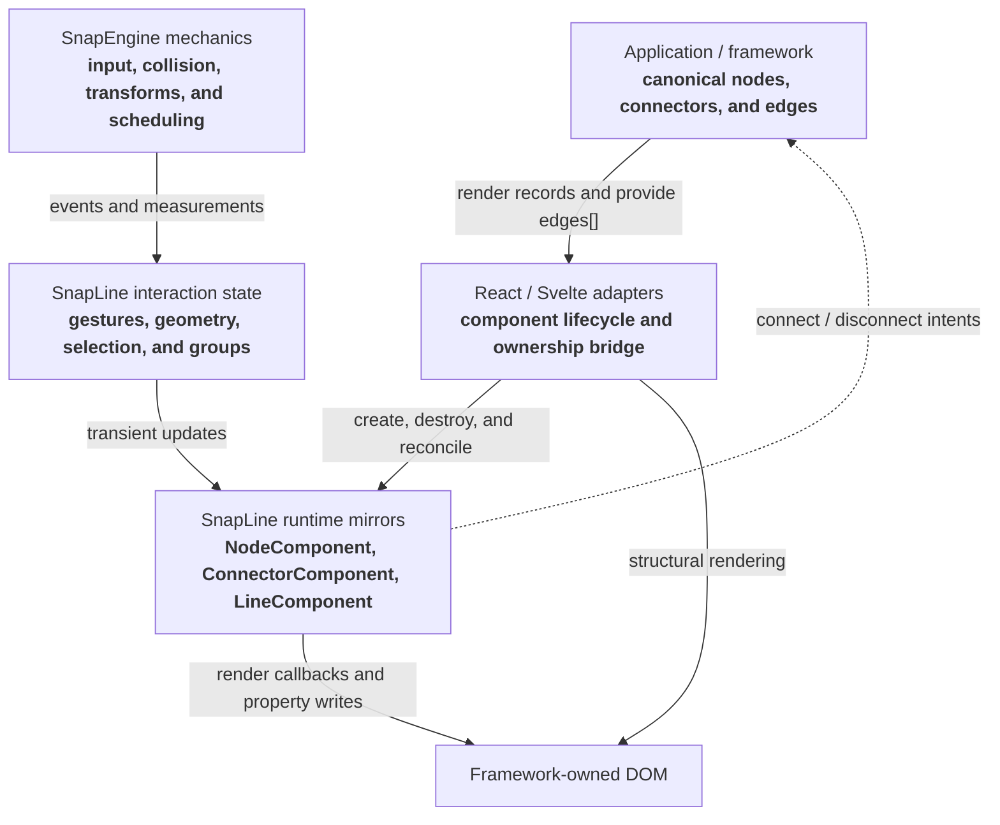
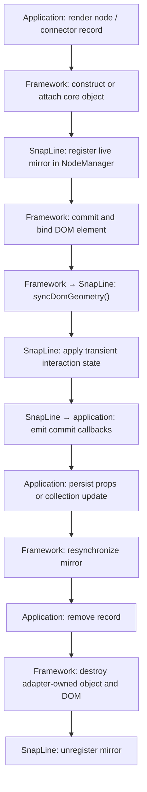
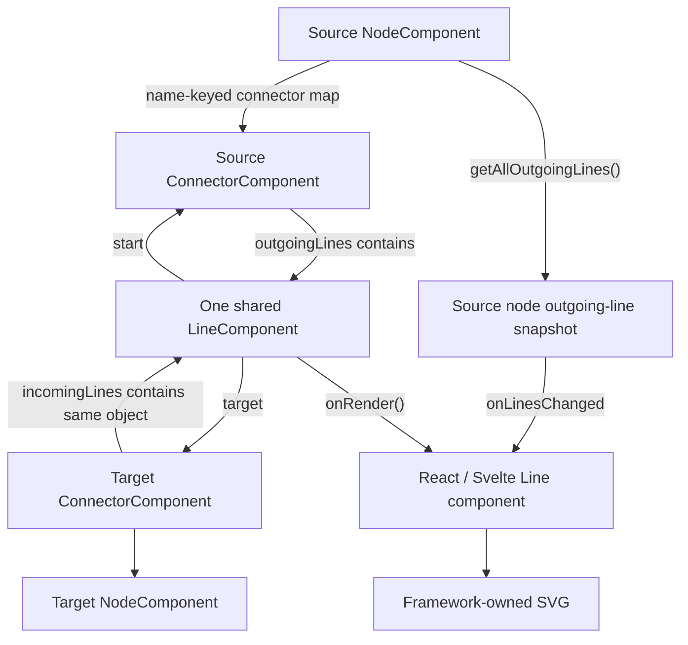
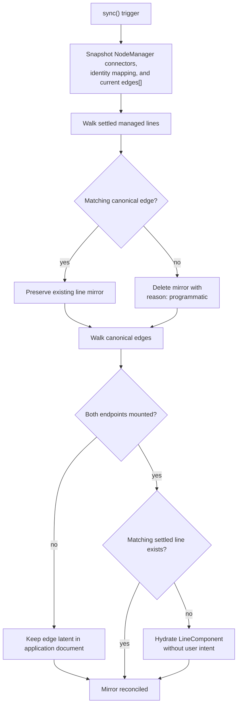
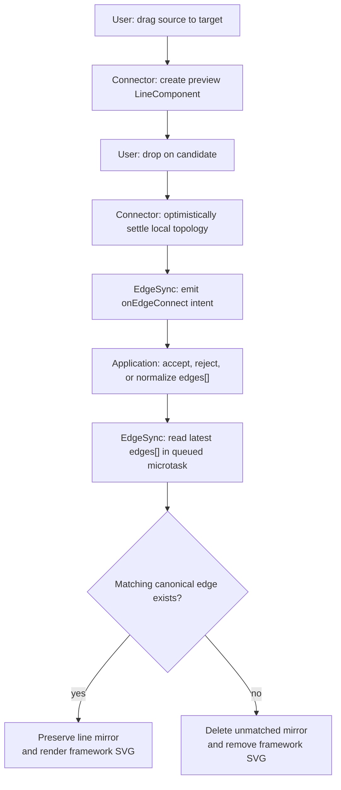
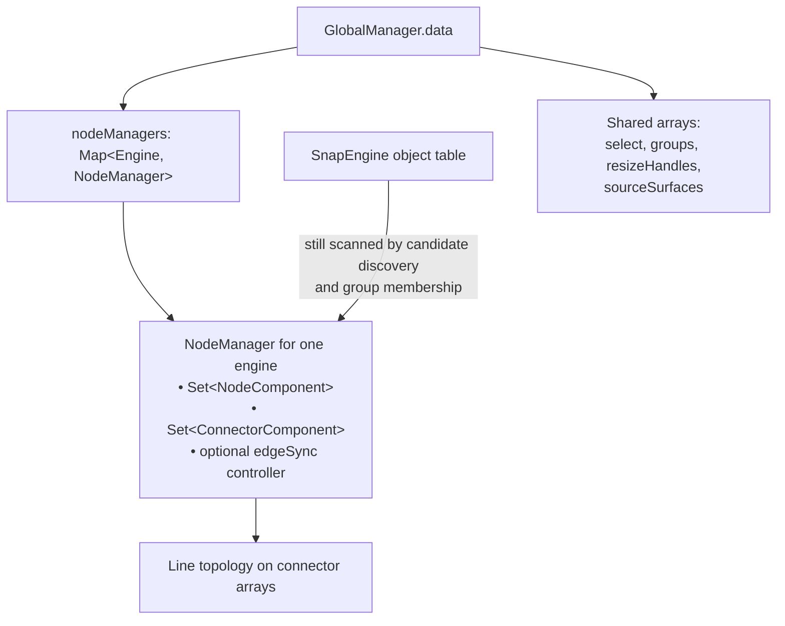
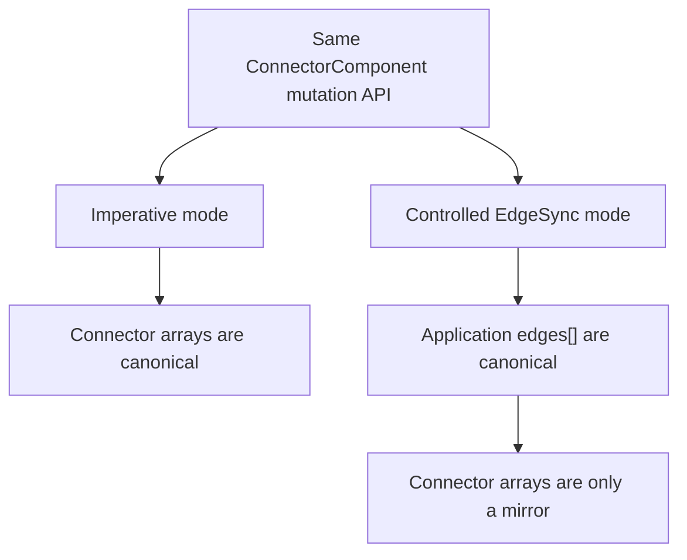

# SnapLine current architecture

Status: review baseline  
Reviewed: 2026-07-25  
Repository baseline: `29373b4`, including the current uncommitted SnapLine work

This document describes the SnapLine code as it exists in the current working
tree. It is descriptive, not an endorsement of every current boundary. The
companion [ownership specification](./ownership-specification.md) turns the
desired framework-owned model into a proposed normative contract.

## Executive summary

SnapLine currently has four layers:

| Layer                       | Current responsibility                                                                                 |
| --------------------------- | ------------------------------------------------------------------------------------------------------ |
| Application/framework state | Renders node and connector collections; may own an `EdgeLike[]` document                               |
| React/Svelte adapters       | Create and destroy core objects, render DOM, and translate callbacks into framework updates            |
| SnapLine core               | Handles gestures, selection, geometry, grouping, connector policy, line objects, and mirror registries |
| SnapEngine core             | Provides object lifecycle, input routing, collision, transforms, scheduling, and camera coordinates    |

Node and connector **existence** is already framework-led: mounting a
`<Node>` or `<Connector>` creates a core object and unmounting it destroys the
owned object. `NodeManager` mirrors the live core instances for queries and
edge reconciliation.

Line ownership is transitional:

- Without `EdgeSyncController`, connector topology is authoritative.
  `ConnectorComponent.connectToConnector()`, connection gestures, and
  `deleteLine()` directly create and destroy `LineComponent` objects.
- With `EdgeSyncController`, an application `EdgeLike[]` is treated as
  canonical. SnapLine still creates and owns the `LineComponent` instances,
  but `sync()` reconciles them to the application edge list and gesture
  mutations are reported as application intents.

That means the current package supports both an imperative topology model and
a controlled-edge model at the same time. Most of the design ambiguity comes
from the overlap between those modes.

## Layer and data flow



The word “mirror” is important. Core objects contain interaction and geometry
state that domain records do not need to contain, but their existence should
follow the application records when the controlled model is in use.

## Entity lifecycle



### Nodes

1. A React or Svelte `Node` adapter is rendered from application state.
2. The adapter either accepts a supplied `NodeComponent` or constructs one.
3. The constructor registers the node with SnapEngine and the per-engine
   `NodeManager`.
4. The adapter assigns the committed DOM element, sets the world transform,
   and calls `syncDomGeometry()`.
5. During a drag, core mutates `worldTransform` immediately and writes the DOM
   transform. `onDragCommit` reports final positions for persistence.
6. During resize, core updates collision state and fires `onSizeChange`; the
   adapter renders width and height. `onResizeCommit` reports the settled box.
7. On unmount, an adapter-owned node is destroyed and unregistered.

The framework controls whether a node is mounted, but live position is locally
owned by core during a gesture. The `x`, `y`, `width`, and `height` props can
resynchronize core, although unchanged props do not by themselves reject and
revert a completed local drag.

### Connectors

1. A connector is rendered inside a node.
2. The adapter constructs or accepts a `ConnectorComponent`.
3. `NodeComponent.addConnectorObject()` calls `assignToNode()`, which stores
   the connector in the node’s name-keyed `_connectors` map and shares the
   node property bag.
4. The constructor also registers the connector in `NodeManager`.
5. Connector policy and presentation-related configuration are updated in
   place through `updateConfig()`.
6. A visible connector binds a DOM element; a virtual connector remains a
   logical object and uses surface strategies for hit testing and anchors.
7. Destroying a connector removes all of its incoming and outgoing line
   mirrors, unregisters it, and removes it from the parent map.

Connector existence therefore follows framework rendering. Connector
configuration is copied into the core mirror. The connector’s `name` is a
construction-time key; metadata is currently the common place to carry domain
node/port identity.

### Lines

Lines are not registered in `NodeManager`. They are organized as topology on
connectors:

- the source connector holds the line in `outgoingLines`;
- the target connector holds the same object in `incomingLines`;
- `LineComponent.start` points to the source;
- `LineComponent.target` points to the target, or is `null` for a preview;
- the source node exposes the flattened outgoing list to its adapter.

The source node adapter renders one framework `Line` component per outgoing
`LineComponent`. `onLinesChanged` copies the latest source list into React or
Svelte state, so framework reconciliation owns the SVG DOM while SnapLine owns
the list being mirrored.

A line also carries transient rendering state: anchors, phase, candidate,
preview position, optional payload, and render subscriptions.



### Groups

`GroupNodeComponent` extends `NodeComponent`. Groups are also kept in the
shared `global.data.groups` list.

Membership is derived from measured geometry:

- ordinary nodes use center containment;
- nested groups require full-bounds containment;
- the smallest eligible group wins by default;
- a per-engine resolver may choose another eligible parent or no parent;
- membership cycles are rejected;
- group drag temporarily reparents transforms, not DOM.

Group membership is therefore SnapLine-derived interaction state, not a
framework graph-document relation in the current design.

### Selection

Selection is stored in `global.data.select`. `NodeComponent.setSelected()`
updates that list, writes `data-selected`/`data-snapline-state`, and emits a
selection callback. `RectSelectComponent` owns the selection gesture and
collision box, while the framework adapter renders the visible rubber-band
rectangle from `onRectChange`.

Selection is not currently a controlled framework prop.

## Controlled edge reconciliation

`EdgeSyncController` is the current implementation of application-owned edge
existence.

### Inputs

```ts
interface EdgeSyncConfig {
  engine: EngineLike;
  identity(connector: ConnectorComponent): EdgeEndpoint | null;
  getEdges(): readonly EdgeLike[];
  callbacks?: {
    onEdgeConnect?(event: EdgeConnectIntentEvent): void;
    onEdgeDisconnect?(event: EdgeDisconnectIntentEvent): void;
  };
}
```

`identity()` maps a live connector mirror to `{ node, port }`. Returning
`null` makes that connector and its lines unmanaged by the controller.

`getEdges()` is consulted fresh for every `sync()`. The controller does not
store a second edge document.

### Reconciliation algorithm

On `sync()`:

1. Snapshot all registered connectors.
2. Resolve each managed connector to an endpoint key.
3. Snapshot the application edge list.
4. Delete settled managed lines whose endpoint pair is absent from the
   application list.
5. Leave preview lines and unmanaged lines untouched.
6. For every application edge whose endpoints are mounted, hydrate a missing
   line with `connectToConnector({ origin: "hydration" })`.
7. Leave edges with unmounted endpoints latent until a later sync.



Connector registration asks the active controller to reconcile in a
microtask, allowing latent document edges to rehydrate when endpoints mount.
Connector teardown deletes line mirrors with reason `"teardown"` but does not
ask the application to delete its edge record.

### Gesture connect

1. Pointer-down arms a connector.
2. Crossing the drag threshold creates a preview `LineComponent` and adds it
   to the source’s outgoing list.
3. Dropping on a candidate calls the legacy `onConnectionRequest` seam.
4. If allowed, `connectToConnector({ origin: "gesture" })` commits the local
   topology.
5. Connector callbacks fire.
6. The active `EdgeSyncController` emits `onEdgeConnect`.
7. The application is expected to update its edge document synchronously.
8. The adapter queues `sync()` in a microtask. Accepted lines remain; rejected
   lines are removed before the next paint when state updates synchronously.



### Gesture disconnect and replacement

Picking up an existing connection detaches it locally and emits a gesture
disconnect intent. Connecting to a full finite-capacity target deletes the
oldest required incoming lines with reason `"replacement"` before committing
the new line. The current controlled demo updates the document from the
disconnect and connect callbacks in that order.

Replacement is therefore exposed as multiple ordered intents rather than one
atomic application transaction.

## Current ownership matrix

| Data or resource              | Current owner                            | Notes                                                                     |
| ----------------------------- | ---------------------------------------- | ------------------------------------------------------------------------- |
| Domain node records           | Application/framework                    | SnapLine does not define node factories or node types                     |
| Mounted node instances        | Framework lifecycle + core mirror        | Adapter creates/destroys `NodeComponent`                                  |
| Domain connector/port records | Application/framework                    | Usually expressed by connector children                                   |
| Mounted connector instances   | Framework lifecycle + core mirror        | Stored in `NodeManager` and the parent node map                           |
| Domain edges                  | Application only when `EdgeSync` is used | Otherwise no separate domain edge source is required                      |
| Settled line topology         | Connector arrays                         | Derived from `edges` in controlled mode; authoritative in imperative mode |
| Preview line                  | SnapLine                                 | Ephemeral gesture state, not a domain edge                                |
| Node/connector/line DOM       | React/Svelte adapter                     | Core never structurally inserts, removes, or reparents framework DOM      |
| Node live transform           | SnapLine during interaction              | Framework geometry props can resynchronize it                             |
| Node persisted transform      | Application by convention                | Reported through drag commit callbacks                                    |
| Node size DOM                 | Framework adapter                        | Core keeps collision size and emits size callbacks                        |
| Connector geometry            | SnapLine                                 | Measured/cached from node and optional connector DOM                      |
| Line geometry and anchors     | SnapLine                                 | Adapter subscribes through `line.onRender()`                              |
| Selection                     | SnapLine shared state                    | Framework receives callbacks; not controlled                              |
| Group membership              | SnapLine derived state                   | Framework receives deltas                                                 |
| Connector policy              | Application config copied into core      | `canConnect`, capabilities, strategies, metadata                          |
| Property propagation          | SnapLine                                 | Legacy name-keyed node property graph                                     |

## Registries and organization

### SnapEngine object table

All `BaseObject`/`ElementObject` instances also participate in SnapEngine’s
general object table. Some SnapLine code still scans that table:

- connector candidate discovery;
- group membership node enumeration.

### `NodeManager`

`NodeManager` is lazy and per engine. It contains:

- a `Set<NodeComponent>`;
- a `Set<ConnectorComponent>`;
- the optional active `edgeSync` controller.

The public `getNodes()`, `getConnectors()`, and `getGroupNodes()` helpers now
delegate to this registry. Registration-order snapshots are returned as
copies.

`NodeManager` does not currently track:

- lines;
- semantic IDs;
- domain records;
- selection;
- group membership;
- ownership of supplied versus adapter-created objects.

### Shared `global.data`

`snapline-globals.ts` types the SnapLine fields on SnapEngine’s shared data bag:

- `select`;
- `groups`;
- `resizeHandles`;
- `sourceSurfaces`;
- `resizingNode`;
- deprecated `allowCameraControl`;
- the per-engine `nodeManagers` map.

The manager is engine-keyed, but several other lists are shared arrays and
must be filtered by engine at their use sites. Selection currently has no
engine-keyed container.



## Public API surface

The package exports raw TypeScript source and is still pre-1.0. The root entry
point currently exports the following API families.

### Core objects

| Export                   | Main public role                                                         |
| ------------------------ | ------------------------------------------------------------------------ |
| `NodeComponent`          | Node geometry, selection, resize, connector lookup, property propagation |
| `ConnectorComponent`     | Port policy, hit testing, gestures, topology mutation, geometry          |
| `LineComponent`          | Line endpoints, phase, anchors, payload, render subscription             |
| `GroupNodeComponent`     | Derived membership and recursive group carry                             |
| `RectSelectComponent`    | Rectangle selection state machine                                        |
| `PlacementController<T>` | Headless placement preview/commit state machine                          |
| `NodeManager`            | Live node/connector registry and edge-sync attachment                    |
| `EdgeSyncController`     | Reconciles connector line mirrors to application edges                   |

### Queries and policy helpers

- `getNodes(engine)`
- `getConnectors(engine)`
- `getGroupNodes(engine)`
- `getSelectedNodes(engine)`
- `getParentGroup(node)`
- `setGroupMembershipResolver(engine, resolver)`
- `resolveConnectorSourceAtPoint(engine, position, node?)`
- `getNodeManager(engine)`

### Important node configuration and callbacks

`NodeConfig` covers position locking, resizing, minimum size, resize handles,
metadata, callbacks, and edge-pan behavior.

`NodeCallbacks` exposes:

- drag authorization and position resolution;
- selection-mode resolution;
- drag start/live/commit;
- selection changes;
- size, resize-handle, and resize-commit events;
- outgoing line-list changes.

Notable callable methods include `setSelected()`, `registerDragHandle()`,
`syncDomGeometry()`, `setSizeState()`, `setSize()`, connector lookup,
incoming/outgoing line queries, property propagation, and `destroy()`.

### Important connector configuration and callbacks

`ConnectorConfig` includes:

- construction-time `name`;
- legacy `maxConnectors` and `allowDragOut`;
- independent source/target/reconnect/parallel capabilities;
- surface hit-test and anchor strategies;
- line class, collider radius, metadata, callbacks, and edge pan.

`ConnectorCallbacks` exposes connection policy, the legacy
`onConnectionRequest` domain seam, pointer/drag lifecycle, candidate changes,
and connect/disconnect events.

The imperative topology API includes:

- `connectToConnector()`;
- `disconnectFromConnector()`;
- `deleteLine()` and `deleteAllLines()`;
- `createLine()`;
- direct `outgoingLines` and `incomingLines` getters;
- `updateConfig()` and `bindElement()`;
- geometry, hit-test, and anchor-resolution helpers.

### Framework packages

The Svelte package exports:

- `Node`
- `Group`
- `Connector`
- `Line`
- `Select`
- `Placement`
- `EdgeSync`

The React package exports the same component families plus:

- the asset-base `Engine` and engine context helpers;
- `NodeObjectContext`;
- `useNodeHandle()`;
- prop/ref types.

Adapters accept caller-supplied core objects. Supplied objects are not
destroyed on unmount; adapter-created objects are.

## Important design tensions in the current code

These are the main topics to resolve before treating the ownership model as
settled.

### 1. Controlled edges are optional

The same connector mutation methods serve both as the imperative source of
truth and as the implementation detail beneath a controlled mirror. There is
no explicit controlled/uncontrolled mode on an engine or connector, so API
callers must understand which authority model is active.



### 2. Two application edge-creation seams overlap

`ConnectorCallbacks.onConnectionRequest` can create a domain edge and attach a
payload before local connection. `EdgeSync.onEdgeConnect` separately asks the
application to create the canonical edge after local connection. Using both
can duplicate policy or mutation work.

### 3. `EdgeLike` has no edge identity

An edge is identified only by its source and target endpoint pair. As a
result:

- duplicate/parallel domain edges collapse during sync;
- `capabilities.allowParallel` cannot be represented by controlled
  `EdgeLike[]`;
- a hydrated line has no standard stable edge ID or payload;
- disconnect intents identify an endpoint pair, not a specific edge record.

### 4. Hydration still applies connector mutation policy

Document hydration calls `connectToConnector()`, which runs `canConnect`,
parallel checks, and incoming-capacity replacement. A canonical document can
therefore remain unrendered or be reduced/reordered by view-layer policy.
This is a direct question for the ownership specification: are those rules
gesture policy, document validity, or both?

### 5. Topology internals are publicly mutable

The connector returns its actual mutable incoming/outgoing arrays.
`LineComponent.start`, `target`, `payload`, anchors, phase, and candidate are
also public writable fields. `NodeComponent` retains several underscore-named
members that are TypeScript-public. Consumers can bypass lifecycle callbacks
and reconciliation invariants.

### 6. There is no line registry or line query

Nodes and connectors have a central mirror registry; lines are only discoverable
by walking connector arrays or node outgoing lists. This makes engine-wide
topology inspection and invariant checking asymmetric.

### 7. Enumeration has two mechanisms

Public queries use `NodeManager`, while connector target discovery and group
membership still scan SnapEngine’s general object table. The manager is not
yet the single internal organization boundary.

### 8. Engine scoping is inconsistent

`NodeManager` is engine-keyed, but selection and several interaction registries
live directly on application-wide `global.data`. Some readers filter by
engine; selected-node queries currently return the shared selection list.

### 9. Geometry props are cooperative, not strictly controlled

Core mutates transforms during interaction and adapters only rerun geometry
effects when prop values change. If an application rejects a move by leaving
its canonical coordinates unchanged, the mirror is not automatically reverted.

### 10. Package exports lag root exports

`EdgeSync` is exported from the React/Svelte root indexes, but the current
package subpath maps do not expose `./EdgeSync`. The core root exports
`EdgeSyncController`, `NodeManager`, and `getNodeManager`, while its documented
subpath map does not include `./edge-sync` or `./node-manager`.

### 11. Callback composition is not uniform

Node and group adapters compose caller callbacks with adapter callbacks.
Selection adapters directly replace `onRectChange`, which can hide a caller’s
original handler. This is an adapter API consistency issue rather than a graph
ownership issue, but it affects how safely applications observe the mirror.

## Source map

| Concern                        | Primary implementation                         |
| ------------------------------ | ---------------------------------------------- |
| Public exports                 | `assets/snapline/core/src/index.ts`            |
| Node lifecycle and interaction | `assets/snapline/core/src/node.ts`             |
| Connector policy and topology  | `assets/snapline/core/src/connector.ts`        |
| Line state and geometry        | `assets/snapline/core/src/line.ts`             |
| Live node/connector registry   | `assets/snapline/core/src/node-manager.ts`     |
| Controlled edge reconciliation | `assets/snapline/core/src/edge-sync.ts`        |
| Shared registries              | `assets/snapline/core/src/snapline-globals.ts` |
| Engine queries                 | `assets/snapline/core/src/query.ts`            |
| Svelte ownership bridge        | `assets/snapline/svelte/src/*.svelte`          |
| React ownership bridge         | `assets/snapline/react/src/*.tsx`              |
| Controlled-edge example        | `demo/svelte/src/demo/node_ui_edges/`          |
| Controlled-edge browser tests  | `tests/e2e/snapline-edges.spec.ts`             |
