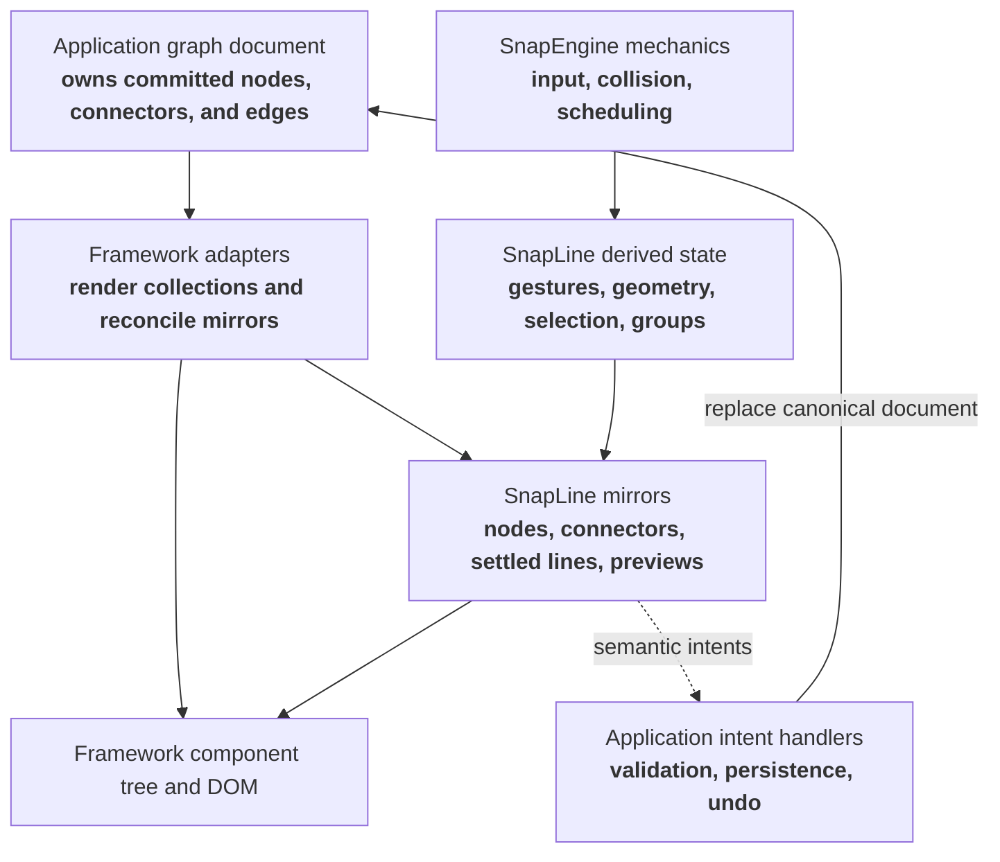
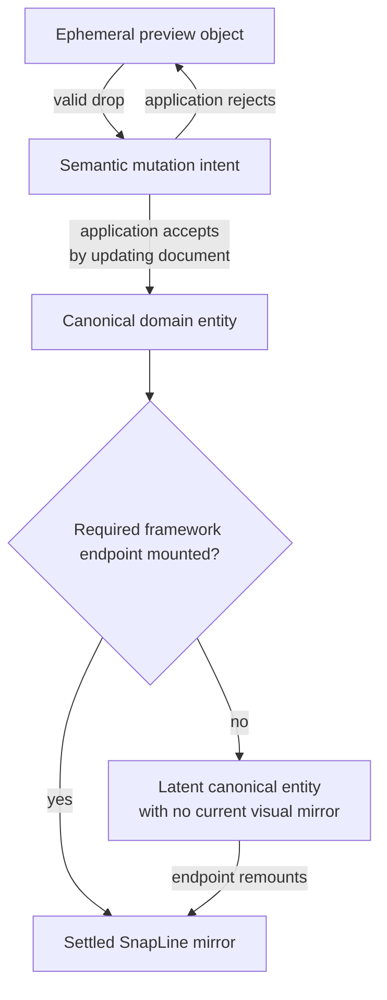
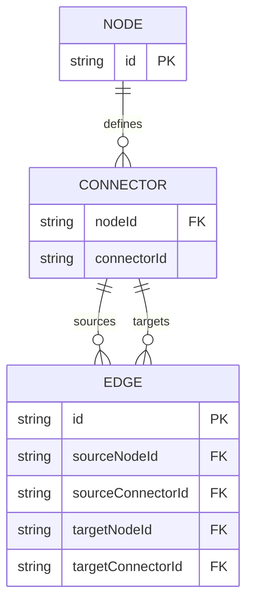
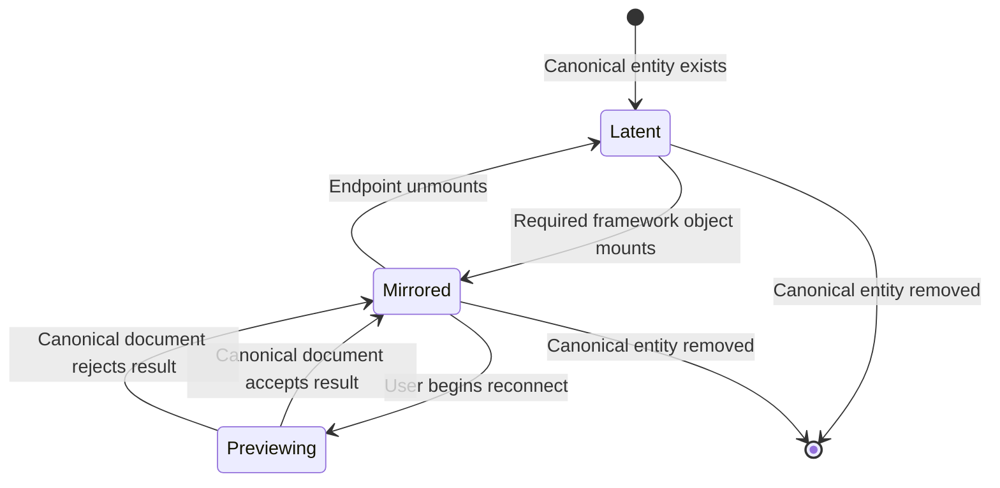
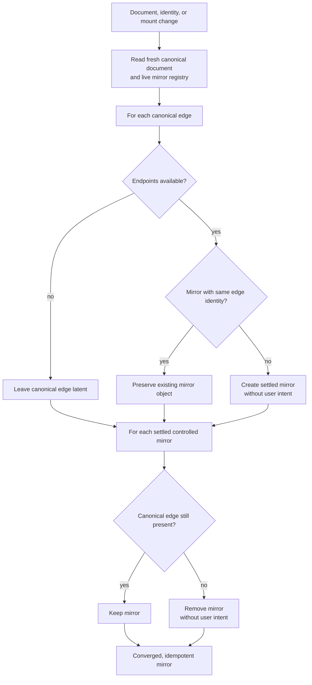
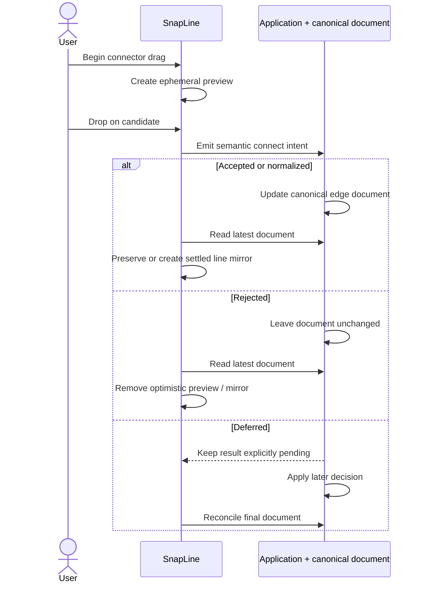
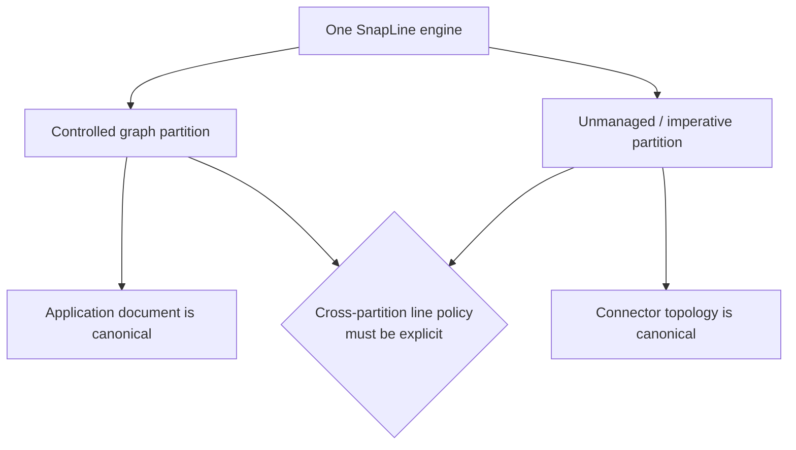

# SnapLine framework ownership specification

Status: proposed review specification  
Reviewed: 2026-07-25  
Companion: [current architecture](./current-architecture.md)

This document proposes the ownership contract implied by the project
direction:

> The application/framework owns the source of truth for which nodes,
> connectors, and edges exist. SnapLine maintains runtime mirrors for input,
> geometry, organization, and rendering.

The requirements use **MUST**, **SHOULD**, and **MAY** in their usual normative
sense. Items under “Open decisions” are intentionally not settled yet.

## Goals

1. Make graph-document authority unambiguous.
2. Let React, Svelte, and vanilla applications use the same core semantics.
3. Keep SnapLine responsible for interaction mechanics rather than domain
   storage.
4. Allow optimistic, responsive gestures without turning transient state into
   canonical graph state.
5. Make mount, unmount, rejection, remount, and document replacement
   deterministic.
6. Keep structural DOM framework-owned.



## Non-goals

SnapLine does not need to define:

- application node types or factories;
- palette contents;
- graph serialization format beyond the identity needed by the mirror;
- business validation or port type systems;
- node labels, edge labels, or application styling;
- undo/redo history;
- collaboration or persistence;
- framework collection mutation.

## Terminology

### Domain document

Application-owned records describing the graph. At minimum, the document can
answer:

- which node IDs exist;
- which connector IDs exist for each node;
- which edge IDs and endpoint pairs exist.

### Mirror object

A SnapLine runtime object associated with a domain entity:

- `NodeComponent`;
- `ConnectorComponent`;
- settled `LineComponent`.

A mirror may contain interaction state and geometry that is absent from the
domain document.

### Preview object

An ephemeral SnapLine object used while a gesture is in progress. A preview
line is not a domain edge and does not imply that an edge exists.

### Intent

A request emitted by SnapLine asking the application to change its canonical
document. An intent is not itself a mutation of the domain document.

### Reconciliation

The idempotent process that makes SnapLine mirrors correspond to the latest
domain document and mounted endpoints.



## Fundamental ownership rules

### O1. Domain existence

The application/framework MUST be the sole authority for committed node,
connector, and edge existence.

SnapLine MUST NOT treat a committed gesture result, registry entry, DOM
element, connector array, or `LineComponent` as proof that a domain entity
exists.

### O2. Runtime mirrors

SnapLine MAY create and retain runtime mirrors, but every settled mirror MUST
be attributable to either:

- a currently rendered domain node or connector;
- a current canonical edge;
- explicitly unmanaged imperative/vanilla use.

Controlled and unmanaged entities MUST be distinguishable by API contract.

### O3. Structural DOM

React/Svelte adapters MUST own structural DOM insertion, removal, ordering,
and reparenting.

Core MAY update existing-element properties that are interaction outputs:

- transforms;
- `data-*` state attributes;
- cursor and other transient property-level hints;
- high-frequency geometry through registered imperative writers.

Core MUST NOT structurally move framework-owned node elements when groups
carry them. Transform parenting is allowed.

### O4. Intents, not document mutation

SnapLine MUST express user-requested graph mutations as semantic intents.
The application decides whether and how to update its document.

The mirror MUST reconcile to the resulting document whether the application:

- accepts the intent;
- rejects it;
- normalizes it;
- replaces other edges;
- applies it asynchronously.

### O5. No shadow graph document

SnapLine MUST NOT retain a second canonical copy of application nodes,
connectors, or edges.

Registries, topology arrays, geometry caches, and line objects are allowed
only as derived runtime state.

Metadata and line payloads SHOULD contain stable links or rendering hints, not
copies of complete domain records.

## Ownership by entity

| Concern                      | Required authority                   | Allowed SnapLine mirror                                          |
| ---------------------------- | ------------------------------------ | ---------------------------------------------------------------- |
| Node existence               | Domain/framework collection          | `NodeComponent` while mounted                                    |
| Connector existence          | Domain/framework node/port rendering | `ConnectorComponent` while mounted                               |
| Edge existence               | Domain edge collection               | Settled `LineComponent` while resolvable                         |
| Preview connection           | SnapLine gesture                     | Targetless preview `LineComponent`                               |
| Node persisted position/size | Domain/application                   | Live transform and collision box                                 |
| Node live drag/resize        | SnapLine                             | Transient local geometry                                         |
| Connector policy             | Application configuration            | Normalized core capabilities                                     |
| Selection                    | Open decision                        | Current SnapLine mirror is acceptable if explicitly uncontrolled |
| Group membership             | Open decision                        | Current geometry-derived mirror                                  |
| DOM structure                | Framework adapter                    | Element handles only                                             |
| Line path geometry           | SnapLine                             | Anchors, phase, candidate, render snapshot                       |

## Identity requirements



### I1. Node identity

Every controlled node MUST have a stable domain node ID that survives
rerenders and remounts.

SnapEngine object IDs are runtime identities and MUST NOT be used as persisted
domain node IDs unless the application deliberately owns and persists them.

### I2. Connector identity

Every controlled connector MUST resolve to a stable identity. The minimum
identity is:

```ts
interface ConnectorIdentity {
  nodeId: string;
  connectorId: string;
}
```

Connector display names and DOM positions MUST NOT be the only identity.

The adapter MAY derive this identity from props. A generic core integration
MAY provide an identity callback. Metadata is acceptable as an integration
bridge but SHOULD NOT be the only long-term typed API.

### I3. Edge identity

Every controlled edge SHOULD have a stable edge ID:

```ts
interface ControlledEdge {
  id: string;
  from: ConnectorIdentity;
  to: ConnectorIdentity;
}
```

Stable edge identity is REQUIRED if parallel edges between the same endpoint
pair are supported.

If the API intentionally omits edge IDs, it MUST explicitly disallow parallel
controlled edges and define endpoint pair as the unique edge key.

### I4. Identity uniqueness

Within one controlled graph:

- node IDs MUST be unique;
- connector identities MUST be unique;
- edge IDs MUST be unique;
- duplicate identity resolution MUST produce a deterministic diagnostic, not
  silent last-writer-wins behavior.

## Mirror lifecycle invariants



### L1. Node mount and unmount

When a framework node mounts, its mirror MUST register exactly once.
When an adapter-owned node unmounts, its mirror MUST unregister and destroy
exactly once.

Supplying an externally owned `NodeComponent` MUST transfer neither domain
ownership nor destruction responsibility to the adapter.

### L2. Connector mount and unmount

When a controlled connector mounts, its mirror MUST register and associate
with exactly one node mirror and one connector identity.

Connector teardown MUST remove line mirrors incident to that connector, but it
MUST NOT emit a domain edge-deletion intent merely because an endpoint became
temporarily unmounted.

### L3. Latent edges

A canonical edge whose endpoint is unmounted remains in the domain document.
SnapLine MAY omit its settled line mirror until both endpoints are available.

When the missing endpoint remounts, reconciliation MUST recreate the line
mirror without emitting a user connect intent.

### L4. Line uniqueness

For each currently resolvable canonical edge, there MUST be exactly one settled
line mirror.

Preview lines MUST be excluded from this invariant.

If endpoint pair is the edge key, the mirror MUST contain at most one settled
line for that pair. If stable edge IDs are used, multiple lines for the same
pair MAY exist as distinct edge mirrors.

### L5. Teardown silence

Mirror cleanup caused by:

- component unmount;
- engine destruction;
- controller disposal;
- document reconciliation;
- hydration replacement;

MUST NOT masquerade as a user disconnect intent.

Lifecycle callbacks MAY still report teardown to low-level observers when
clearly labeled.

## Reconciliation requirements



### R1. Fresh canonical input

Every reconciliation pass MUST read the application’s latest edge collection.
It MUST NOT reconcile from a cached shadow document.

### R2. Idempotence

Running reconciliation repeatedly against unchanged inputs MUST preserve the
same mirror objects whenever their identity and endpoints have not changed.
It MUST emit no graph mutation intents.

### R3. Removal

If a settled controlled line has no matching canonical edge, reconciliation
MUST remove the line mirror without a user disconnect intent.

### R4. Creation

If a canonical edge has both endpoints mounted and no matching settled line,
reconciliation MUST create the line mirror without a user connect intent.

### R5. Preview isolation

Reconciliation MUST NOT delete or reinterpret a targetless preview line merely
because it is absent from the canonical edge list.

If a document update invalidates a preview’s source or candidate, the gesture
MUST cancel cleanly.

### R6. Policy separation

Gesture policy and document reconciliation MUST be distinct concepts.

`canConnect`, target capacity, reconnect behavior, and snapping rules MAY
reject or transform a proposed user intent. They MUST NOT silently rewrite the
canonical document during hydration.

If a canonical edge cannot be represented, SnapLine MUST use one explicitly
chosen policy:

1. render the canonical edge despite gesture-only constraints; or
2. omit it and report a structured reconciliation error.

Silently omitting, evicting, or replacing a canonical edge is not conforming.

### R7. Scheduling

Adapters SHOULD reconcile:

- after the controller mounts;
- after the canonical edge collection changes;
- after a controlled connector registers;
- after controlled identity mapping changes.

Multiple same-task triggers SHOULD coalesce.

## Gesture requirements



### G1. Preview

Crossing the connector drag threshold MAY create a preview line immediately.
The preview MUST be clearly marked as transient and MUST NOT appear in
controlled settled-edge queries.

### G2. Connect intent

Dropping on an eligible target MUST emit a semantic connect intent containing:

- source connector identity;
- target connector identity;
- proposed edge identity, or enough data for the application to allocate it;
- original gesture context where useful;
- any application-defined candidate payload.

The application callback MUST be able to accept, reject, or normalize the
proposal by updating canonical state.

### G3. Rejection

If the application document does not contain the proposed edge after its state
update, reconciliation MUST remove the optimistic settled mirror.

Synchronous application updates SHOULD settle before paint. Deferred updates
MAY show an explicitly pending preview state, but MUST NOT be presented as a
canonical accepted edge.

### G4. Disconnect intent

A user disconnect MUST identify the specific canonical edge whenever edge IDs
exist. Endpoint pairs alone are insufficient for parallel edges.

Dropping a reconnected line on empty space MUST request deletion; it MUST NOT
delete the domain edge directly.

### G5. Capacity replacement

Connecting to a full target SHOULD be represented as one atomic intent:

```ts
interface EdgeChangeIntent {
  add: readonly ProposedEdge[];
  remove: readonly EdgeIdentity[];
  reason: "connect" | "disconnect" | "replacement" | "reconnect";
}
```

The application may accept the whole transaction, reject it, or apply a
different normalization. Separate ordered disconnect/connect callbacks are
permitted only if their transaction semantics are explicitly defined.

### G6. Reconnect

Picking up an existing edge SHOULD retain its domain edge identity through the
gesture. A successful reconnect SHOULD request an endpoint update rather than
necessarily deleting one record and creating an unrelated record.

## Adapter requirements

### A1. Framework collections

React and Svelte examples MUST render nodes and connectors from application
collections or explicit application structure.

They MUST NOT ask SnapLine to insert, remove, or reorder framework elements.

### A2. Line rendering

Adapters MAY render from SnapLine’s line-mirror collection as long as:

- that collection is derived from the canonical edge document in controlled
  mode;
- preview lines are identifiable;
- stable framework keys use edge identity when available;
- removal from the document deterministically removes the rendered line.

### A3. Geometry

Adapters MUST render node/group width and height.
Core MAY update collision state synchronously and request a rendered size
through callbacks.

Adapters MUST call `syncDomGeometry()` after the committed element and
dimensions are available.

### A4. Callback composition

Adapter-required callbacks MUST compose with consumer callbacks. An adapter
MUST NOT silently replace and hide a consumer lifecycle callback.

### A5. Supplied objects

When an adapter accepts a caller-supplied core object, the ownership and
destruction contract MUST be documented and consistent across React and
Svelte.

### A6. Controlled geometry

The API MUST state whether node position and size props are:

- initial/default values;
- externally controlled values;
- persisted values reconciled only after commits.

If called “controlled,” unchanged canonical props MUST be able to reject and
revert a local interaction result.

## Core organization requirements

### C1. One engine-scoped mirror registry

SnapLine SHOULD have one engine-scoped organization boundary for live node,
connector, and settled-line mirrors.

Specialized indexes MAY exist, but public queries and internal discovery SHOULD
not disagree about which objects are live.

### C2. Read-only topology views

Public topology queries MUST return read-only snapshots or iterables.
Consumers MUST NOT be able to mutate internal arrays and bypass lifecycle
events.

All topology changes MUST go through commands, reconciliation, or an explicitly
documented unmanaged API.

### C3. Encapsulation

Mutable fields needed only by SnapLine internals SHOULD use JavaScript private
fields or internal modules. Underscore naming alone is not an API boundary in
TypeScript.

### C4. Engine isolation

Selection, groups, resize handles, source surfaces, controllers, and all query
results MUST be scoped to one engine.

An application-wide `GlobalManager` MAY host the storage, but each logical
registry MUST be keyed or filtered consistently.

### C5. Diagnostics

The mirror SHOULD report structured diagnostics for:

- duplicate node/connector/edge identity;
- canonical edges with missing identities;
- canonical edges that cannot be represented;
- multiple controlled-edge controllers on one engine;
- illegal cross-engine endpoints;
- mutation through an unmanaged API while controlled mode is active.

## Public API boundary

The intended public API SHOULD separate four categories.

### Configuration

Declarative policy and presentation hooks:

- connector capabilities;
- hit-test and anchor strategies;
- drag/selection/resize policy;
- metadata or typed domain identity;
- line renderer selection.

### Intents and lifecycle events

Semantic notifications:

- connect, disconnect, replace, reconnect;
- node move/resize commit;
- selection changes;
- membership changes;
- reconciliation diagnostics.

Intent names SHOULD make it clear that the application still owns the change.

### Queries

Read-only snapshots:

- live node mirrors;
- live connector mirrors;
- settled line mirrors;
- preview lines, separately;
- selected nodes;
- group membership;
- mirror lookup by domain identity.

### Commands

Commands SHOULD be explicit about authority:

- interaction commands that change only transient state;
- `sync()`/reconciliation commands;
- unmanaged imperative topology commands for vanilla use.

An imperative `connect()` command MUST either be unavailable in controlled
mode or clearly mean “emit an application intent,” not “override the
canonical document.”

## Vanilla/unmanaged mode

Vanilla consumers may reasonably choose an imperative graph without a
framework store. That mode can coexist with the controlled model if it is
explicit.

In unmanaged mode:

- the consumer owns calling constructors and `destroy()`;
- connector topology may be the source of truth;
- imperative connect/disconnect commands are allowed;
- DOM ownership remains with the consumer;
- controlled-edge reconciliation is absent.

Mixing controlled and unmanaged connectors on one engine MAY be supported, but
the identity callback MUST clearly return `null` for unmanaged connectors and
cross-boundary lines need an explicit policy.



## Current conformance snapshot

| Requirement area                    | Current status     | Comment                                                   |
| ----------------------------------- | ------------------ | --------------------------------------------------------- |
| Framework-owned node existence      | Mostly conforms    | Mount/unmount controls adapter-owned `NodeComponent`      |
| Framework-owned connector existence | Mostly conforms    | Mount/unmount controls adapter-owned connector            |
| Framework-owned structural DOM      | Conforms by design | Core performs property/transform writes only              |
| Canonical application edges         | Partial            | Available only through optional `EdgeSync`                |
| Fresh/idempotent edge sync          | Mostly conforms    | `getEdges()` is fresh and sync mutations suppress intents |
| Latent edge remount                 | Mostly conforms    | Connector registration queues reconciliation              |
| Preview isolation                   | Conforms           | Targetless drag lines are skipped by sync                 |
| Stable edge identity                | Does not conform   | `EdgeLike` is endpoint-pair only                          |
| Parallel controlled edges           | Does not conform   | Endpoint pairs collapse                                   |
| Hydration/policy separation         | Does not conform   | Hydration uses `connectToConnector()` policy/capacity     |
| Atomic replacement intent           | Does not conform   | Separate disconnect then connect events                   |
| Read-only topology views            | Does not conform   | Connector arrays are returned directly                    |
| Unified mirror registry             | Partial            | Manager tracks nodes/connectors; other scans and no lines |
| Engine isolation                    | Partial            | Several shared registries are not engine-keyed            |
| Strictly controlled geometry        | Not defined        | Current behavior is cooperative/local-first               |
| Uniform callback composition        | Partial            | Node/group compose; selection replaces rect callback      |
| Explicit controlled/unmanaged mode  | Does not conform   | Both authority models share the same mutation surface     |

## Open decisions for review

1. Should controlled edges become the default and recommended mode, with the
   current imperative topology API explicitly labeled unmanaged?
2. Does every edge need a stable `edgeId`, or should SnapLine formally prohibit
   parallel controlled edges?
3. Should connector identity become a typed constructor/adapter prop instead
   of an `identity(connector)` callback commonly backed by metadata?
4. Should `NodeManager` remain public, become internal, or evolve into a
   read-only graph-mirror service?
5. Should settled lines be centrally registered and queryable by edge ID?
6. Should hydration bypass gesture predicates and capacity, or report
   structured document-invalid diagnostics?
7. Should replacement and reconnect be atomic edge-change intents?
8. Should `onConnectionRequest` be removed in favor of the controlled-edge
   intent API, retained only for unmanaged mode, or merged with it?
9. Are node positions and sizes controlled props, commit outputs, or both via
   separate `value`/`defaultValue`-style APIs?
10. Should selection and group membership remain SnapLine-owned derived state,
    or also become optionally controlled application state?
11. Can controlled and unmanaged connectors coexist on one engine, and may a
    line cross that boundary?
12. Which low-level methods and fields are genuinely public for 1.0, and which
    should become private/internal before the API settles?
