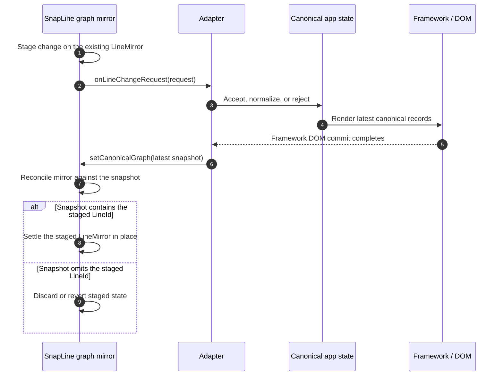
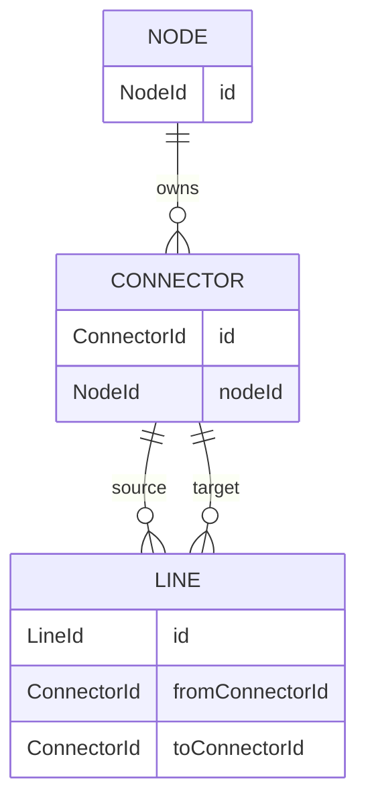
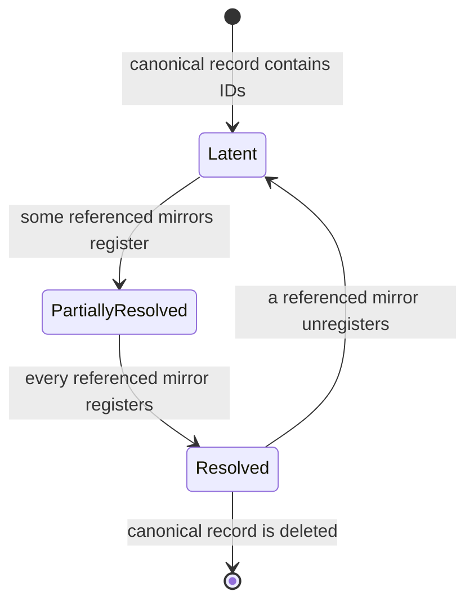
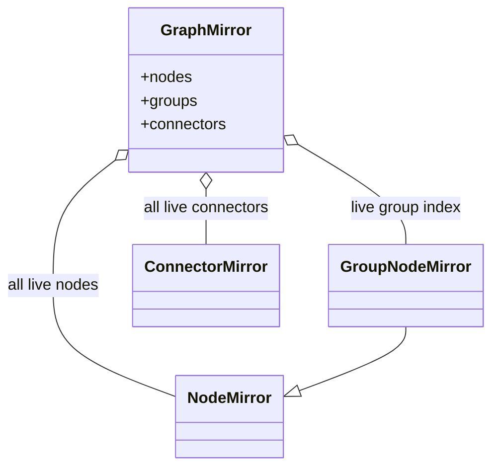
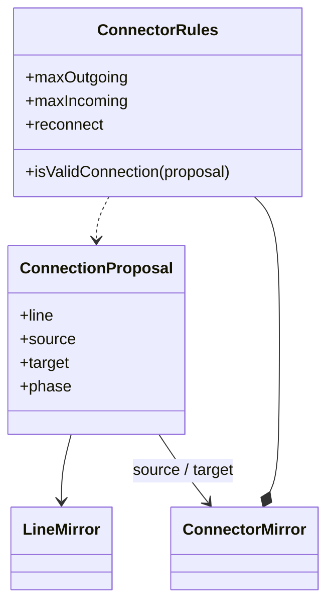
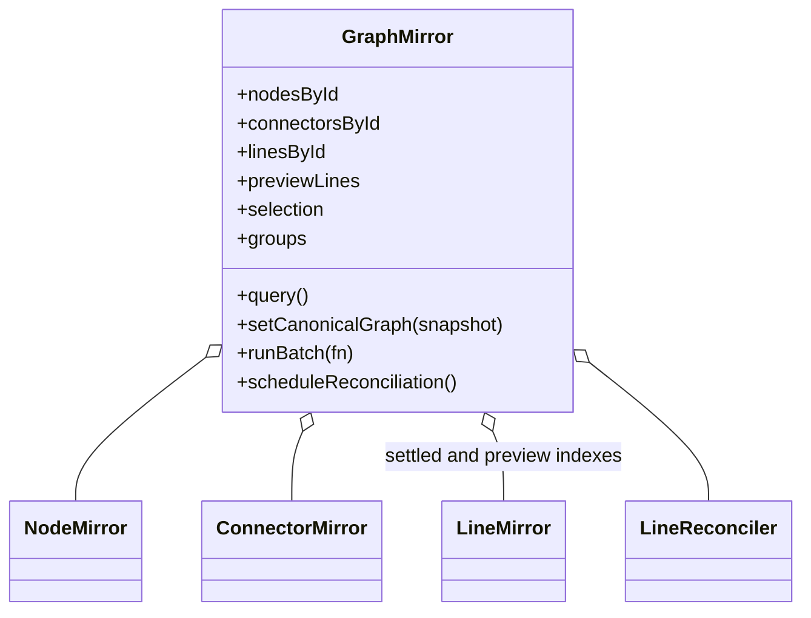
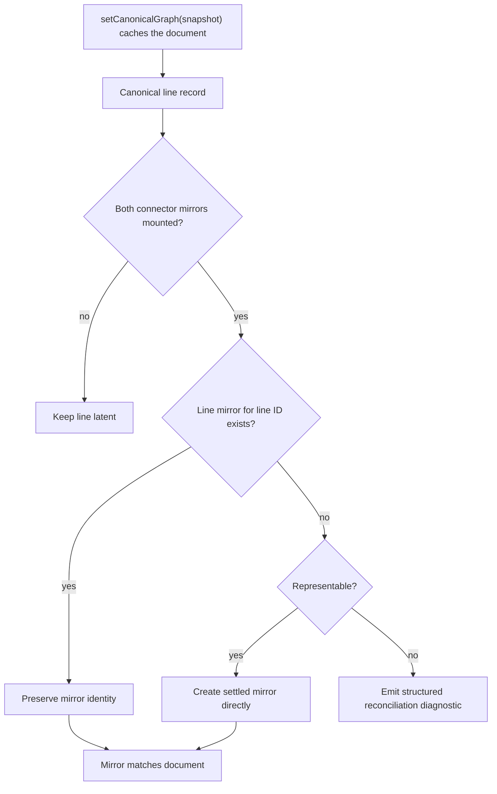
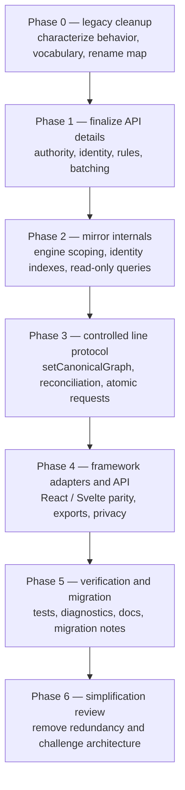

# SnapLine planned re-architecture

Status: living planning document  
Started: 2026-07-25  
Related:
[current architecture](./current-architecture.md) ·
[ownership specification](./ownership-specification.md)

This document is a delta from the current implementation. It contains only:

- unresolved decisions that block implementation;
- agreed changes that have not been implemented;
- verification required for those changes.

Current behavior, completed decisions, and invariants that already hold belong
in [current architecture](./current-architecture.md), not here. Remove an item
from this document once its implementation and required verification land.

## Working objective

Make the application/framework the unambiguous source of truth for committed
nodes, connectors, and lines, then simplify SnapLine around an engine-scoped
runtime mirror that is reconciled from application-pushed canonical snapshots.

**Graph** is the standard term for the network of nodes, connectors, and
lines. Use it consistently: the application owns the canonical graph; SnapLine
maintains the graph mirror.

## Phase 0: legacy audit, vocabulary, and naming cleanup

SnapLine is one of the oldest areas of the project. Before changing its
architecture, perform a behavior-preserving review of the whole SnapLine
codebase and remove naming and organization debt accumulated over roughly four
years.

The first naming problem to eliminate is the interchangeable use of “edge” and
“line.” SnapLine APIs will converge on **line**. Suffixes identify the layer:

| Convention          | Meaning                                                                    |
| ------------------- | -------------------------------------------------------------------------- |
| `*Record`           | Canonical application data, such as `NodeRecord` or `LineRecord`           |
| `*Mirror`           | SnapLine runtime entity, such as `NodeMirror` or `LineMirror`              |
| `*Component`        | React, Svelte, or another front-end framework component                    |
| `*Element`          | Actual framework-owned DOM/SVG element                                     |
| `*Snapshot`         | Immutable point-in-time data returned by a mirror or query                 |
| `LineRecord`        | Canonical committed relationship identified by `LineId`                    |
| `LineMirror`        | SnapLine runtime representation in preview, settled, or detached phase     |
| `LineMirrorPhase`   | Explicit lifetime state; “preview” is a phase, not a second runtime entity |
| `LineComponent`     | Framework component rendering a `LineMirror`                               |
| `LineChangeRequest` | Atomic request for the application to change canonical line records        |
| `*LifecycleEvent`   | Observation of local mirror topology without canonical document authority  |

The `Mirror` suffix is deliberate: it names the architecture role directly, so
the type names teach the ownership model. In uncontrolled mode a mirror is
locally authoritative rather than a reflection of canonical records, but the
type is the same and the name stays `Mirror`.

For example, `onLinesChanged` and `onEdgeConnect` participate in the same broad
connection pipeline, but they are not equivalent:

- `onLinesChanged` publishes `LineMirror` instances so an adapter can reconcile
  `LineComponent` instances;
- `onEdgeConnect` currently proposes a canonical line-record mutation.

Their names fail to communicate that difference. Phase 0 must produce and apply
a rename map in which the layer and direction are visible. Architecture-bound
callbacks that D5/D6 will replace should receive their final names when the
unified request API lands rather than being renamed twice.

### Naming rules

- Remove `Edge*` from the SnapLine vocabulary; translate external edge
  terminology at integration boundaries when necessary.
- Core runtime classes end in `Mirror`; front-end framework types end in
  `Component`.
- Every callback or consumer-supplied hook begins with `on`, **except**
  boolean predicate callbacks, which begin with `is` or `can` and must be
  synchronous and side-effect free (for example `isValidConnection`).
- No imperative command, query, or method that consumers call begins with
  `on`.
- `on*Request` asks an owner to perform an operation; it does not imply
  acceptance or completion.
- `on*Changed` observes state after it changed and does not request another
  mutation.
- `on*Resolve` is a callback that computes and returns a value without
  committing topology.
- Imperative `can*`, `is*`, and `resolve*` methods are queries/calculations.
  A `can*`/`is*` name on a config field is a supplied predicate callback; the
  same name on a mirror or query object is an imperative query. Both answer a
  question and neither mutates.
- `reconcile*` is the only verb for making the runtime mirror match canonical
  state. `sync` is not part of the target vocabulary: for canonical/mirror
  alignment always use `reconcile`; for unrelated operations name the actual
  work, such as `remeasureDomGeometry()` or `writeTransform()`. The word
  “synchronous” may still describe timing, and external API names such as
  React’s `flushSync` remain unchanged — neither names a SnapLine alignment
  operation.
- `write*` means an imperative presentation/DOM property write.
- `bind*Writer` registers a presentation sink and immediately supplies its
  latest snapshot.
- `register*` / `unregister*` change mirror indexes.
- `create*`, `settle*`, `detach*`, `discard*`, and `destroy*` describe distinct
  lifetime operations and must not be hidden behind optional arguments.

### Canonical and mirror lifecycle vocabulary

The ownership model is directional: canonical state flows into the mirror, and
proposals flow back out as requests. The analogy to staging and discarding is
loosely Git-inspired, but it describes ownership and movement, not a literal
Git implementation:

| Term                 | SnapLine meaning                                                                           |
| -------------------- | ------------------------------------------------------------------------------------------- |
| **Canonical**        | Application-owned node, connector, and line records                                         |
| **Mirror**           | Engine-scoped SnapLine runtime entities derived from canonical records                      |
| **Stage**            | Make a provisional local change to an existing mirror; canonical state is unchanged         |
| **Request**          | Ask the canonical owner to accept an atomic staged change through an `on*Request` callback  |
| **Canonical update** | The application accepts or normalizes a request by changing its canonical records           |
| **Framework commit** | React, Svelte, or another framework finishes rendering canonical state into its DOM         |
| **Set canonical**    | The application/adapter pushes the latest canonical snapshot via `setCanonicalGraph()`      |
| **Reconcile**        | Make the SnapLine mirror match the most recently set canonical snapshot                     |
| **Settle**           | Confirm a staged mirror against the canonical snapshot without recreating the mirror        |
| **Discard / revert** | Remove or undo staged state after cancellation or canonical rejection                       |

Staging is a phase of the same `LineMirror`, not a second temporary entity.
Calling a request callback is not a commit: the application may reject or
normalize the request, and SnapLine does not own the framework’s DOM commit.
Use “commit” only when referring to an update that the canonical owner or
frontend framework has actually completed.

**SnapLine never pulls canonical state through a callback.** The application
(usually through an adapter) pushes the latest snapshot into the mirror with
`setCanonicalGraph(snapshot)`. The mirror caches the last snapshot it was
given; internally triggered reconciliation — a connector registering, an
identity resolving, a batch closing — replays the cached snapshot rather than
calling back into the application:

```ts
setCanonicalGraph(snapshot: CanonicalGraphSnapshot): void {
  this.#canonicalSnapshot = snapshot;
  this.#scheduleReconciliation();
}

// Internal triggers replay the cache:
reconcile(): void {
  this.reconcileMirror(this.#canonicalSnapshot);
}
```

Because canonical state only ever arrives through this one setter, there is no
pull callback to keep read-only, no getter-freshness contract for adapters,
and no request → pull → request recursion risk to design around. The
staleness obligation is symmetrical to any controlled model: the application
must call `setCanonicalGraph()` whenever its canonical graph changes.

Do not use `push` for the outbound operation. SnapLine is proposing a change,
not publishing authoritative state, so `request` expresses the boundary more
accurately.

```ts
interface GraphMirrorCallbacks {
  onLineChangeRequest(request: LineChangeRequest): void;
  onDiagnosticsChanged?(diagnostics: readonly ReconciliationError[]): void;
}

// Inbound canonical state is a plain setter, not a callback:
graphMirror.setCanonicalGraph(snapshot);
```



After dispatching a request, the adapter must guarantee a follow-up
`setCanonicalGraph()` call (a queued microtask that reads the adapter’s live
snapshot source, matching the timing the current `getEdges()` ref relies on).
Acceptance and rejection are then both decided by the next snapshot: no
request result object, no timing inference. An application that rejects by
doing nothing still resolves, because the follow-up push delivers an unchanged
snapshot that omits the staged `LineId`.

`setCanonicalGraph()` and reconciliation are read-only with respect to
canonical state and must never emit a change request. Only staged interactions
may invoke `onLineChangeRequest`. That one-way rule prevents request →
reconcile → request recursion.

### Initial rename direction

The exhaustive rename map still requires the Phase 0 inventory. These names
establish the direction and prevent later architecture work from introducing a
second vocabulary:

| Current or legacy name                                    | Target direction                           | Reason                                                              |
| --------------------------------------------------------- | ------------------------------------------ | ------------------------------------------------------------------- |
| Core `NodeComponent`                                       | `NodeMirror`                               | It is a SnapLine runtime entity, not a framework component          |
| Core `ConnectorComponent`                                  | `ConnectorMirror`                          | Same layer distinction                                              |
| Core `LineComponent`                                       | `LineMirror`                               | Same layer distinction and the canonical “line” term                |
| Core `GroupNodeComponent`                                  | `GroupNodeMirror`                          | Same layer distinction                                              |
| `NodeManager` (grown into the general registry)            | `GraphMirror`                              | It becomes the one engine-scoped registry for the whole graph       |
| `EdgeSyncController`                                       | `LineReconciler` (internal)                | Describes canonical line records converging into runtime mirrors    |
| `EdgeSyncController.sync()`                                | `setCanonicalGraph()` + `reconcile()`      | Splits inbound snapshot supply from mirror convergence              |
| `#syncing` / `#syncQueued`                                 | `#reconciling` / `#reconciliationQueued`   | Names reconciliation state rather than generic synchronization      |
| `syncDomGeometry()`                                        | `remeasureDomGeometry()`                   | Names DOM measurement rather than canonical reconciliation          |
| `onLinesChanged`                                           | `onLineMirrorsChanged`                     | Observes the runtime collection used to render framework components |
| `onEdgeConnect`, `onEdgeDisconnect`, connection callbacks  | `onLineChangeRequest`                      | One callback for atomic canonical line-record proposals             |
| Consumer-supplied `canConnect` predicate                   | `isValidConnection`                        | Predicate callback named as a question, per the predicate exemption |
| Imperative connection predicate                            | `canConnect`                               | Imperative query the caller invokes on a mirror                     |
| `EdgeId`, `EdgeRecord`, and `edgeId`                       | `LineId`, `LineRecord`, and `lineId`       | Removes the edge/line synonym                                       |
| Framework rendering type                                   | `LineComponent`                            | `Component` remains reserved for React/Svelte/front-end entities    |

This is not a blind global replacement. For example,
`onLineMirrorsChanged` and `onLineChangeRequest` intentionally remain separate:
the former reports an already-changed runtime render collection, while the
latter asks the application to change canonical records.

### Readability and performance rule

Optimize for code that a developer can read, debug, and modify manually.
Prefer a clean API, small modules, explicit state transitions, and linear logic
over a clever abstraction or fused algorithm that provides only a speculative
or minor speed improvement.

- Choose the simplest algorithm that meets measured product requirements.
- Profile before introducing algorithmic complexity.
- Prefer two obvious passes over one difficult stateful pass unless a benchmark
  demonstrates that the extra pass is a real bottleneck.
- Keep mutations explicit and close to the state they change.
- Avoid hidden work in getters, callbacks, constructors, and optional
  arguments.
- Isolate unavoidable hot-path optimizations behind a small, well-named API.
- Require a benchmark, focused tests, and an invariant comment for any
  non-obvious optimization.
- Do not accept accidental pathological behavior such as unbounded repeated
  full-graph scans merely in the name of simplicity; clarity and reasonable
  scaling are both required.

### Phase 0 scope

Phase 0 is intentionally small. Because D5/D6 replaces the connection callback
surface and Workstream C rewrites mirror mutability, renaming or refactoring
those areas in Phase 0 would churn code that is scheduled for replacement, and
the current behavior coverage is overwhelmingly Playwright-based, so every
extra churn pass is verified by slow, coarse tests. Deferred to each API’s
owning phase, where new focused tests protect the change:

- normalizing the `on`/`is`/`can` prefix rules across callbacks;
- splitting mixed-responsibility functions and simplifying implicit control
  flow.

### Phase 0 tasks

- Inventory every core, React, and Svelte public type, callback, method, field,
  module, and package export.
- Classify each API as canonical graph, runtime mirror, interaction, geometry,
  presentation, query, or uncontrolled command.
- Produce an old-name → new-name table before editing public APIs.
- Add characterization tests only where existing behavior is not sufficiently
  protected for a safe cleanup.
- Rename core runtime `*Component` types to `*Mirror`.
- Replace internal `Edge*` terminology with `Line*`.
- Remove dead code, obsolete aliases, duplicated helpers, stale comments, and
  compatibility paths that are unnecessary before 1.0.
- Run type checking and the complete SnapLine unit, React, Svelte, and browser
  suites before and after the cleanup.

### Phase 0 exit criteria

- The glossary and rename map are reviewed.
- No SnapLine public or internal name uses edge and line as synonyms.
- Core runtime types use the `Mirror` suffix; no core type uses `Component`.
- No target API uses `sync`: canonical/mirror alignment uses `reconcile`, while
  unrelated operations name their concrete measurement, write, or scheduling
  work.
- A pending proposal is named a request, while `commit` refers only to a
  completed canonical or framework update.
- Removed APIs have migration notes where externally relevant.
- Behavior and framework DOM ownership remain unchanged.
- All SnapLine checks pass.

## Priority design decisions

These decisions block or shape most of the implementation work.

| ID  | Decision                                                                   | Resolution                                                                 | Status      |
| --- | -------------------------------------------------------------------------- | --------------------------------------------------------------------------- | ----------- |
| D1  | Is controlled graph state the primary/recommended mode?                    | Yes; uncontrolled mode is an explicit opt-in; one mode per engine          | **Decided** |
| D2  | Which canonical graph entities require stable IDs?                         | Nodes, connectors, and lines; string IDs; SnapLine mints when not supplied | **Decided** |
| D3  | How are references to mirrors that have not registered yet represented?    | ID-based soft links resolved through `GraphMirror` indexes                 | **Decided** |
| D4  | What does hydration do with lines that violate gesture policy?             | Preserve the canonical record and report a structured error                | **Decided** |
| D5  | Are replacement and reconnect atomic operations?                           | Yes; emit one line-change request                                          | **Decided** |
| D6  | What becomes of `onConnectionRequest`?                                     | Merge it with controlled line changes into one request callback            | **Decided** |
| D7  | Is the mirror registry public API or an internal service?                  | Internal; expose the read-only `GraphQuery` facade                         | **Decided** |
| D8  | How do node position and size props interact with SnapLine-owned geometry? | Explicit `"uncontrolled"` (default) and `"controlled"` geometry modes      | **Decided** |
| D11 | Where is the live engine group registry stored?                            | The mirror registry; remove the separate `global.data.groups` registry     | **Decided** |
| D12 | How are multi-render-commit graph mounts reconciled?                       | Nestable `runBatch()` boundary with `beginBatch`/`end` escape hatch        | **Decided** |
| D13 | How are connector direction, capacity, and compatibility expressed?        | Symmetric incoming/outgoing limits plus a line-aware admission predicate   | **Decided** |

“Decided” means the design question is settled; every one of these remains
unimplemented and stays in this document until its implementation and
verification land. Remaining sub-details are listed inside each section.

## Agreed changes not yet implemented

### D1. Controlled graph authority with explicit uncontrolled mode

**Planned delta**

Make controlled graph state the primary and recommended integration. The
vocabulary matches React’s controlled/uncontrolled idiom so frontend
developers can transfer their intuition directly:

- **Controlled**: application node, connector, and line records are canonical;
  SnapLine mirrors and settled lines are reflections; user gestures stage line
  changes and emit line-change requests; direct settled-topology mutation is
  internal or rejected.
- **Uncontrolled**: SnapLine mirror topology is locally authoritative and the
  imperative API mutates it directly. Uncontrolled code must opt into that
  authority model explicitly rather than acquiring it merely because no
  callback was supplied.

Public types, examples, and method names must make the authority mode visible.

**Resolved:** one engine has exactly one authority mode. Mixed or partitioned
controlled/uncontrolled graphs within a single engine are not supported for
1.0: a per-engine mode flag is set at engine or provider construction, and any
operation belonging to the other mode fails fast with a structured diagnostic.
Applications that genuinely need both models run two engines; engine scoping
(Workstream E) makes that safe.

### D2/D3. Stable graph IDs and soft-link resolution

**Planned delta**

Every canonical node, connector, and line has a stable string ID:

```ts
type NodeId = string;
type ConnectorId = string;
type LineId = string;

interface NodeRecord {
  id: NodeId;
}

interface ConnectorRecord {
  id: ConnectorId;
  nodeId: NodeId;
}

interface LineRecord {
  id: LineId;
  fromConnectorId: ConnectorId;
  toConnectorId: ConnectorId;
}
```

**Resolved ID semantics:**

- IDs are strings only. Generic `string | number` identity would infect every
  interface signature for near-zero benefit.
- Connector IDs are graph-global, so one `ConnectorId` is an unambiguous soft
  link. `ConnectorRecord.nodeId` is denormalized parentage used for
  validation.
- The `id` prop/record field is **optional**. When omitted, SnapLine mints a
  stable string ID at mirror creation and reports it through the normal
  snapshot and request surfaces.
- A minted ID is stable for the lifetime of the mirror, and no longer. Any
  canonical graph that outlives a mirror’s lifetime — persisted documents,
  cross-session reloads, framework remounts — must supply its own IDs, or
  stored `LineRecord`s will reference dead connector IDs after the reload.
  Auto-minting is the convenience default; supplying IDs is the persistence
  contract.
- IDs are immutable and unique within one canonical graph.

A runtime `BaseObject.id` is not a substitute for a supplied ID in persistent
graphs: it identifies one instantiated mirror and cannot reference an entity
before that mirror exists or across a remount.



Canonical relationships store IDs, not `NodeMirror` or `ConnectorMirror`
references. The mirror registry adds live lookup indexes:

```ts
nodesById: ReadonlyMap<NodeId, NodeMirror>;
connectorsById: ReadonlyMap<ConnectorId, ConnectorMirror>;
linesById: ReadonlyMap<LineId, LineMirror>;
```

The same soft-link rule applies to a connector’s parent-node reference, line
endpoint references, and any future node-to-node or connector-to-connector
relationship.

If a referenced node or connector has not registered, resolution returns
`null` and the relationship remains latent. Registration marks reconciliation
dirty; a later pass resolves any newly satisfiable links and creates or updates
their mirrors. Unregistration makes affected links latent again without
deleting the canonical records.



**Planned implementation**

- Add immutable typed identity to node, connector, and line mirrors, minted at
  creation when not supplied.
- Add registry indexes and read-only lookup methods for all three IDs.
- Make controlled records and line-change requests carry IDs rather than
  runtime mirror references as their durable identity.
- Validate a connector’s `nodeId` against its mounted parent node.
- Detect duplicate IDs and report structured diagnostics; never silently let
  the last registration win.
- Keep unresolved records in the application/controller layer rather than
  constructing placeholder core mirrors.
- Trigger the batch-aware reconciliation scheduler when a missing identity
  registers or unregisters.
- Preserve a `LineMirror` across endpoint changes when its `lineId` remains
  the same.

**Remaining details**

- Define whether an attempted identity change is rejected or handled as an
  unregister/register transaction. Current leaning: rejected with a structured
  diagnostic, consistent with ID immutability.

### D4. Canonical hydration reports structured errors

**Planned delta**

When a canonical line cannot be represented because of duplicate identity, an
invalid reference after a graph load is declared complete, connector capacity,
parallel-line policy, or another connector rule:

- do not delete, reorder, replace, or otherwise rewrite the canonical record;
- do not emit a line-change request from reconciliation;
- leave the mirror latent or explicitly errored;
- publish a structured reconciliation error.

```ts
interface ReconciliationError {
  code:
    | "duplicate-id"
    | "missing-node"
    | "missing-connector"
    | "capacity-exceeded"
    | "connection-rejected"
    | "unrepresentable-line";
  lineId?: LineId;
  nodeId?: NodeId;
  connectorId?: ConnectorId;
  message: string;
  cause?: unknown;
}
```

**Resolved delivery:** diagnostics stay deliberately minimal — one current
array available through the `GraphQuery.diagnostics()` read-only query, plus
one `onDiagnosticsChanged` callback that observes the array after it changes.
No separate diagnostics subsystem, severity hierarchy, or subscription API.
Reconciliation retries an errored/latent record after relevant identities,
rules, or canonical records change.

A valid soft link whose mirror simply has not mounted yet remains latent and is
not itself an error.

**Remaining details**

- Diagnostic retention and clearing semantics (when a resolved error leaves
  the array; whether cleared errors are reported once more).

### D5/D6. One atomic line-change request callback

**Planned delta**

Replace the overlapping `onConnectionRequest`, `onEdgeConnect`, and
`onEdgeDisconnect` application seams with one controlled callback:

```ts
interface LineChangeRequest {
  intent: "connect" | "disconnect" | "replace" | "reconnect";
  add: readonly ProposedLine[];
  remove: readonly LineId[];
  update: readonly LineEndpointUpdate[];
  originalEvent?: PointerEvent;
}

interface ProposedLine {
  id: LineId; // minted by SnapLine for the staged mirror
  fromConnectorId: ConnectorId;
  toConnectorId: ConnectorId;
}

interface ControlledLineCallbacks {
  onLineChangeRequest(request: LineChangeRequest): void;
}
```

The field is `intent`, not `reason`: the request has not happened yet, and
“reason” would imply past causation.

- A normal connection proposes one atomic `add`.
- A disconnect proposes one atomic `remove`.
- Capacity replacement proposes its removals and addition together.
- Reconnect proposes an endpoint update for the same stable `LineId`.
- The application accepts, rejects, or normalizes the proposal by updating its
  canonical document and calling `setCanonicalGraph()`.

**Resolved correlation contract — SnapLine mints the `LineId`:**

- A gesture-created line receives its `LineId` from SnapLine at staging time,
  and the `ProposedLine` in the request carries it.
- The application **adopts the proposed ID** when it accepts. On the next
  `setCanonicalGraph()`, a canonical record with the staged ID settles the
  staged `LineMirror` in place; a snapshot without the ID discards it. No
  correlation IDs, no request result object, no timing inference.
- The application retains ID authority: it may substitute its own ID, but then
  it forfeits settle-in-place — the staged mirror is discarded and a fresh
  mirror is created for the app-named record on reconciliation. Document this
  trade explicitly in the public API docs.
- Rejection needs no signal. The adapter’s guaranteed post-request
  `setCanonicalGraph()` (see the lifecycle section) delivers a snapshot; if
  the application declined to add the record, the snapshot omits the staged ID
  and the mirror is discarded.
- **Invariant:** at most one in-flight gesture request per engine. Pointer
  gestures are serial, so this is already true; documenting it removes any
  need for request supersession rules or per-request correlation.
- The staged-awaiting-decision state is an explicit `LineMirrorPhase`, so a
  staged line that has not yet been settled or discarded is visible and
  debuggable rather than silently ambiguous.

Low-level connector lifecycle observers may remain for local behavior, but they
must not be alternate application graph-mutation seams. Their names must begin
with `on` and identify them as observations rather than requests.

### D7. Internal registry with the read-only `GraphQuery` facade

**Planned delta**

Keep registration, unregistration, reconciliation attachment, and mutable
indexes internal to the engine-scoped mirror registry. Replace public
`NodeManager`, `getNodeManager()`, and `EdgeSyncLike` access with a read-only
query facade exposing snapshots and identity lookups:

```ts
interface GraphQuery {
  nodes(): readonly NodeMirror[];
  connectors(): readonly ConnectorMirror[];
  groups(): readonly GroupNodeMirror[];
  lines(): readonly LineMirror[];
  node(id: NodeId): NodeMirror | null;
  connector(id: ConnectorId): ConnectorMirror | null;
  line(id: LineId): LineMirror | null;
  diagnostics(): readonly ReconciliationError[];
}
```

The facade must not expose registry sets, topology arrays, controller
attachment, or mutation methods.

**Where read-only is enforced:** the facade returns **live mirrors**, not deep
snapshots. The facade’s read-only guarantee applies to the registry layer — a
consumer cannot add, remove, or re-attach anything through it. The mirrors it
returns are the real interactive runtime objects; their own mutation surface
is constrained separately, by the Workstream C read-only topology work and by
controlled-mode mutation rejection (D1). Do not describe the facade as
returning immutable data.

### D8. Explicit geometry authority modes

**Planned delta**

Expose two clearly named position/size modes, using the same
controlled/uncontrolled vocabulary as D1:

```ts
type GeometryAuthority = "uncontrolled" | "controlled";
```

`"uncontrolled"` is the default:

- props provide initial geometry and deliberate later external commands;
- SnapLine owns live and settled position/size during interaction;
- `onGeometryChanged` observes the final position and size;
- the consumer may persist or otherwise honor the observation, but ignoring it
  does not revert SnapLine’s settled geometry.

`"controlled"` is opt-in:

- props remain canonical;
- SnapLine may display optimistic live interaction geometry;
- SnapLine stages the final position and size and invokes
  `onGeometryChangeRequest`;
- updated props accept or normalize the proposal;
- the next `setCanonicalGraph()`/reconciliation settles an accepted value or
  reverts a rejected value.

Both callbacks carry the same position/size payload shape, but their names make
the ownership contract explicit: `Changed` is an observation and `Request`
asks the canonical owner to act. The previous provisional `"commit"` and
`"snapline"` mode names are removed: SnapLine-owned geometry is not a
canonical or framework commit, and a mode value should name the authority
model, not the library.

### D11. The mirror registry owns the engine group registry

**Planned delta**

Move the live group registry from `global.data.groups` into the engine’s
mirror registry (currently `NodeManager`, becoming `GraphMirror` under
Workstream A).

The registry is the organization boundary for engine-level node information.
A `GroupNodeMirror` is both:

- a node in the registry’s node index;
- a group in a dedicated group index.



**Planned implementation**

- Add a private `Set<GroupNodeMirror>` to the registry.
- Add group registration/unregistration methods used by `GroupNodeMirror`.
- Expose groups as a read-only snapshot.
- Remove `groups` and `getGroups()` from `snapline-globals.ts`.
- Make `getGroupNodes()` read the registry’s dedicated group index.
- Make group membership reconciliation enumerate the registry’s node and group
  indexes.
- Stop scanning SnapEngine’s general object table for membership nodes.
- Stop filtering a shared group array by `engine`.
- Add registration, teardown, and multi-engine isolation tests.

**Related state to review**

The group module also keeps engine-level coordination outside the registry:

- `parentGroups`;
- `membershipResolvers`;
- `reconcilingEngines`.

We should decide whether these become registry-owned group state as well. That
is a follow-up to D11, not yet part of the settled decision.

### D12. Nestable bulk reconciliation boundary

**Planned delta**

Add an explicit reconciliation batch for saved-graph loads that span multiple
framework render commits or asynchronous chunks. The primary API is a scoped
function, so exception safety is structural rather than a call-site
convention:

```ts
await graphMirror.runBatch(async () => {
  // The application installs canonical records and the framework mounts
  // their mirrors, possibly across multiple render commits.
});
```

A low-level `beginBatch()`/`end()` token pair remains as an escape hatch for
adapters whose lifecycles do not nest inside one function. Required semantics:

- registrations and `setCanonicalGraph()` calls mark reconciliation dirty;
- no partial graph reconciliation runs while a batch is open;
- batches may nest;
- only the outermost close schedules the final pass;
- closing is idempotent and exception-safe;
- a batch with no relevant changes does not run a pass;
- the final pass runs after framework connector registration render commits
  and reconciles against the latest cached canonical snapshot;
- vanilla consumers and tests can explicitly `flush()`;
- an unrelated long-running import cannot delay gesture acceptance/rejection.

Because canonical state arrives through `setCanonicalGraph()` and is cached,
the batch boundary has no adapter-surface question left: batching only defers
when the cached snapshot is reconciled, never how it is obtained.

The load ordering is:

1. Install canonical node, connector, and line records via
   `setCanonicalGraph()`.
2. Let the framework mount their available mirrors.
3. Close the outer bulk boundary.
4. Reconcile once, resolving all links whose mirrors are available.

### D13. Symmetric connector limits and line-aware admission

**Planned delta**

Replace the asymmetric source/target-plus-incoming-capacity model with two
general limits on every connector:

- maximum outgoing lines;
- maximum incoming lines.

Each limit supports zero, a finite non-negative count, or unlimited. A zero
outgoing limit makes a connector target-only; a zero incoming limit makes it
source-only. A connector with nonzero capacity in both directions supports
both roles, so separate `source` and `target` booleans become derived rather
than independent configuration.

**Resolved representation:** unlimited is the explicit string `"unlimited"`,
which is self-documenting at call sites and JSON-safe. Internally it is
normalized to `Infinity` so capacity checks stay branch-free
(`count < max` handles unlimited for free). The negative-number sentinel is
removed.

```ts
type ConnectionLimit = number | "unlimited";

interface ConnectorRules {
  maxOutgoing: ConnectionLimit;
  maxIncoming: ConnectionLimit;
  reconnect: boolean;
  isValidConnection?: (proposal: ConnectionProposal) => boolean;
}
```

The compatibility predicate must receive the actual proposed line in addition
to its endpoints:

```ts
interface ConnectionProposal {
  line: LineMirror;
  source: ConnectorMirror;
  target: ConnectorMirror;
  phase: "candidate" | "drop";
}
```

This allows a developer to admit a line based on line type, payload, source,
target, and connector metadata. The predicate is synchronous and side-effect
free because candidate discovery may call it repeatedly. It is checked again
on the final drop. Source-level and target-level rules may both veto the same
proposal. (An `origin` field is deliberately omitted: gestures are currently
the only origin, and a single-value union is speculative surface. Add it when
a second origin exists.)



**Capacity semantics**

- Creating a new preview reserves one outgoing slot.
- A reconnect reuses its existing outgoing slot.
- Incoming capacity is reserved when a target is accepted.
- Lines pending deletion do not consume capacity.
- Capacity and the compatibility predicate are rechecked before settlement.
- Canonical reconciliation does not silently delete application lines to
  satisfy gesture limits; it follows the policy selected under D4 and emits a
  diagnostic when needed.

Reject an over-capacity proposal by default. If replacement is desired, add a
separate explicit replacement policy that selects affected stable line IDs and
produces one atomic line-change request. Remove implicit oldest-line eviction
from `connectToConnector()`.

**Remaining details**

- Decide whether `allowParallel` remains a convenience rule or is expressed
  entirely through the compatibility predicate.
- Decide how proposed canonical line-record data is exposed alongside a preview
  line when admission depends on application-specific line fields.

## Workstream A: one engine-scoped graph mirror

**Problem**

The current organization is split:

- `NodeManager` tracks nodes and connectors;
- lines live only in connector arrays;
- selection/groups/surfaces live in shared `global.data` lists;
- candidate discovery and group membership still scan SnapEngine’s object
  table;
- public queries and internal discovery do not use one source.

**Decided structure**

`GraphMirror` is the settled name: the one engine-scoped registry for every
SnapLine runtime entity — the mirror of the whole graph. The name states what
the thing is rather than its role, and it avoids the redundancy of a
“SnapLineManager” inside the SnapLine package. `LineReconciler` (the
`EdgeSyncController` successor) is an internal service owned by `GraphMirror`.



**Planned cleanup**

- Move the live group registry from `global.data.groups` to
  `GraphMirror.groups`.
- Route connector candidate discovery and group membership enumeration through
  the registry instead of SnapEngine’s general object table.
- Track settled lines separately from previews.
- Add lookup by stable domain identity.
- Make connector topology and new registry indexes read-only to consumers.
- Remove stale per-engine registry entries during engine/controller teardown.
- Move remaining application-wide selection and interaction registries behind
  engine-scoped registry state or accessors.

## Workstream B: controlled line reconciliation

**Problem**

The legacy `EdgeSyncController` establishes the correct high-level direction,
but it reuses imperative connector mutation behavior underneath. Hydration
therefore still runs gesture policy, parallel checks, capacity replacement,
and callback paths that can conflict with a canonical document.

**Planned separation**



**Candidate implementation changes**

- Replace `EdgeSyncController.sync()` with `setCanonicalGraph(snapshot)` plus
  `LineReconciler.reconcile()`, which reconciles the mirror against the cached
  snapshot.
- Keep reconciliation read-only with respect to canonical state; only staged
  interactions may invoke `onLineChangeRequest`.
- Separate a private “create settled mirror from canonical line” path from a
  user connect command.
- Separate gesture settlement of an existing preview line from line creation;
  do not hide both operations behind an optional `line` argument.
- Preserve a settled line by stable line ID when its endpoints are updated.
- Route connector registration, identity changes, canonical snapshot changes,
  and explicit requests through one batch-aware scheduler.
- Surface duplicate identities, missing endpoints, and unrepresentable lines
  as diagnostics.
- Leave policy-violating canonical records latent/errored and publish the D4
  structured diagnostic.

## Workstream C: public API cleanup

**Cleanup candidates**

- Make `incomingLines` and `outgoingLines` read-only snapshots.
- Make `LineMirror.start`, `target`, phase, candidate, and anchors
  read-only outside internal mutation paths.
- Convert underscore-prefixed implementation fields to `#` private fields or
  internal module state.
- Stop exposing input event handlers as incidental public methods.
- Rename and document low-level lifecycle events versus semantic application
  requests so their roles are unambiguous.
- Remove public `NodeManager`, `getNodeManager()`, and `EdgeSyncLike` access in
  favor of the D7 read-only `GraphQuery` facade.
- Add missing package subpaths for APIs that remain public.
- Remove or rename deprecated connector options instead of carrying parallel
  legacy and capability APIs indefinitely.
- Standardize property-style access where it improves the API without hiding
  commands that perform meaningful work.

## Workstream D: adapter consistency

**Cleanup candidates**

- Use stable line identity for framework line keys.
- Make node and connector identity typed adapter props.
- After D8, expose geometry explicitly as uncontrolled/default or controlled
  with request/rejection semantics.
- Guarantee the post-request `setCanonicalGraph()` follow-up push in both the
  React and Svelte adapters with identical timing semantics.
- Add direct package exports for every documented component and replace the
  legacy `EdgeSync` name with the final line-reconciliation name.

## Workstream E: engine isolation

**Cleanup candidates**

- Key selection by engine.
- Key group registries by engine.
- Key resize handles and source surfaces by engine, or enforce filtering at a
  single access boundary.
- Remove cross-engine connector candidates by construction.
- Add multi-engine tests for queries, selection, groups, and connections.

## Workstream F: legacy property propagation

`NodeMirror` currently owns a name-keyed property bag and propagates values
through outgoing connectors.

**Decided: remove it from SnapLine.**

The thesis of this re-architecture is that the application owns the canonical
graph and its dataflow. A second, name-keyed dataflow mechanism living in the
view library contradicts that ownership model, and keeping it would require
typing, cycle safety, parallel-line semantics, and controlled-remount behavior
— substantial cost for a legacy feature.

**Removal plan**

- Remove the property bag and propagation API from node and connector mirrors.
- Write a migration note showing how an application expresses dataflow in its
  own graph document and pushes results through canonical records.
- If a real consumer surfaces during migration that cannot adopt
  application-level dataflow, extraction into an optional module may be
  reconsidered; do not preemptively build that module.

## Workstream G: tests and diagnostics

Add coverage only for behavior introduced or altered by this plan:

- stable line ID preservation;
- minted-ID adoption: staged line settles in place when the next snapshot
  contains the proposed `LineId`, and is discarded when it does not;
- rejection-by-inaction resolving through the adapter’s post-request push;
- parallel controlled lines;
- reconnect preserving line identity;
- atomic capacity replacement;
- zero, finite, and `"unlimited"` incoming/outgoing capacity;
- outgoing preview reservation and reconnect slot reuse;
- line-aware source and target admission predicates;
- explicit over-capacity rejection and replacement-policy behavior;
- hydration that conflicts with gesture policy;
- duplicate node/connector/line identity diagnostics;
- direct mutation rejection in controlled mode, and cross-mode operations
  failing fast under the per-engine authority flag;
- read-only topology query behavior;
- multi-engine isolation;
- controlled geometry rejection/reversion;
- React/Svelte semantic parity;
- one final reconciliation pass for a multi-render-commit `runBatch()`,
  including nested batches and the `beginBatch`/`end` escape hatch;
- registry-owned group registration, teardown, and engine isolation;
- property-propagation removal migration notes verified against the demos;
- package export coverage for APIs retained by the re-architecture.

## Final phase: post-rearchitecture simplification review

After the planned behavior and ownership changes work end to end, review the
result as a new codebase rather than assuming every intermediate abstraction
must survive. This phase may simplify the architecture more aggressively, but
must preserve the agreed ownership model, public behavior, and verified
performance requirements.

### Review method

- Trace line creation, preview settlement, reconnect, disconnect, canonical
  reconciliation, bulk load, selection, and teardown from public entry point
  to final state.
- Remove redundant adapters, forwarding callbacks, snapshots, indexes,
  schedulers, wrappers, and compatibility aliases.
- Challenge every abstraction that exists only because of the legacy
  architecture or an intermediate migration step.
- Consolidate registries or schedulers when one explicit implementation is
  easier to understand.
- Flatten control flow where layers merely delegate without enforcing an
  ownership boundary or invariant.
- Prefer explicit state machines and small named operations over clever
  multi-purpose methods.
- Profile large graph loads, candidate discovery, reconciliation, and drag
  interaction before retaining or adding non-obvious optimization.
- Delete migration-only internals that are no longer needed before 1.0.
- Repeat the vocabulary audit so one concept has one name, every observation
  and request callback starts with `on`, and every predicate callback starts
  with `is` or `can`.
- Update the current-architecture and ownership documents to describe the
  resulting implementation, not the migration history.

### Exit criteria

- Each major lifecycle has one obvious path through the code.
- No known layer, registry, callback, or snapshot merely duplicates another.
- Public APIs expose the smallest surface required by the ownership model.
- Core runtime `Mirror` types and framework `Component` types never overlap in
  meaning.
- All tests, type checks, adapter suites, browser tests, and relevant
  benchmarks pass after the simplification.

## Proposed implementation sequence



This order is provisional. It protects legacy behavior before structural work,
settles identity and authority before rewriting adapters, and reserves a final
pass for simplification after the complete system can be evaluated.

## Initial task board

### Phase 0

- [ ] Inventory and classify the current core, React, and Svelte APIs.
- [ ] Add characterization tests for behavior needed during cleanup.
- [ ] Review and approve the vocabulary and old-name → new-name map.
- [ ] Rename core runtime `*Component` types to `*Mirror`.
- [ ] Replace internal `Edge*` terminology with `Line*`.
- [ ] Remove dead code, obsolete aliases, duplicate helpers, and stale comments.
- [ ] Run all SnapLine checks before beginning architectural changes.

(Callback-prefix normalization and mixed-responsibility function splitting are
deliberately deferred to each API’s owning phase; see “Phase 0 scope.”)

### Remaining API details

- [ ] Decide identity-change handling: reject with a diagnostic (leaning) or
      unregister/register transaction.
- [ ] Finalize D4 diagnostic retention and clearing semantics.
- [ ] Resolve D13 details: parallel shorthand and proposed line-record data
      exposure.
- [ ] Finalize the D7 `GraphQuery` package location.
- [ ] Finalize D8 prop names for the geometry authority modes.

### Core

- [ ] Design `GraphMirror`, the engine-scoped mirror registry.
- [ ] Add immutable node, connector, and line identity to mirrors, minted at
      creation when not supplied.
- [ ] Add read-only registry indexes and soft-link resolution by those IDs.
- [ ] Keep missing references latent and retry them after registration.
- [ ] Reject duplicate IDs with structured diagnostics.
- [ ] Move the group registry into the mirror registry.
- [ ] Rework group reconciliation to use registry node/group indexes.
- [ ] Remove `global.data.groups` and its accessor.
- [ ] Decide where parent mappings, membership resolvers, and the
      reconciliation guard live.
- [ ] Add settled-line and preview-line indexes.
- [ ] Unify object discovery.
- [ ] Make topology views read-only.
- [ ] Add the per-engine controlled/uncontrolled authority flag with fail-fast
      cross-mode diagnostics.
- [ ] Replace role booleans and incoming-only capacity with symmetric limits
      and the `"unlimited"` representation.
- [ ] Make connection admission line-aware via `isValidConnection`.
- [ ] Extract implicit oldest-line eviction into an explicit replacement rule.
- [ ] Split preview settlement, preview disposal, and programmatic settled-line
      creation into explicit internal operations.
- [ ] Implement `setCanonicalGraph()` with snapshot caching and one coalescing,
      batch-aware reconciliation scheduler.
- [ ] Implement `runBatch()` plus the `beginBatch()`/`end()` escape hatch and
      `flush()`.
- [ ] Separate hydration from imperative connection mutation.
- [ ] Add structured reconciliation diagnostics with `onDiagnosticsChanged`.
- [ ] Remove the property bag and propagation API.
- [ ] Scope all shared SnapLine state by engine.

### Adapters

- [ ] Design the shared controlled graph contract around `setCanonicalGraph()`
      and `onLineChangeRequest`.
- [ ] Guarantee the post-request follow-up push in both adapters.
- [ ] Use stable line IDs for line rendering keys.
- [ ] Define controlled/uncontrolled geometry APIs.
- [ ] Align root and subpath exports.

### Documentation and migration

- [ ] Remove overlapping or obsolete callback seams.
- [ ] Write the property-propagation removal migration note.
- [ ] Document the minted-ID adoption contract and the persistence requirement
      for app-supplied IDs.
- [ ] Update examples to show one recommended ownership model.
- [ ] Write migration notes before the next package release.

### Verification

- [ ] Add unit tests around reconciliation and identity.
- [ ] Expand controlled-line browser coverage.
- [ ] Add multi-engine isolation coverage.
- [ ] Run the full React and Svelte SnapLine suites.
- [ ] Verify the package export maps.

### Final simplification

- [ ] Trace every major lifecycle through the completed architecture.
- [ ] Remove migration-only and forwarding layers that no longer enforce an
      invariant.
- [ ] Look for registries, schedulers, snapshots, and algorithms that can be
      consolidated or made more direct.
- [ ] Profile before retaining any non-obvious optimization.
- [ ] Repeat the naming, public-surface, and ownership audits.
- [ ] Update the architecture documents to the final implementation.
- [ ] Run the complete verification matrix again.
