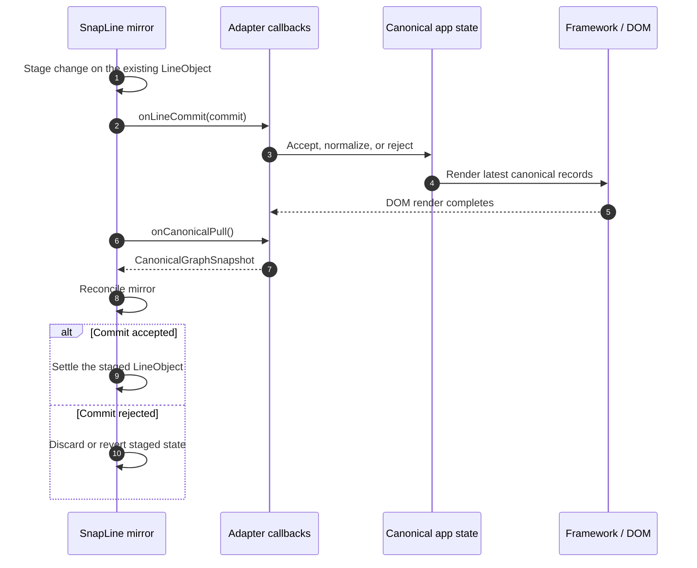
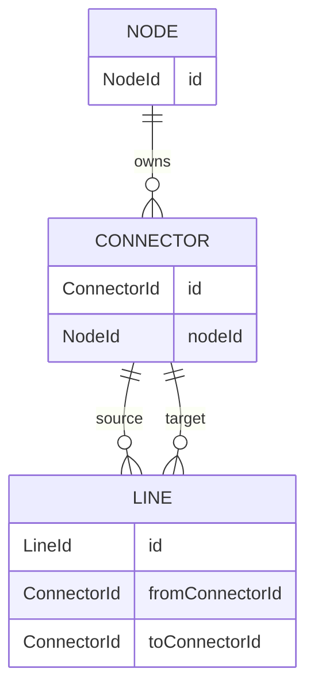
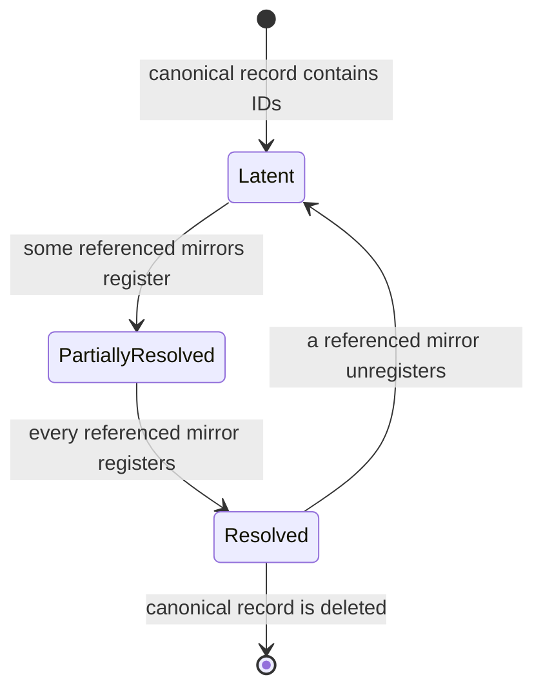
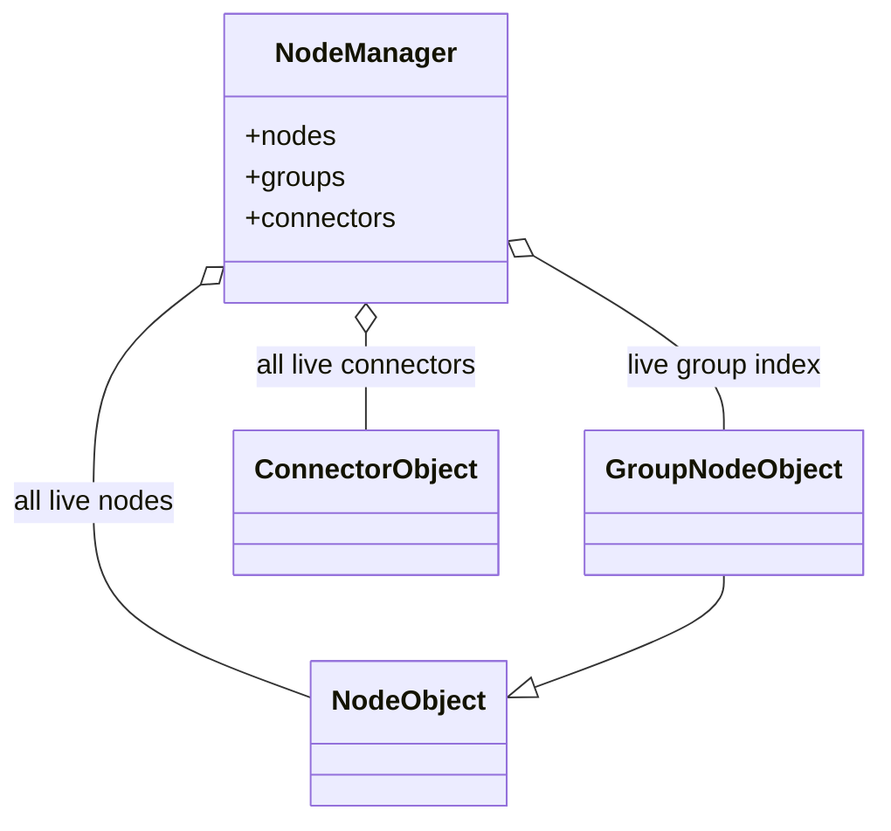
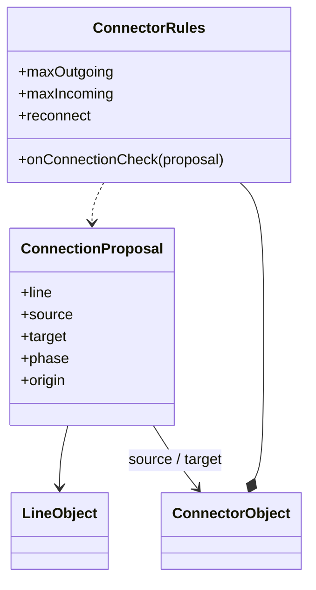
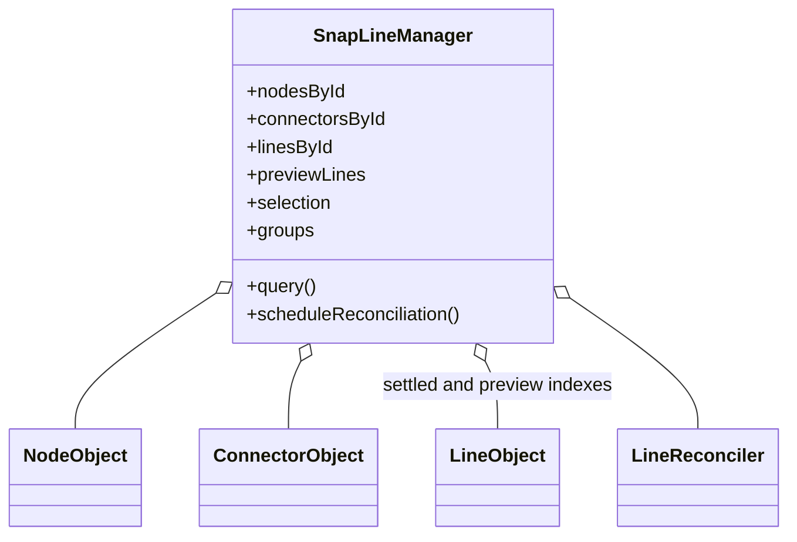
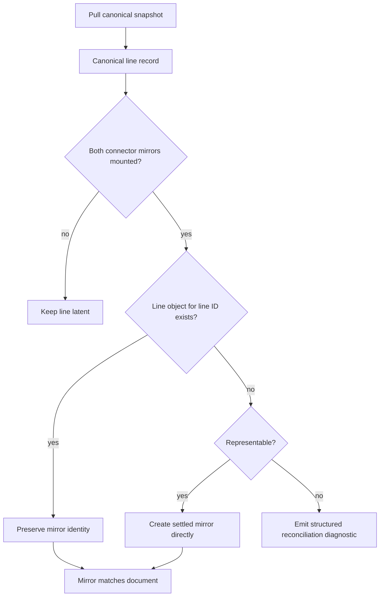
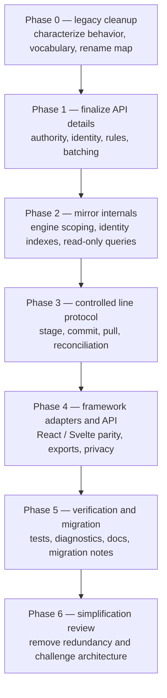

# SnapLine planned re-architecture

Status: living planning document  
Started: 2026-07-25  
Related:
[current architecture](./current-architecture.md) ·
[ownership specification](./ownership-specification.md)

This document is a delta from the current implementation. It contains only:

- unresolved decisions that block implementation;
- agreed changes that have not been implemented;
- verification required for those changes.

Current behavior, completed decisions, and invariants that already hold belong
in [current architecture](./current-architecture.md), not here. Remove an item
from this document once its implementation and required verification land.

## Working objective

Make the application/framework the unambiguous source of truth for committed
nodes, connectors, and lines, then simplify SnapLine around an engine-scoped,
read-only runtime mirror.

## Phase 0: legacy audit, vocabulary, and naming cleanup

SnapLine is one of the oldest areas of the project. Before changing its
architecture, perform a behavior-preserving review of the whole SnapLine
codebase and remove naming and organization debt accumulated over roughly four
years.

The first naming problem to eliminate is the interchangeable use of “edge” and
“line.” SnapLine APIs will converge on **line**. Suffixes identify the layer:

| Convention        | Meaning                                                                    |
| ----------------- | -------------------------------------------------------------------------- |
| `*Record`         | Canonical application data, such as `NodeRecord` or `LineRecord`           |
| `*Object`         | SnapLine runtime entity, such as `NodeObject` or `LineObject`              |
| `*Component`      | React, Svelte, or another front-end framework component                    |
| `*Element`        | Actual framework-owned DOM/SVG element                                     |
| `*Snapshot`       | Immutable point-in-time data returned by an object or query                |
| `LineRecord`      | Canonical committed relationship identified by `LineId`                    |
| `LineObject`      | SnapLine runtime representation in preview, settled, or detached phase     |
| `LineObjectPhase` | Explicit lifetime state; “preview” is a phase, not a second runtime entity |
| `LineComponent`   | Framework component rendering a `LineObject`                               |
| `LineCommit`      | Atomic staged line change handed to the canonical owner                    |
| `*LifecycleEvent` | Observation of local object topology without canonical document authority  |

For example, `onLinesChanged` and `onEdgeConnect` participate in the same broad
connection pipeline, but they are not equivalent:

- `onLinesChanged` publishes `LineObject` instances so an adapter can reconcile
  `LineComponent` instances;
- `onEdgeConnect` currently proposes a canonical line-record mutation.

Their names fail to communicate that difference. Phase 0 must produce and apply
a rename map in which the layer and direction are visible. Architecture-bound
callbacks that D5/D6 will replace should receive their final names when the
unified commit API lands rather than being renamed twice.

### Naming rules

- Remove `Edge*` from the SnapLine vocabulary; translate external edge
  terminology at integration boundaries when necessary.
- Core runtime classes end in `Object`; front-end framework types end in
  `Component`.
- Every callback or consumer-supplied hook begins with `on`.
- No imperative command, query, or method that consumers call begins with
  `on`.
- `on*Commit` hands an atomic staged change to the canonical owner. The next
  pull confirms the result.
- `on*Changed` observes state after it changed and does not request another
  mutation.
- `on*Check` is a synchronous, side-effect-free predicate callback.
- `on*Resolve` is a callback that computes and returns a value without
  committing topology.
- `on*Pull` supplies the latest canonical snapshot to a read-only pull
  operation.
- Imperative `can*`, `is*`, and `resolve*` methods are queries/calculations, not
  callbacks.
- `reconcile*` is the only target verb for making the runtime mirror match
  canonical state.
- `write*` means an imperative presentation/DOM property write.
- `bind*Writer` registers a presentation sink and immediately supplies its
  latest snapshot.
- `register*` / `unregister*` change mirror indexes.
- `create*`, `settle*`, `detach*`, `discard*`, and `destroy*` describe distinct
  lifetime operations and must not be hidden behind optional arguments.

### Canonical and mirror lifecycle vocabulary

Use a Git-inspired directional model when the application/framework owns the
canonical graph. The analogy describes ownership and movement, not a literal
Git implementation:

| Term                 | SnapLine meaning                                                                     |
| -------------------- | ------------------------------------------------------------------------------------ |
| **Canonical**        | Application-owned node, connector, and line records                                  |
| **Mirror**           | Engine-scoped SnapLine objects derived from canonical records                        |
| **Stage**            | Create or modify provisional state on a local object; canonical state is unchanged   |
| **Commit**           | Hand an atomic staged change to the canonical owner through an `on*Commit` callback  |
| **Canonical update** | The application accepts or normalizes a commit by changing its canonical records     |
| **DOM render**       | The framework materializes the latest canonical state in its owned DOM               |
| **Pull**             | Read the latest canonical snapshot through a read-only `on*Pull` callback            |
| **Reconcile**        | Make the SnapLine mirror match the snapshot returned by a pull                       |
| **Settle**           | Confirm a staged object against pulled canonical state without recreating the object |
| **Discard / revert** | Remove or undo staged state after cancellation or canonical rejection                |

Staging is a phase of the same `LineObject`, not a second temporary entity.
Calling `onLineCommit` begins the commit operation. The common case is that the
application accepts it, but the next canonical pull remains authoritative and
may confirm, normalize, or reject the staged change.

Do not use `push` for the outbound operation. SnapLine is proposing a change,
not replacing the canonical document wholesale.

`sync` is not part of the target SnapLine vocabulary. For canonical/mirror
alignment, always use `reconcile`; for unrelated operations, name the actual
work, such as `remeasureDomGeometry()` or `writeTransform()`.

Pull and reconciliation remain separate directional steps:

- `pullCanonical()` obtains the current canonical snapshot;
- `reconcileMirror(snapshot)` applies that snapshot to SnapLine objects.

`LineReconciler.reconcile()` is the high-level replacement for the legacy
`EdgeSyncController.sync()`. It pulls once and then reconciles:

```ts
reconcile(): void {
  const snapshot = this.pullCanonical();
  this.reconcileMirror(snapshot);
}
```

The word “synchronous” may still describe timing, and external API names such
as React’s `flushSync` remain unchanged. Neither case names a SnapLine
alignment operation.

A framework adapter may implement the pull callback by returning the latest
props; “pull” does not imply a network request.

```ts
interface CanonicalLineBridge {
  onCanonicalPull(): CanonicalGraphSnapshot;
  onLineCommit(commit: LineCommit): void;
}
```



Pull and reconciliation are read-only with respect to canonical state and must
never emit a commit. That one-way rule prevents commit → pull → commit
recursion.

### Initial rename direction

The exhaustive rename map still requires the Phase 0 inventory. These names
establish the direction and prevent later architecture work from introducing a
second vocabulary:

| Current or legacy name                                    | Target direction                         | Reason                                                              |
| --------------------------------------------------------- | ---------------------------------------- | ------------------------------------------------------------------- |
| Core `NodeComponent`                                      | `NodeObject`                             | It is a SnapLine runtime entity, not a framework component          |
| Core `ConnectorComponent`                                 | `ConnectorObject`                        | Same layer distinction                                              |
| Core `LineComponent`                                      | `LineObject`                             | Same layer distinction and the canonical “line” term                |
| Core `GroupNodeComponent`                                 | `GroupNodeObject`                        | Same layer distinction                                              |
| `EdgeSyncController`                                      | `LineReconciler`                         | Describes canonical line records converging into runtime objects    |
| `EdgeSyncController.sync()`                               | `LineReconciler.reconcile()`             | Uses the precise mirror-alignment verb                              |
| `#syncing` / `#syncQueued`                                | `#reconciling` / `#reconciliationQueued` | Names reconciliation state rather than generic synchronization      |
| `syncDomGeometry()`                                       | `remeasureDomGeometry()`                 | Names DOM measurement rather than canonical reconciliation          |
| `onLinesChanged`                                          | `onLineObjectsChanged`                   | Observes the runtime collection used to render framework components |
| `onEdgeConnect`, `onEdgeDisconnect`, connection callbacks | `onLineCommit`                           | One callback for atomic canonical line-record changes               |
| Consumer-supplied `canConnect` predicate                  | `onConnectionCheck`                      | The `on` prefix identifies a supplied callback                      |
| Imperative connection predicate                           | `canConnect`                             | No `on` prefix identifies a query the caller invokes                |
| `EdgeId`, `EdgeRecord`, and `edgeId`                      | `LineId`, `LineRecord`, and `lineId`     | Removes the edge/line synonym                                       |
| Framework rendering type                                  | `LineComponent`                          | `Component` remains reserved for React/Svelte/front-end entities    |

This is not a blind global replacement. For example,
`onLineObjectsChanged` and `onLineCommit` intentionally remain separate:
the former reports an already-changed runtime render collection, while the
latter asks the application to change canonical records.

### Readability and performance rule

Optimize for code that a developer can read, debug, and modify manually.
Prefer a clean API, small modules, explicit state transitions, and linear logic
over a clever abstraction or fused algorithm that provides only a speculative
or minor speed improvement.

- Choose the simplest algorithm that meets measured product requirements.
- Profile before introducing algorithmic complexity.
- Prefer two obvious passes over one difficult stateful pass unless a benchmark
  demonstrates that the extra pass is a real bottleneck.
- Keep mutations explicit and close to the state they change.
- Avoid hidden work in getters, callbacks, constructors, and optional
  arguments.
- Isolate unavoidable hot-path optimizations behind a small, well-named API.
- Require a benchmark, focused tests, and an invariant comment for any
  non-obvious optimization.
- Do not accept accidental pathological behavior such as unbounded repeated
  full-graph scans merely in the name of simplicity; clarity and reasonable
  scaling are both required.

### Phase 0 tasks

- Inventory every core, React, and Svelte public type, callback, method, field,
  module, and package export.
- Classify each API as canonical graph, runtime mirror, interaction, geometry,
  presentation, query, or unmanaged command.
- Produce an old-name → new-name table before editing public APIs.
- Audit every use of `sync`, `commit`, `push`, `pull`, `request`, and
  `reconcile` against the canonical/mirror lifecycle.
- Rename misleading internals immediately; schedule architecture-dependent
  public replacements in their owning phase.
- Split functions that combine unrelated creation, mutation, notification, and
  presentation responsibilities.
- Replace clever or implicit control flow with explicit intermediate values and
  named operations, even when that costs a small amount of non-critical work.
- Remove dead code, obsolete aliases, duplicated helpers, stale comments, and
  compatibility paths that are unnecessary before 1.0.
- Normalize private-field usage, event/type suffixes, method ordering, and
  module boundaries.
- Add characterization tests only where existing behavior is not sufficiently
  protected for a safe cleanup.
- Run type checking and the complete SnapLine unit, React, Svelte, and browser
  suites before and after the cleanup.

### Phase 0 exit criteria

- The glossary and rename map are reviewed.
- No SnapLine public or internal name uses edge and line as synonyms.
- Every callback begins with `on`, and no imperative API begins with `on`.
- No target API uses `sync`: canonical/mirror alignment uses `reconcile`, while
  unrelated operations name their concrete measurement, write, or scheduling
  work.
- `pull` only retrieves canonical state; it does not imply reconciliation.
- A staged proposal becomes a commit when passed to `onLineCommit`; the next
  pull confirms, normalizes, or rejects it.
- Callback names distinguish predicates, observations, presentation writers,
  lifecycle events, pulls, and canonical line commits.
- Large functions have one identifiable responsibility or a documented reason
  to coordinate several operations.
- Removed APIs have migration notes where externally relevant.
- Behavior and framework DOM ownership remain unchanged.
- All SnapLine checks pass.

## Priority design decisions

These decisions block or shape most of the implementation work.

| ID  | Decision                                                                   | Current leaning                                                          | Status      |
| --- | -------------------------------------------------------------------------- | ------------------------------------------------------------------------ | ----------- |
| D1  | Is controlled graph state the primary/recommended mode?                    | Yes; keep imperative behavior as an explicit unmanaged mode              | **Planned** |
| D2  | Which canonical graph entities require stable IDs?                         | Nodes, connectors, and lines                                             | **Planned** |
| D3  | How are references to mirrors that have not registered yet represented?    | ID-based soft links resolved through `NodeManager` indexes               | **Planned** |
| D4  | What does hydration do with lines that violate gesture policy?             | Preserve the canonical record and report a structured error              | **Planned** |
| D5  | Are replacement and reconnect atomic operations?                           | Yes; emit one atomic line commit                                         | **Planned** |
| D6  | What becomes of `onConnectionRequest`?                                     | Merge it with controlled line changes into one commit callback           | **Planned** |
| D7  | Is `NodeManager` public API or an internal mirror service?                 | Keep the service internal and expose a read-only query facade            | **Planned** |
| D8  | How do node position and size props interact with SnapLine-owned geometry? | Expose explicit SnapLine-owned and canonical modes                       | **Planned** |
| D11 | Where is the live engine group registry stored?                            | `NodeManager`; remove the separate `global.data.groups` registry         | **Planned** |
| D12 | How are multi-render-commit graph mounts reconciled?                       | Add an explicit, nestable bulk-update boundary                           | **Planned** |
| D13 | How are connector direction, capacity, and compatibility expressed?        | Symmetric incoming/outgoing limits plus a line-aware admission predicate | **Planned** |

## Agreed changes not yet implemented

### D1. Controlled graph authority with explicit unmanaged code

**Planned delta**

Make controlled graph state the primary and recommended integration:

- application node, connector, and line records are canonical;
- SnapLine objects and settled lines are mirrors;
- user gestures stage line changes and emit atomic line commits;
- direct settled-topology mutation is internal or rejected for controlled
  entities.

Keep imperative behavior through a separately named unmanaged API. Unmanaged
code may treat connector topology as canonical, but it must opt into that
authority model explicitly rather than acquiring it merely because no callback
was supplied.

Public types, examples, and method names must make the authority mode visible.
The remaining design detail is whether one engine may contain explicitly
partitioned controlled and unmanaged graphs; accidental cross-mode lines are
not allowed.

### D2/D3. Stable graph IDs and soft-link resolution

**Planned delta**

Require application-owned stable IDs for every canonical node, connector, and
line:

```ts
type NodeId = string;
type ConnectorId = string;
type LineId = string;

interface NodeRecord {
  id: NodeId;
}

interface ConnectorRecord {
  id: ConnectorId;
  nodeId: NodeId;
}

interface LineRecord {
  id: LineId;
  fromConnectorId: ConnectorId;
  toConnectorId: ConnectorId;
}
```

The exact primitive type remains to settle, but IDs must be immutable and
unique within one canonical graph. A runtime `BaseObject.id` is not a
substitute: it identifies one instantiated mirror and cannot reference an
entity before that mirror exists or across a remount.



Canonical relationships store IDs, not `NodeObject` or `ConnectorObject`
references. `NodeManager` adds live lookup indexes:

```ts
nodesById: ReadonlyMap<NodeId, NodeObject>;
connectorsById: ReadonlyMap<ConnectorId, ConnectorObject>;
linesById: ReadonlyMap<LineId, LineObject>;
```

The same soft-link rule applies to a connector’s parent-node reference, line
endpoint references, and any future node-to-node or connector-to-connector
relationship.

If a referenced node or connector has not registered, resolution returns
`null` and the relationship remains latent. Registration marks reconciliation
dirty; a later pass resolves any newly satisfiable links and creates or updates
their mirrors. Unregistration makes affected links latent again without
deleting the canonical records.



**Planned implementation**

- Add immutable typed identity to node, connector, and line mirrors.
- Add manager indexes and read-only lookup methods for all three IDs.
- Make controlled records and line commits carry IDs rather than runtime
  object references as their durable identity.
- Validate a connector’s `nodeId` against its mounted parent node.
- Detect duplicate IDs and report structured diagnostics; never silently let
  the last registration win.
- Keep unresolved records in the application/controller layer rather than
  constructing placeholder core objects.
- Trigger the batch-aware reconciliation scheduler when a missing identity
  registers or unregisters.
- Preserve a `LineObject` across endpoint changes when its `lineId` remains
  the same.

**Remaining details**

- Choose whether IDs are strings only or generic string/number values.
- Decide whether connector IDs are graph-global or unique within a node. The
  current leaning is graph-global so one `ConnectorId` is an unambiguous soft
  link.
- Define whether an attempted identity change is rejected or handled as an
  unregister/register transaction.

### D4. Canonical hydration reports structured errors

**Planned delta**

When a canonical line cannot be represented because of duplicate identity, an
invalid reference after a graph load is declared complete, connector capacity,
parallel-line policy, or another connector rule:

- do not delete, reorder, replace, or otherwise rewrite the canonical record;
- do not emit a line commit from pull/reconciliation;
- leave the mirror latent or explicitly errored;
- publish a structured reconciliation error.

```ts
interface ReconciliationError {
  code:
    | "duplicate-id"
    | "missing-node"
    | "missing-connector"
    | "capacity-exceeded"
    | "connection-rejected"
    | "unrepresentable-line";
  lineId?: LineId;
  nodeId?: NodeId;
  connectorId?: ConnectorId;
  message: string;
  cause?: unknown;
}
```

Errors must be available through a callback and a read-only diagnostic query.
Reconciliation retries an errored/latent record after relevant identities,
rules, or canonical records change.

A valid soft link whose mirror simply has not mounted yet remains latent and is
not itself an error.

### D5/D6. One atomic line-commit callback

**Planned delta**

Replace the overlapping `onConnectionRequest`, `onEdgeConnect`, and
`onEdgeDisconnect` application seams with one controlled callback:

```ts
interface LineCommit {
  reason: "connect" | "disconnect" | "replace" | "reconnect";
  add: readonly ProposedLine[];
  remove: readonly LineId[];
  update: readonly LineEndpointUpdate[];
  originalEvent?: PointerEvent;
}

interface ControlledLineCallbacks {
  onLineCommit(commit: LineCommit): void;
}
```

- A normal connection proposes one atomic `add`.
- A disconnect proposes one atomic `remove`.
- Capacity replacement proposes its removals and addition together.
- Reconnect proposes an endpoint update for the same stable `LineId`.
- The application accepts, rejects, or normalizes the proposal by updating its
  canonical document.

Low-level connector lifecycle observers may remain for local behavior, but they
must not be alternate application graph-mutation seams. Their names must begin
with `on` and identify them as observations rather than commits.

**Remaining details**

- Define how a staged `LineObject` correlates with the accepted `LineRecord` so
  a newly connected line settles in place rather than being recreated.
- Choose the post-commit completion signal: a canonical revision, an adapter
  post-render notification, an explicit commit result, or a combination.
- Ensure rejection also closes the commit and triggers a pull; do not infer
  rejection from a timing guess.
- Define whether a later pull supersedes every older pending commit or whether
  commits require individual correlation IDs.

### D7. Internal manager with a read-only query facade

**Planned delta**

Keep registration, unregistration, reconciliation attachment, and mutable
indexes internal to the engine-scoped mirror service. Replace public
`NodeManager`, `getNodeManager()`, and `EdgeSyncLike` access with a read-only
query facade exposing snapshots and identity lookups:

```ts
interface SnapLineQuery {
  nodes(): readonly NodeObject[];
  connectors(): readonly ConnectorObject[];
  groups(): readonly GroupNodeObject[];
  lines(): readonly LineObject[];
  node(id: NodeId): NodeObject | null;
  connector(id: ConnectorId): ConnectorObject | null;
  line(id: LineId): LineObject | null;
  diagnostics(): readonly ReconciliationError[];
}
```

The facade must not expose registry sets, topology arrays, controller
attachment, or mutation methods.

### D8. Explicit geometry authority modes

**Planned delta**

Expose two clearly named position/size modes:

```ts
type GeometryAuthority = "snapline" | "canonical";
```

`"snapline"` is the default:

- props provide initial geometry and deliberate later external commands;
- SnapLine owns live and settled position/size during interaction;
- `onGeometryChanged` observes the final position and size;
- the consumer may persist or otherwise honor the observation, but ignoring it
  does not revert SnapLine’s settled geometry.

`"canonical"` is opt-in:

- props remain canonical;
- SnapLine may display optimistic live interaction geometry;
- SnapLine stages the final position and size and invokes
  `onGeometryCommit`;
- updated props accept or normalize the proposal;
- the next pull/reconciliation settles an accepted value or reverts a rejected
  value.

Both callbacks carry the same position/size payload shape, but their names make
the ownership contract explicit: `Changed` is an observation and `Commit`
hands staged data to the canonical owner. The previous provisional `"commit"`
mode name is removed because the authority mode itself is SnapLine-owned;
commit instead names the outbound canonical operation.

### D11. `NodeManager` owns the engine group registry

**Planned delta**

Move the live group registry from `global.data.groups` into the engine’s
`NodeManager`.

`NodeManager` is the organization boundary for engine-level node information.
A `GroupNodeObject` is both:

- a node in `manager.nodes`;
- a group in a dedicated `manager.groups` index.



**Planned implementation**

- Add a private `Set<GroupNodeObject>` to `NodeManager`.
- Add group registration/unregistration methods used by
  `GroupNodeObject`.
- Expose groups as a read-only snapshot.
- Remove `groups` and `getGroups()` from `snapline-globals.ts`.
- Make `getGroupNodes()` read the manager’s dedicated group index.
- Make group membership reconciliation enumerate `manager.nodes` and
  `manager.groups`.
- Stop scanning SnapEngine’s general object table for membership nodes.
- Stop filtering a shared group array by `engine`.
- Add registration, teardown, and multi-engine isolation tests.

**Related state to review**

The group module also keeps engine-level coordination outside `NodeManager`:

- `parentGroups`;
- `membershipResolvers`;
- `reconcilingEngines`.

We should decide whether these become manager-owned group state as well. That
is a follow-up to D11, not yet part of the settled decision.

### D12. Nestable bulk reconciliation boundary

**Planned delta**

Add an explicit reconciliation batch for saved-graph loads that span multiple
framework render commits or asynchronous chunks:

```ts
const batch = snapLineManager.beginReconciliationBatch();
try {
  // The application updates its canonical nodes, connectors, and lines.
  await frameworkCommit();
} finally {
  batch.end();
}
```

The exact adapter surface may be a batch token, `ready` prop, or graph revision
boundary. Its required semantics are:

- registrations and line-document changes mark reconciliation dirty;
- no partial graph reconciliation runs while a batch is open;
- batches may nest;
- only the outermost `end()` schedules the final pass;
- `end()` is idempotent and exception-safe;
- a batch with no relevant changes does not run a pass;
- the final pass runs after framework connector registration render commits
  and reads the latest canonical document;
- vanilla consumers and tests can explicitly `flush()`;
- an unrelated long-running import cannot delay gesture acceptance/rejection.

The load ordering is:

1. Install canonical node, connector, and line records.
2. Let the framework mount their available mirrors.
3. Close the outer bulk boundary.
4. Reconcile once, resolving all links whose mirrors are available.

### D13. Symmetric connector limits and line-aware admission

**Planned delta**

Replace the asymmetric source/target-plus-incoming-capacity model with two
general limits on every connector:

- maximum outgoing lines;
- maximum incoming lines.

Each limit supports zero, a finite non-negative count, or no limit. A zero
outgoing limit makes a connector target-only; a zero incoming limit makes it
source-only. A connector with nonzero capacity in both directions supports
both roles, so separate `source` and `target` booleans become derived rather
than independent configuration.

Use an explicit unlimited value instead of the current negative-number
sentinel. The concrete representation remains an API detail to settle;
`number | null` is the current candidate:

```ts
type ConnectionLimit = number | null; // null means unlimited

interface ConnectorRules {
  maxOutgoing: ConnectionLimit;
  maxIncoming: ConnectionLimit;
  reconnect: boolean;
  onConnectionCheck?: (proposal: ConnectionProposal) => boolean;
}
```

The compatibility predicate must receive the actual proposed line in addition
to its endpoints:

```ts
interface ConnectionProposal {
  line: LineObject;
  source: ConnectorObject;
  target: ConnectorObject;
  phase: "candidate" | "drop";
  origin: "gesture";
}
```

This allows a developer to admit a line based on line type, payload, source,
target, and connector metadata. The predicate is synchronous and side-effect
free because candidate discovery may call it repeatedly. It is checked again
on the final drop. Source-level and target-level rules may both veto the same
proposal.



**Capacity semantics**

- Creating a new preview reserves one outgoing slot.
- A reconnect reuses its existing outgoing slot.
- Incoming capacity is reserved when a target is accepted.
- Lines pending deletion do not consume capacity.
- Capacity and the compatibility predicate are rechecked before settlement.
- Canonical reconciliation does not silently delete application lines to
  satisfy gesture limits; it follows the policy selected under D4 and emits a
  diagnostic when needed.

Reject an over-capacity proposal by default. If replacement is desired, add a
separate explicit replacement policy that selects affected stable line IDs and
produces one atomic line commit. Remove implicit oldest-line eviction from
`connectToConnector()`.

**Remaining details**

- Choose the public unlimited representation (`null`, `"unlimited"`, or
  another explicit value).
- Decide whether `allowParallel` remains a convenience rule or is expressed
  entirely through the compatibility predicate.
- Decide how proposed canonical line-record data is exposed alongside a preview
  line when admission depends on application-specific line fields.

## Workstream A: one engine-scoped mirror service

**Problem**

The current organization is split:

- `NodeManager` tracks nodes and connectors;
- lines live only in connector arrays;
- selection/groups/surfaces live in shared `global.data` lists;
- candidate discovery and group membership still scan SnapEngine’s object
  table;
- public queries and internal discovery do not use one source.

**Candidate structure**



`SnapLineManager` is the provisional target name if the current `NodeManager`
grows into the one registry for every SnapLine object. If its responsibility
remains node-specific, retain `NodeManager` and place line reconciliation in a
separate, clearly named internal service. Do not keep the name `NodeManager`
for a general graph registry merely to avoid a rename.

**Planned cleanup**

- Move the live group registry from `global.data.groups` to
  `NodeManager.groups`.
- Route connector candidate discovery and group membership enumeration through
  the manager instead of SnapEngine’s general object table.
- Track settled lines separately from previews.
- Add lookup by stable domain identity.
- Make connector topology and new manager indexes read-only to consumers.
- Remove stale per-engine registry entries during engine/controller teardown.
- Move remaining application-wide selection and interaction registries behind
  engine-scoped manager state or accessors.

## Workstream B: controlled line reconciliation

**Problem**

The legacy `EdgeSyncController` establishes the correct high-level direction,
but it
reuses imperative connector mutation behavior underneath. Hydration therefore
still runs gesture policy, parallel checks, capacity replacement, and callback
paths that can conflict with a canonical document.

**Planned separation**



**Candidate implementation changes**

- Replace `EdgeSyncController.sync()` with `LineReconciler.reconcile()`;
  implement it as one `pullCanonical()` followed by
  `reconcileMirror(snapshot)`.
- Keep pull/reconciliation read-only with respect to canonical state; only
  staged interactions may invoke `onLineCommit`.
- Separate a private “create settled mirror from canonical line” path from a
  user connect command.
- Separate gesture settlement of an existing preview line from line creation;
  do not hide both operations behind an optional `line` argument.
- Preserve a settled line by stable line ID when its endpoints are updated.
- Route connector registration, identity changes, canonical changes, and
  explicit pulls through one batch-aware scheduler.
- Surface duplicate identities, missing endpoints, and unrepresentable lines
  as diagnostics.
- Leave policy-violating canonical records latent/errored and publish the D4
  structured diagnostic.

## Workstream C: public API cleanup

**Cleanup candidates**

- Make `incomingLines` and `outgoingLines` read-only snapshots.
- Make `LineObject.start`, `target`, phase, candidate, and anchors
  read-only outside internal mutation paths.
- Convert underscore-prefixed implementation fields to `#` private fields or
  internal module state.
- Stop exposing input event handlers as incidental public methods.
- Rename and document low-level lifecycle events versus semantic application
  commits so their roles are unambiguous.
- Remove public `NodeManager`, `getNodeManager()`, and `EdgeSyncLike` access in
  favor of the D7 read-only query facade.
- Add missing package subpaths for APIs that remain public.
- Remove or rename deprecated connector options instead of carrying parallel
  legacy and capability APIs indefinitely.
- Standardize property-style access where it improves the API without hiding
  commands that perform meaningful work.

## Workstream D: adapter consistency

**Cleanup candidates**

- Use stable line identity for framework line keys.
- Make node and connector identity typed adapter props.
- After D8, expose geometry explicitly as SnapLine-owned/default or canonical
  with commit/rejection semantics.
- Add direct package exports for every documented component and replace the
  legacy `EdgeSync` name with the final line-reconciliation name.

## Workstream E: engine isolation

**Cleanup candidates**

- Key selection by engine.
- Key group registries by engine.
- Key resize handles and source surfaces by engine, or enforce filtering at a
  single access boundary.
- Remove cross-engine connector candidates by construction.
- Add multi-engine tests for queries, selection, groups, and connections.

## Workstream F: legacy property propagation

`NodeObject` currently owns a name-keyed property bag and propagates values
through outgoing connectors.

**Decision**

Choose one:

1. Keep it as a supported SnapLine data-flow feature.
2. Extract it into an optional module.
3. Remove it from SnapLine so the application graph owns evaluation/data flow.

If retained:

- type the property API;
- separate connector identity from property name;
- preserve cycle safety;
- define behavior for parallel lines and controlled line remounts;
- avoid treating the property bag as domain graph persistence.

## Workstream G: tests and diagnostics

Add coverage only for behavior introduced or altered by this plan:

- stable line ID preservation;
- parallel controlled lines;
- reconnect preserving line identity;
- atomic capacity replacement;
- zero, finite, and unlimited incoming/outgoing capacity;
- outgoing preview reservation and reconnect slot reuse;
- line-aware source and target admission predicates;
- explicit over-capacity rejection and replacement-policy behavior;
- hydration that conflicts with gesture policy;
- duplicate node/connector/line identity diagnostics;
- direct mutation rejection in controlled mode;
- read-only topology query behavior;
- multi-engine isolation;
- controlled geometry rejection/reversion;
- React/Svelte semantic parity;
- one final pull/reconciliation pass for a multi-render-commit explicit batch,
  including nested batches;
- manager-owned group registration, teardown, and engine isolation;
- package export coverage for APIs retained by the re-architecture.

## Final phase: post-rearchitecture simplification review

After the planned behavior and ownership changes work end to end, review the
result as a new codebase rather than assuming every intermediate abstraction
must survive. This phase may simplify the architecture more aggressively, but
must preserve the agreed ownership model, public behavior, and verified
performance requirements.

### Review method

- Trace line creation, preview settlement, reconnect, disconnect, canonical
  reconciliation, bulk load, selection, and teardown from public entry point
  to final state.
- Remove redundant adapters, forwarding callbacks, snapshots, indexes,
  schedulers, wrappers, and compatibility aliases.
- Challenge every abstraction that exists only because of the legacy
  architecture or an intermediate migration step.
- Consolidate registries or schedulers when one explicit implementation is
  easier to understand.
- Flatten control flow where layers merely delegate without enforcing an
  ownership boundary or invariant.
- Prefer explicit state machines and small named operations over clever
  multi-purpose methods.
- Profile large graph loads, candidate discovery, reconciliation, and drag
  interaction before retaining or adding non-obvious optimization.
- Delete migration-only internals that are no longer needed before 1.0.
- Repeat the vocabulary audit so one concept has one name and every remaining
  callback starts with `on`.
- Update the current-architecture and ownership documents to describe the
  resulting implementation, not the migration history.

### Exit criteria

- Each major lifecycle has one obvious path through the code.
- No known layer, registry, callback, or snapshot merely duplicates another.
- Public APIs expose the smallest surface required by the ownership model.
- Core runtime `Object` types and framework `Component` types never overlap in
  meaning.
- All tests, type checks, adapter suites, browser tests, and relevant
  benchmarks pass after the simplification.

## Proposed implementation sequence



This order is provisional. It protects legacy behavior before structural work,
settles identity and authority before rewriting adapters, and reserves a final
pass for simplification after the complete system can be evaluated.

## Initial task board

### Phase 0

- [ ] Inventory and classify the current core, React, and Svelte APIs.
- [ ] Add characterization tests for behavior needed during cleanup.
- [ ] Review and approve the vocabulary and old-name → new-name map.
- [ ] Rename core runtime `*Component` types to `*Object`.
- [ ] Replace internal `Edge*` terminology with `Line*`.
- [ ] Ensure every callback/hook starts with `on` and no command or query does.
- [ ] Replace canonical/mirror `sync` names with `reconcile`; replace unrelated
      `sync` names with their concrete measurement, write, or scheduling
      operation.
- [ ] Split mixed-responsibility functions and simplify implicit control flow.
- [ ] Remove dead code, obsolete aliases, duplicate helpers, and stale comments.
- [ ] Run all SnapLine checks before beginning architectural changes.

### Remaining API details

- [ ] Decide whether explicitly partitioned controlled and unmanaged graphs may
      coexist in one engine.
- [ ] Finalize D2/D3 details: ID primitive, connector-ID scope, identity
      mutation, and adapter delivery API.
- [ ] Finalize D4 diagnostic delivery, retention, and clearing semantics.
- [ ] Finalize the D5/D6 unified commit schema and application acceptance
      contract.
- [ ] Finalize the canonical pull callback, post-commit completion signal, and
      staged-object correlation contract.
- [ ] Finalize the D7 query-facade naming and package location.
- [ ] Finalize D8 mode and prop names.
- [ ] Choose the D12 framework adapter surface: batch token, `ready`, revision,
      or a combination.
- [ ] Resolve D13 details: unlimited representation, parallel shorthand, and
      proposed line data.

### Core

- [ ] Design the engine-scoped mirror service.
- [ ] Add immutable node, connector, and line identity to controlled mirrors.
- [ ] Add read-only manager indexes and soft-link resolution by those IDs.
- [ ] Keep missing references latent and retry them after registration.
- [ ] Reject duplicate IDs with structured diagnostics.
- [ ] Move the group registry into `NodeManager`.
- [ ] Rework group reconciliation to use manager node/group indexes.
- [ ] Remove `global.data.groups` and its accessor.
- [ ] Decide where parent mappings, membership resolvers, and the
      reconciliation guard live.
- [ ] Add settled-line and preview-line indexes.
- [ ] Unify object discovery.
- [ ] Make topology views read-only.
- [ ] Replace role booleans and incoming-only capacity with symmetric limits.
- [ ] Make connection admission line-aware and gesture-specific.
- [ ] Extract implicit oldest-line eviction into an explicit replacement rule.
- [ ] Split preview settlement, preview disposal, and programmatic settled-line
      creation into explicit internal operations.
- [ ] Unify pull/reconciliation work behind one coalescing, batch-aware
      scheduler.
- [ ] Separate hydration from imperative connection mutation.
- [ ] Add structured reconciliation diagnostics.
- [ ] Scope all shared SnapLine state by engine.

### Adapters

- [ ] Design the shared controlled graph contract.
- [ ] Use stable line IDs for line rendering.
- [ ] Define canonical/SnapLine-owned geometry APIs.
- [ ] Align root and subpath exports.

### Documentation and migration

- [ ] Remove overlapping or obsolete callback seams.
- [ ] Decide the future of property propagation.
- [ ] Update examples to show one recommended ownership model.
- [ ] Write migration notes before the next package release.

### Verification

- [ ] Add unit tests around reconciliation and identity.
- [ ] Expand controlled-line browser coverage.
- [ ] Add multi-engine isolation coverage.
- [ ] Run the full React and Svelte SnapLine suites.
- [ ] Verify the package export maps.

### Final simplification

- [ ] Trace every major lifecycle through the completed architecture.
- [ ] Remove migration-only and forwarding layers that no longer enforce an
      invariant.
- [ ] Look for registries, schedulers, snapshots, and algorithms that can be
      consolidated or made more direct.
- [ ] Profile before retaining any non-obvious optimization.
- [ ] Repeat the naming, public-surface, and ownership audits.
- [ ] Update the architecture documents to the final implementation.
- [ ] Run the complete verification matrix again.
